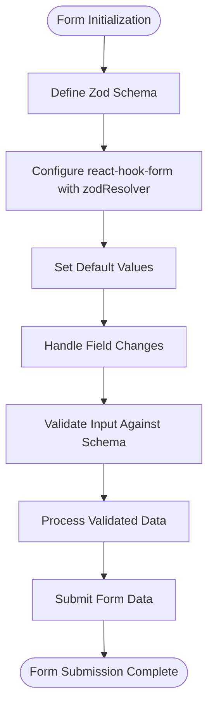
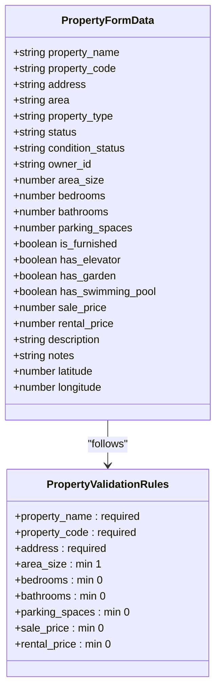
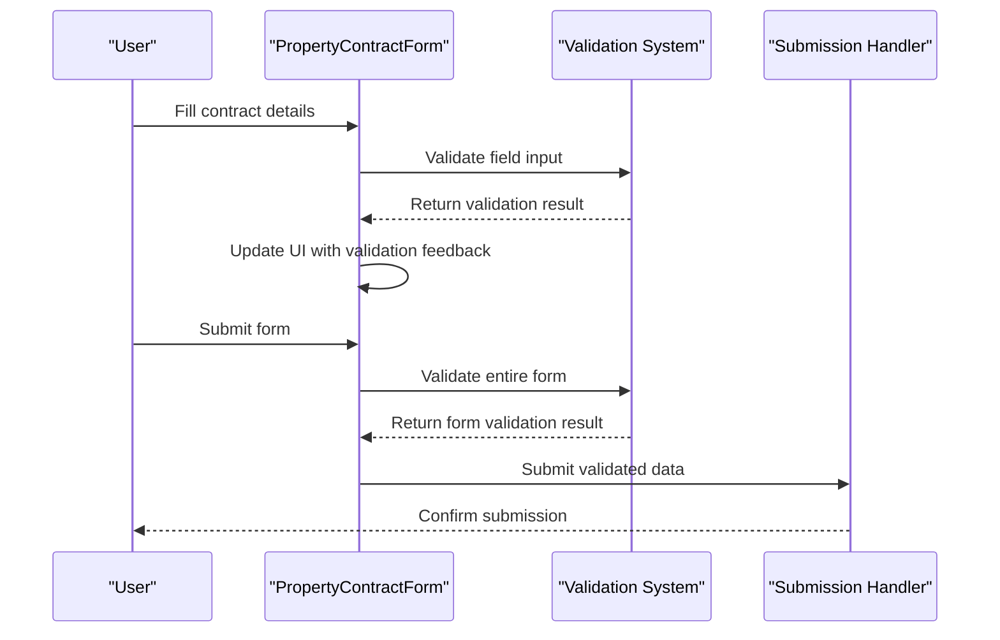
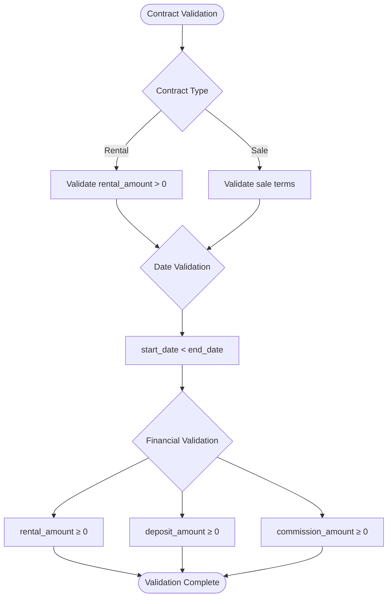
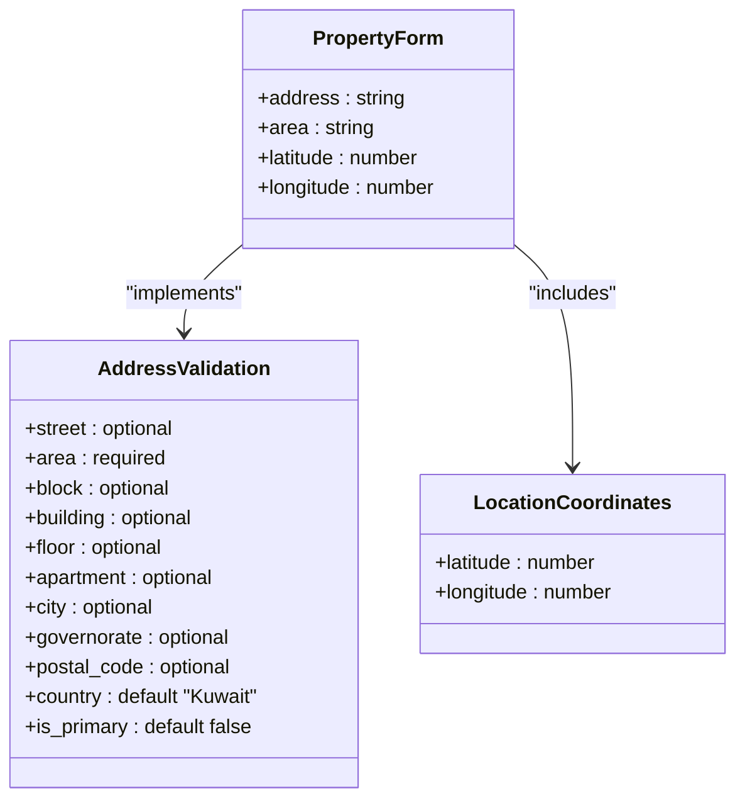
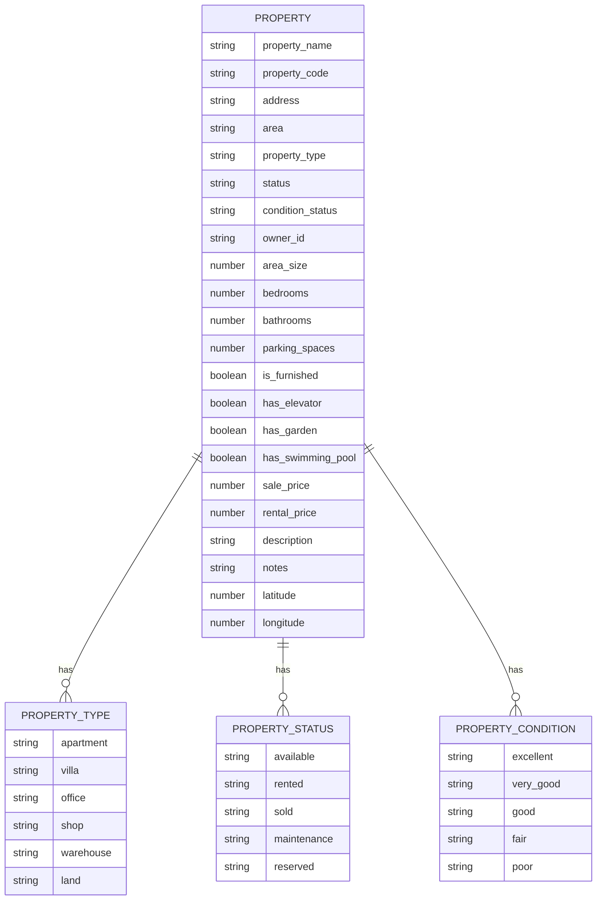
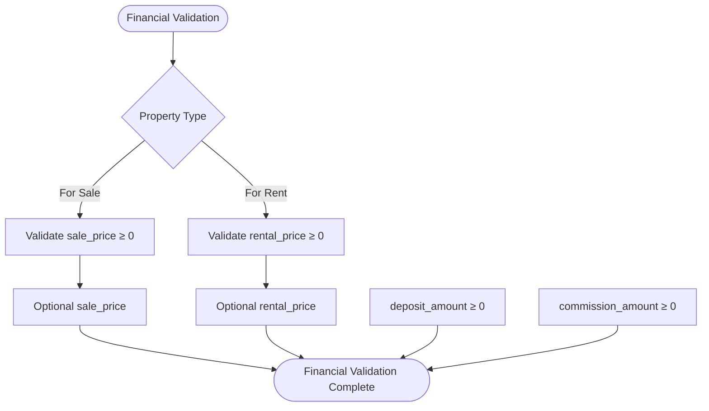
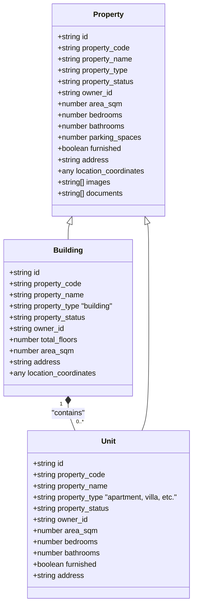
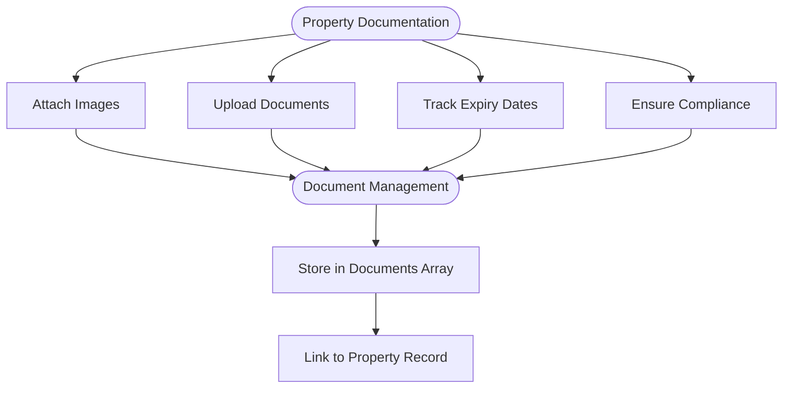
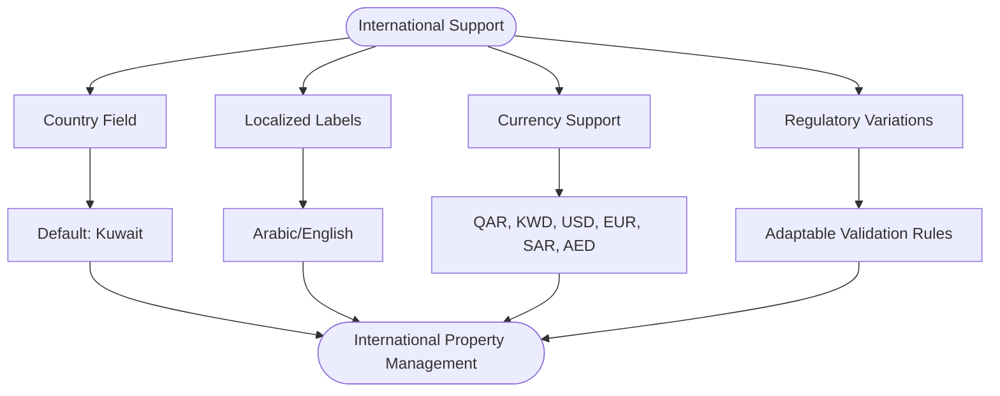

# Property Form Hooks

<cite>
**Referenced Files in This Document**   
- [PropertyForm.tsx](file://src/modules/properties/components/PropertyForm.tsx)
- [PropertyContractForm.tsx](file://src/components/property/PropertyContractForm.tsx)
- [common.schema.ts](file://src/schemas/common.schema.ts)
- [contract.schema.ts](file://src/schemas/contract.schema.ts)
</cite>

## Table of Contents
1. [Introduction](#introduction)
2. [Property Form State Management](#property-form-state-management)
3. [Property Validation Rules](#property-validation-rules)
4. [Property Contract Form Integration](#property-contract-form-integration)
5. [Contract Validation and Business Logic](#contract-validation-and-business-logic)
6. [Address and Location Validation](#address-and-location-validation)
7. [Property Classification and Zoning](#property-classification-and-zoning)
8. [Rental Pricing and Financial Validation](#rental-pricing-and-financial-validation)
9. [Complex Property Hierarchies](#complex-property-hierarchies)
10. [Property Documentation and Compliance](#property-documentation-and-compliance)
11. [International Property Management](#international-property-management)

## Introduction
This document provides comprehensive documentation for property form state management hooks in the real estate management system. It details the implementation of validation logic for property creation and property contract workflows, covering specialized validation rules for real estate data. The documentation includes integration with PropertyContractForm and PropertyForm components, addressing validation for property characteristics, zoning regulations, lease terms, tenant information, and compliance requirements.

## Property Form State Management
The property form state management is implemented through React Hook Form with Zod validation resolver, providing a robust foundation for managing form state and validation in property creation workflows.

**Diagram sources**
- [PropertyForm.tsx](file://src/modules/properties/components/PropertyForm.tsx#L35-L65)

**Section sources**
- [PropertyForm.tsx](file://src/modules/properties/components/PropertyForm.tsx#L1-L582)

## Property Validation Rules
The property form implements comprehensive validation rules for real estate data, ensuring data integrity and business rule compliance. The validation schema covers property characteristics, financial information, and location data.

**Diagram sources**
- [PropertyForm.tsx](file://src/modules/properties/components/PropertyForm.tsx#L35-L65)

**Section sources**
- [PropertyForm.tsx](file://src/modules/properties/components/PropertyForm.tsx#L35-L65)

## Property Contract Form Integration
The PropertyContractForm component integrates with the property management system to handle contract creation for rental and sale agreements. It manages tenant information, contract terms, and financial details with comprehensive validation.

**Diagram sources**
- [PropertyContractForm.tsx](file://src/components/property/PropertyContractForm.tsx#L35-L69)

**Section sources**
- [PropertyContractForm.tsx](file://src/components/property/PropertyContractForm.tsx#L1-L491)

## Contract Validation and Business Logic
The contract validation system implements business logic for property contracts, including date validation, financial constraints, and contractual requirements. The validation ensures that contract start dates precede end dates and that financial amounts are non-negative.

**Diagram sources**
- [PropertyContractForm.tsx](file://src/components/property/PropertyContractForm.tsx#L35-L69)
- [contract.schema.ts](file://src/schemas/contract.schema.ts#L1-L102)

**Section sources**
- [PropertyContractForm.tsx](file://src/components/property/PropertyContractForm.tsx#L35-L69)
- [contract.schema.ts](file://src/schemas/contract.schema.ts#L1-L102)

## Address and Location Validation
The system implements address validation through structured address fields and geolocation integration. Property addresses are validated for completeness, and location coordinates are captured through an integrated map picker component.

**Diagram sources**
- [common.schema.ts](file://src/schemas/common.schema.ts#L20-L40)
- [PropertyForm.tsx](file://src/modules/properties/components/PropertyForm.tsx#L35-L65)

**Section sources**
- [common.schema.ts](file://src/schemas/common.schema.ts#L20-L40)
- [PropertyForm.tsx](file://src/modules/properties/components/PropertyForm.tsx#L35-L65)

## Property Classification and Zoning
The system supports multiple property types with specific classification rules. Property classification is validated against a predefined enumeration of property types, ensuring consistency in property categorization.

**Diagram sources**
- [PropertyForm.tsx](file://src/modules/properties/components/PropertyForm.tsx#L35-L65)
- [types/index.ts](file://src/modules/properties/types/index.ts#L1-L66)

**Section sources**
- [PropertyForm.tsx](file://src/modules/properties/components/PropertyForm.tsx#L35-L65)
- [types/index.ts](file://src/modules/properties/types/index.ts#L1-L66)

## Rental Pricing and Financial Validation
The system implements financial validation rules for rental pricing, ensuring that rental amounts are non-negative and that pricing data is consistent with business requirements. The validation includes constraints for sale prices, rental prices, and deposit amounts.

**Diagram sources**
- [PropertyForm.tsx](file://src/modules/properties/components/PropertyForm.tsx#L35-L65)

**Section sources**
- [PropertyForm.tsx](file://src/modules/properties/components/PropertyForm.tsx#L35-L65)

## Complex Property Hierarchies
The system supports complex property hierarchies through the building property type, which can contain multiple units. While the current implementation focuses on individual properties, the data model supports future expansion to handle buildings with multiple units and shared amenities.

**Diagram sources**
- [types/index.ts](file://src/modules/properties/types/index.ts#L1-L66)

**Section sources**
- [types/index.ts](file://src/modules/properties/types/index.ts#L1-L66)

## Property Documentation and Compliance
The system supports property documentation and compliance requirements through document management features. While the current form implementation focuses on core property data, the underlying data model includes support for property images and documents, enabling compliance with regulatory requirements.

**Diagram sources**
- [types/index.ts](file://src/modules/properties/types/index.ts#L1-L66)

**Section sources**
- [types/index.ts](file://src/modules/properties/types/index.ts#L1-L66)

## International Property Management
The system is designed to support international property management with considerations for varying regulatory requirements. The data model includes country-specific fields and supports multiple languages, enabling adaptation to different regional requirements.

**Diagram sources**
- [common.schema.ts](file://src/schemas/common.schema.ts#L20-L40)
- [types/index.ts](file://src/modules/properties/types/index.ts#L1-L66)

**Section sources**
- [common.schema.ts](file://src/schemas/common.schema.ts#L20-L40)
- [types/index.ts](file://src/modules/properties/types/index.ts#L1-L66)