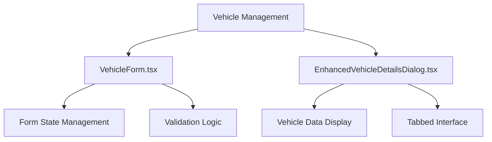
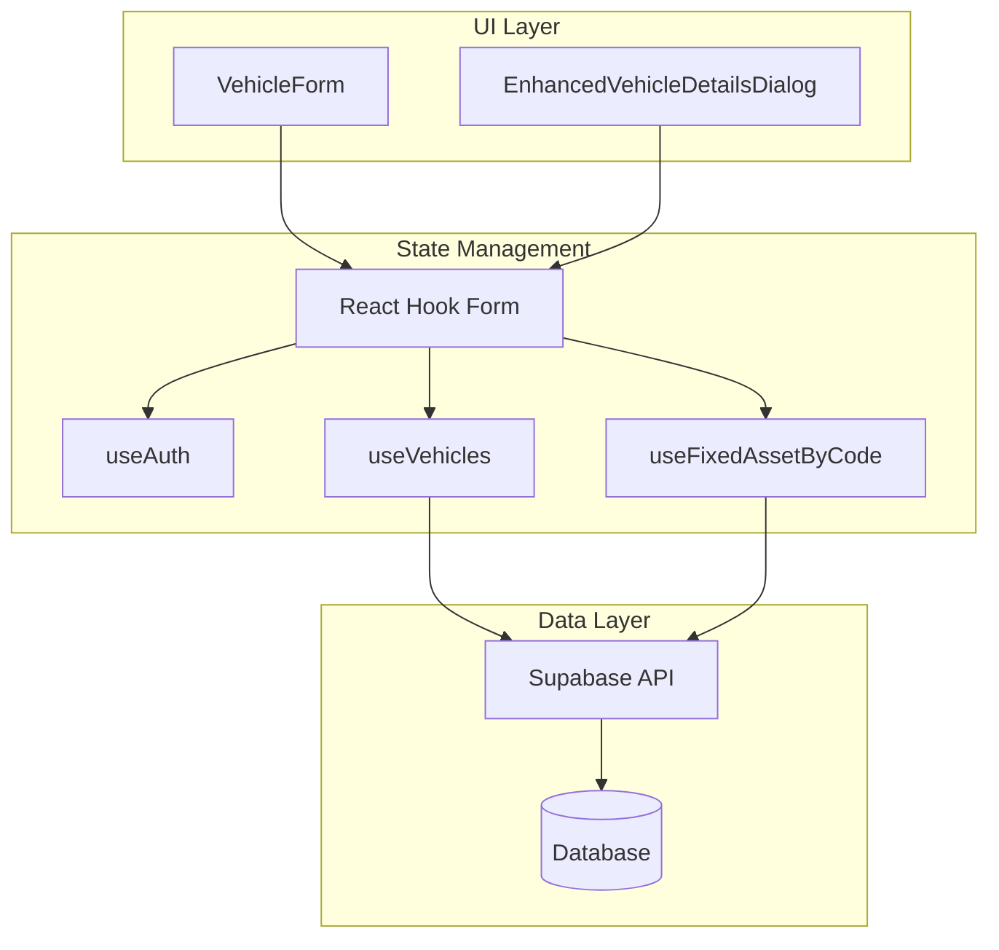
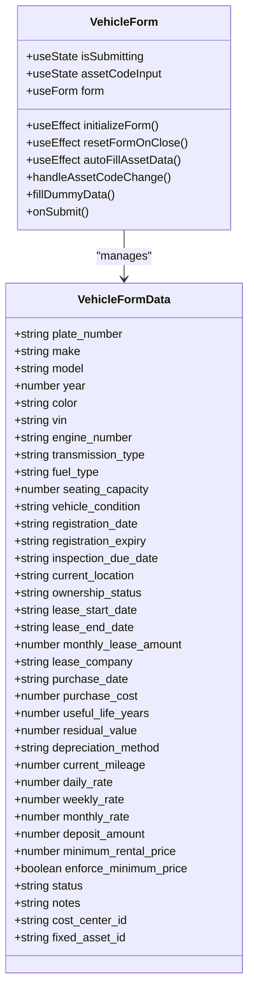
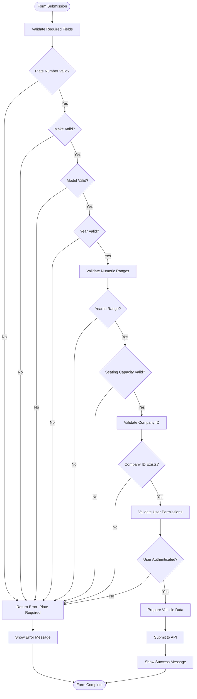
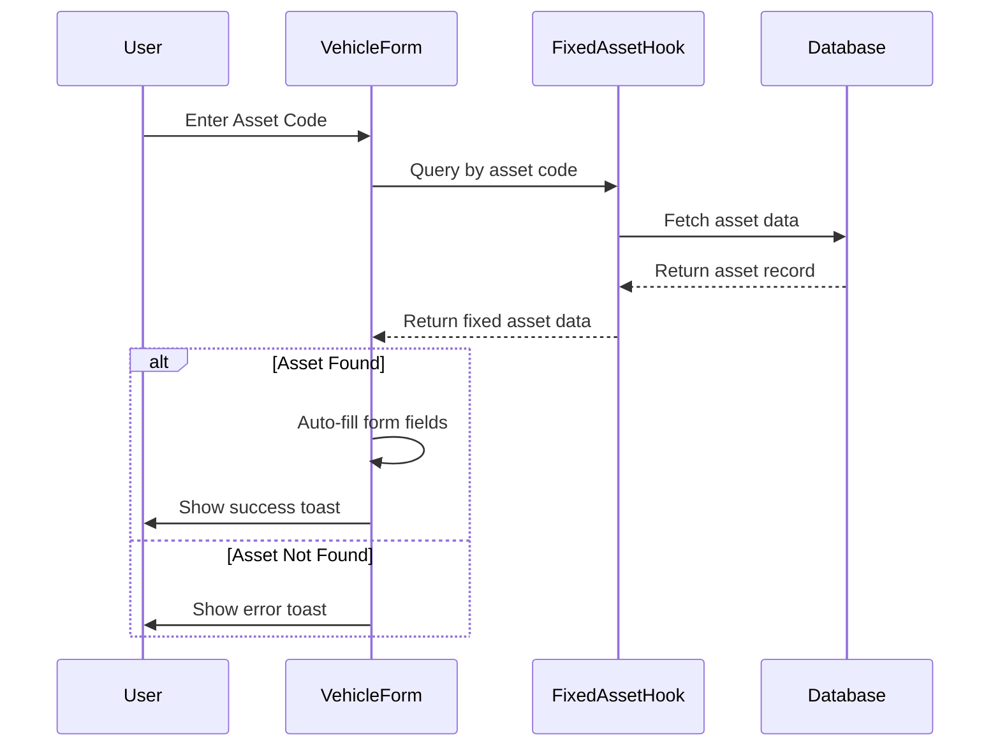
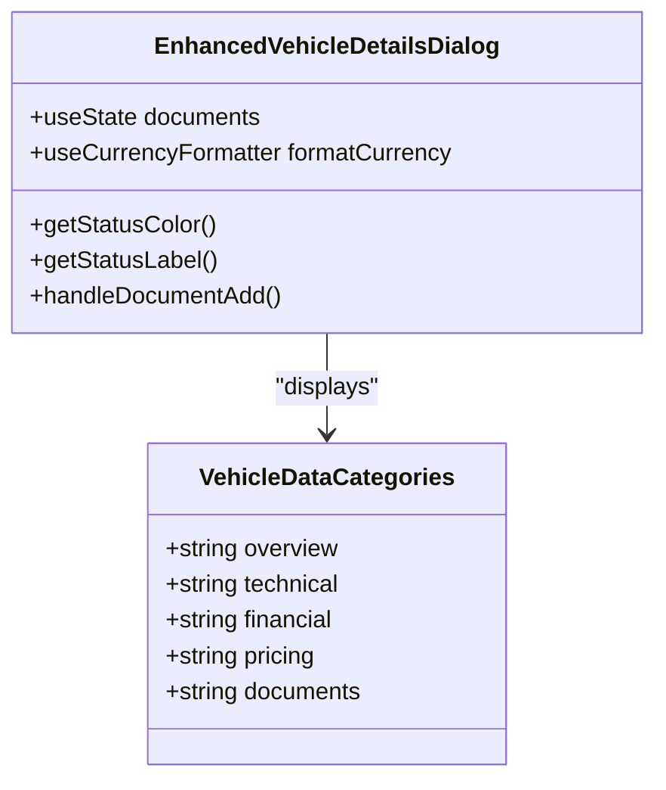
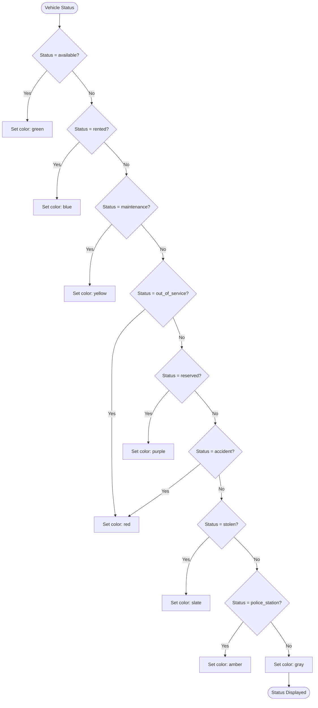
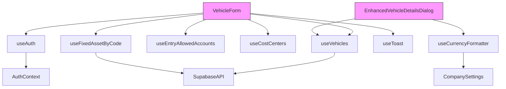

# Vehicle Form Hooks

<cite>
**Referenced Files in This Document**   
- [VehicleForm.tsx](file://src/components/fleet/VehicleForm.tsx)
- [EnhancedVehicleDetailsDialog.tsx](file://src/components/fleet/EnhancedVehicleDetailsDialog.tsx)
</cite>

## Table of Contents
1. [Introduction](#introduction)
2. [Project Structure](#project-structure)
3. [Core Components](#core-components)
4. [Architecture Overview](#architecture-overview)
5. [Detailed Component Analysis](#detailed-component-analysis)
6. [Dependency Analysis](#dependency-analysis)
7. [Performance Considerations](#performance-considerations)
8. [Troubleshooting Guide](#troubleshooting-guide)
9. [Conclusion](#conclusion)

## Introduction
This document provides a comprehensive analysis of vehicle form state management hooks within the Fleetify application. It focuses on the implementation of form validation logic, integration with vehicle-related components, and handling of complex vehicle data entry scenarios. The documentation covers conditional requirements based on vehicle type, usage category, and maintenance status, as well as integration with VehicleForm and EnhancedVehicleDetailsDialog components.

## Project Structure
The vehicle management functionality is organized within the fleet module of the application, with core components located in the src/components/fleet directory. The form state management is implemented using React hooks and integrated with UI components through a structured component hierarchy.

**Diagram sources**
- [VehicleForm.tsx](file://src/components/fleet/VehicleForm.tsx)
- [EnhancedVehicleDetailsDialog.tsx](file://src/components/fleet/EnhancedVehicleDetailsDialog.tsx)

**Section sources**
- [VehicleForm.tsx](file://src/components/fleet/VehicleForm.tsx)
- [EnhancedVehicleDetailsDialog.tsx](file://src/components/fleet/EnhancedVehicleDetailsDialog.tsx)

## Core Components
The vehicle form system consists of two primary components: VehicleForm for data entry and EnhancedVehicleDetailsDialog for data display. These components work together to provide a complete vehicle management experience, with shared state management and validation logic.

**Section sources**
- [VehicleForm.tsx](file://src/components/fleet/VehicleForm.tsx)
- [EnhancedVehicleDetailsDialog.tsx](file://src/components/fleet/EnhancedVehicleDetailsDialog.tsx)

## Architecture Overview
The vehicle form architecture follows a component-based design pattern with separation of concerns between data entry, validation, and display. The system uses React Hook Form for state management and integrates with various hooks for data fetching and mutation operations.

**Diagram sources**
- [VehicleForm.tsx](file://src/components/fleet/VehicleForm.tsx)
- [EnhancedVehicleDetailsDialog.tsx](file://src/components/fleet/EnhancedVehicleDetailsDialog.tsx)

## Detailed Component Analysis

### VehicleForm Analysis
The VehicleForm component provides a comprehensive interface for vehicle data entry with extensive validation and auto-fill capabilities. It supports both creation and editing of vehicle records with conditional field requirements.

#### Form State Management
The component uses React Hook Form for efficient state management, with a comprehensive default values configuration that includes all vehicle attributes. The form is divided into multiple tabs for better organization of related fields.

**Diagram sources**
- [VehicleForm.tsx](file://src/components/fleet/VehicleForm.tsx#L0-L799)

#### Validation Logic
The form implements comprehensive validation rules for vehicle data entry, including required field checks, numeric range validation, and data type validation. The validation occurs both at the field level and during form submission.

**Diagram sources**
- [VehicleForm.tsx](file://src/components/fleet/VehicleForm.tsx#L324-L476)

#### Integration with Fixed Assets
The component includes functionality to link vehicles with fixed assets, allowing for automatic population of vehicle data from existing asset records. This integration enhances data consistency and reduces manual entry.

**Diagram sources**
- [VehicleForm.tsx](file://src/components/fleet/VehicleForm.tsx#L477-L550)

### EnhancedVehicleDetailsDialog Analysis
The EnhancedVehicleDetailsDialog component provides a detailed view of vehicle information with a tabbed interface for organizing related data categories.

#### Data Display Structure
The component organizes vehicle information into logical categories, making it easy to access specific types of information. Each tab focuses on a particular aspect of the vehicle's data.

**Diagram sources**
- [EnhancedVehicleDetailsDialog.tsx](file://src/components/fleet/EnhancedVehicleDetailsDialog.tsx#L0-L409)

#### Status Management
The component includes functionality to display and format vehicle status information, with appropriate color coding and labels for different status types.

**Diagram sources**
- [EnhancedVehicleDetailsDialog.tsx](file://src/components/fleet/EnhancedVehicleDetailsDialog.tsx#L15-L80)

## Dependency Analysis
The vehicle form components have dependencies on several core hooks and context providers that enable their functionality.

**Diagram sources**
- [VehicleForm.tsx](file://src/components/fleet/VehicleForm.tsx)
- [EnhancedVehicleDetailsDialog.tsx](file://src/components/fleet/EnhancedVehicleDetailsDialog.tsx)

**Section sources**
- [VehicleForm.tsx](file://src/components/fleet/VehicleForm.tsx)
- [EnhancedVehicleDetailsDialog.tsx](file://src/components/fleet/EnhancedVehicleDetailsDialog.tsx)

## Performance Considerations
The vehicle form implementation includes several performance optimizations to ensure smooth user experience:

1. **Debounced field validation**: Field validation is debounced to prevent excessive re-renders during typing
2. **Conditional rendering**: Tabs are rendered only when active, reducing initial render complexity
3. **Efficient state updates**: React Hook Form optimizes state updates to minimize re-renders
4. **Lazy loading**: Related components like pricing and documents panels are loaded only when their tabs are activated

## Troubleshooting Guide
Common issues and their solutions for the vehicle form system:

**Section sources**
- [VehicleForm.tsx](file://src/components/fleet/VehicleForm.tsx)
- [EnhancedVehicleDetailsDialog.tsx](file://src/components/fleet/EnhancedVehicleDetailsDialog.tsx)

## Conclusion
The vehicle form system provides a robust solution for vehicle data management with comprehensive validation, efficient state management, and seamless integration with related systems. The implementation follows best practices for React component design and provides a user-friendly interface for managing complex vehicle data.