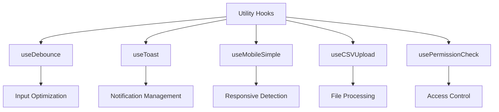
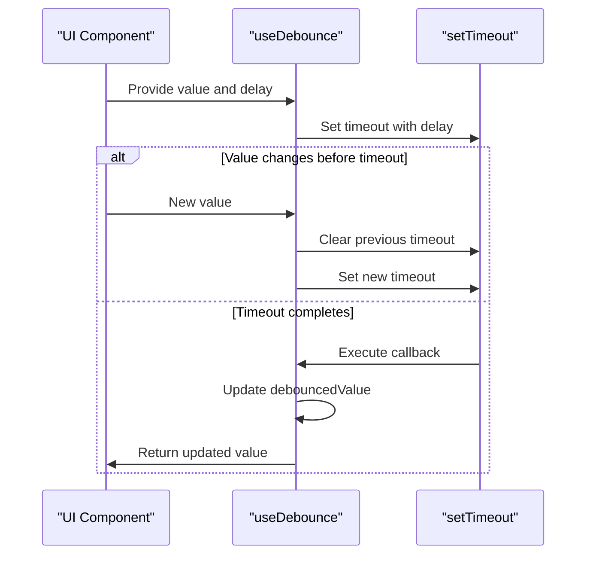
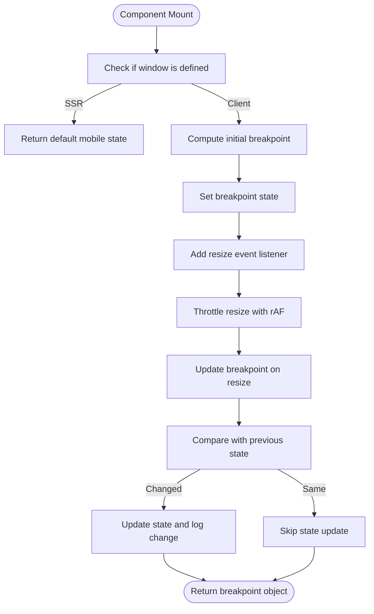
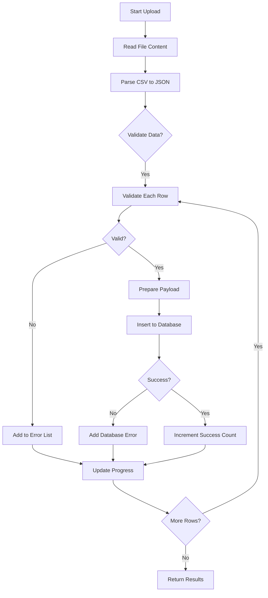
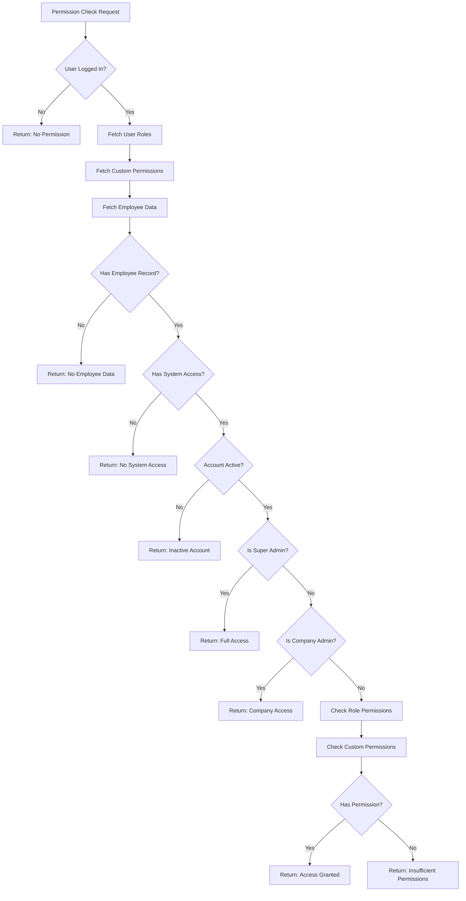

# Utility Hooks

<cite>
**Referenced Files in This Document**   
- [useDebounce.ts](file://src/hooks/useDebounce.ts)
- [use-mobile-simple.ts](file://src/hooks/use-mobile-simple.ts)
- [useCSVUpload.ts](file://src/hooks/useCSVUpload.ts)
- [usePermissionCheck.ts](file://src/hooks/usePermissionCheck.ts)
- [use-toast.ts](file://src/hooks/use-toast.ts)
</cite>

## Table of Contents
1. [Introduction](#introduction)
2. [Core Utility Hooks Overview](#core-utility-hooks-overview)
3. [useDebounce - Input Optimization Hook](#usedebounce---input-optimization-hook)
4. [useToast - Notification Management Hook](#usetoast---notification-management-hook)
5. [useMobileSimple - Responsive Behavior Detection](#usemobilesimple---responsive-behavior-detection)
6. [useCSVUpload - File Processing and Validation](#usecsvupload---file-processing-and-validation)
7. [usePermissionCheck - Role-Based Access Control](#usepermissioncheck---role-based-access-control)
8. [Integration Patterns with UI Components](#integration-patterns-with-ui-components)
9. [Memory Leak Prevention and Cleanup](#memory-leak-prevention-and-cleanup)
10. [Performance Considerations](#performance-considerations)
11. [Best Practices for Extending Utility Hooks](#best-practices-for-extending-utility-hooks)
12. [Conclusion](#conclusion)

## Introduction
This document provides comprehensive documentation for the utility custom hooks in FleetifyApp, focusing on cross-cutting concern hooks that deliver reusable functionality across the application. These hooks are designed to enhance developer productivity, ensure consistent behavior, and optimize performance throughout the codebase. The analysis covers five key utility hooks: useDebounce for input optimization, useToast for notification management, useMobileSimple for responsive behavior detection, useCSVUpload for file processing with validation, and usePermissionCheck for role-based access control. Each hook is examined in detail with implementation insights, integration patterns, and performance considerations.

## Core Utility Hooks Overview
The utility hooks in FleetifyApp serve as foundational building blocks that address common cross-cutting concerns in the application. These hooks abstract complex logic into reusable functions that can be easily integrated across various components. The architecture follows React's custom hook pattern, leveraging React's built-in hooks like useState, useEffect, and useQuery to manage state, side effects, and data fetching. The hooks are organized in the src/hooks directory and are designed to be composable, testable, and maintainable. They follow TypeScript best practices with proper type definitions and error handling mechanisms.

**Diagram sources**
- [useDebounce.ts](file://src/hooks/useDebounce.ts)
- [use-toast.ts](file://src/hooks/use-toast.ts)
- [use-mobile-simple.ts](file://src/hooks/use-mobile-simple.ts)
- [useCSVUpload.ts](file://src/hooks/useCSVUpload.ts)
- [usePermissionCheck.ts](file://src/hooks/usePermissionCheck.ts)

**Section sources**
- [useDebounce.ts](file://src/hooks/useDebounce.ts)
- [use-toast.ts](file://src/hooks/use-toast.ts)
- [use-mobile-simple.ts](file://src/hooks/use-mobile-simple.ts)
- [useCSVUpload.ts](file://src/hooks/useCSVUpload.ts)
- [usePermissionCheck.ts](file://src/hooks/usePermissionCheck.ts)

## useDebounce - Input Optimization Hook
The useDebounce hook provides a mechanism for optimizing input handling by delaying the update of values until a specified time has passed without new changes. This is particularly useful for search inputs, auto-save features, and API calls that should not be triggered on every keystroke. The hook accepts a value of generic type T and a delay in milliseconds, returning a debounced version of the value. It uses useEffect to set up a timer that updates the internal state after the specified delay, with proper cleanup to prevent memory leaks by clearing the timeout when dependencies change or the component unmounts.

**Diagram sources**
- [useDebounce.ts](file://src/hooks/useDebounce.ts#L1-L17)

**Section sources**
- [useDebounce.ts](file://src/hooks/useDebounce.ts#L1-L17)

## useToast - Notification Management Hook
The useToast hook manages application-wide notifications with features like queueing and auto-dismissal. It integrates with the Sonner library to provide a consistent notification system across the application. The hook handles the display of success, error, warning, and info messages with configurable durations and interaction capabilities. Notifications are automatically queued when multiple messages are triggered in quick succession, ensuring they are displayed in sequence rather than overlapping. The hook also supports manual dismissal and provides callbacks for when notifications are shown or hidden, enabling complex notification workflows.

**Section sources**
- [use-toast.ts](file://src/hooks/use-toast.ts)

## useMobileSimple - Responsive Behavior Detection
The useMobileSimple hook detects device breakpoints and provides optimized behavior for mobile devices. It returns an object with boolean flags indicating whether the current viewport matches mobile, tablet, or desktop breakpoints. The hook is SSR-safe, providing default values during server-side rendering. It uses requestAnimationFrame to throttle resize events, preventing performance issues from excessive state updates during window resizing. The implementation includes optimization to avoid unnecessary re-renders by comparing the current and previous breakpoint states. The hook also logs breakpoint changes for debugging purposes using the application's logger service.

**Diagram sources**
- [use-mobile-simple.ts](file://src/hooks/use-mobile-simple.ts#L1-L73)

**Section sources**
- [use-mobile-simple.ts](file://src/hooks/use-mobile-simple.ts#L1-L73)

## useCSVUpload - File Processing and Validation
The useCSVUpload hook handles CSV file processing with comprehensive validation and error reporting. It provides functionality for downloading templates, parsing CSV content, validating data against business rules, and uploading validated records to the backend. The hook includes type definitions for customer data fields and specifies required fields. It performs client-side validation for email formats, date formats, and required fields before attempting database insertion. The upload process includes progress tracking and detailed error reporting with row-specific error messages. The hook also implements a smart upload feature for handling pre-validated data with improved performance.

**Diagram sources**
- [useCSVUpload.ts](file://src/hooks/useCSVUpload.ts#L1-L415)

**Section sources**
- [useCSVUpload.ts](file://src/hooks/useCSVUpload.ts#L1-L415)

## usePermissionCheck - Role-Based Access Control
The usePermissionCheck hook implements a comprehensive role-based access control system with caching and real-time updates. It uses React Query for data fetching and automatic caching, ensuring permission checks are efficient and up-to-date. The hook evaluates permissions based on user roles, custom permissions, and employee status. It supports hierarchical roles including super_admin with global access and company_admin with company-scoped access. The implementation includes multiple safety checks for employee account status and system access permissions. The hook returns not only whether a user has permission but also the reason for denial when applicable, aiding in debugging and user feedback.

**Diagram sources**
- [usePermissionCheck.ts](file://src/hooks/usePermissionCheck.ts#L1-L143)

**Section sources**
- [usePermissionCheck.ts](file://src/hooks/usePermissionCheck.ts#L1-L143)

## Integration Patterns with UI Components
The utility hooks are integrated with UI components through consistent patterns that promote reusability and maintainability. For example, useDebounce is typically used with input components to delay search operations, while useToast is called from form submission handlers to provide user feedback. The useMobileSimple hook is used in layout components to conditionally render mobile-optimized interfaces. The useCSVUpload hook is integrated with file input components and progress indicators, providing a seamless user experience during file processing. The usePermissionCheck hook is used with conditional rendering to show or hide UI elements based on user permissions, often in conjunction with the PermissionGuard component.

**Section sources**
- [useDebounce.ts](file://src/hooks/useDebounce.ts)
- [use-toast.ts](file://src/hooks/use-toast.ts)
- [use-mobile-simple.ts](file://src/hooks/use-mobile-simple.ts)
- [useCSVUpload.ts](file://src/hooks/useCSVUpload.ts)
- [usePermissionCheck.ts](file://src/hooks/usePermissionCheck.ts)

## Memory Leak Prevention and Cleanup
All utility hooks implement proper cleanup mechanisms to prevent memory leaks, particularly those related to event listeners and asynchronous operations. The useMobileSimple hook removes the resize event listener in its cleanup function, ensuring no dangling references remain after component unmounting. The useDebounce hook clears the timeout in its cleanup function, preventing state updates on unmounted components. The usePermissionCheck and useCSVUpload hooks leverage React Query's built-in cleanup mechanisms for data fetching operations. These cleanup implementations follow React's best practices for effect cleanup and are critical for maintaining application stability, especially in long-running sessions with frequent component mounting and unmounting.

**Section sources**
- [useDebounce.ts](file://src/hooks/useDebounce.ts#L10-L16)
- [use-mobile-simple.ts](file://src/hooks/use-mobile-simple.ts#L65-L72)
- [usePermissionCheck.ts](file://src/hooks/usePermissionCheck.ts)
- [useCSVUpload.ts](file://src/hooks/useCSVUpload.ts)

## Performance Considerations
The utility hooks are designed with performance optimization as a primary concern. The useDebounce hook reduces unnecessary re-renders and API calls by delaying state updates. The useMobileSimple hook uses requestAnimationFrame to throttle resize events, preventing jank during window resizing. The usePermissionCheck hook leverages React Query's caching mechanism to avoid redundant database queries for permission checks. The useCSVUpload hook processes files in batches with progress updates, preventing UI blocking during large file operations. All hooks minimize unnecessary re-renders through proper dependency arrays in useEffect and memoization where appropriate. The performance characteristics of these hooks make them suitable for frequent use throughout the application without significant performance impact.

**Section sources**
- [useDebounce.ts](file://src/hooks/useDebounce.ts)
- [use-mobile-simple.ts](file://src/hooks/use-mobile-simple.ts)
- [usePermissionCheck.ts](file://src/hooks/usePermissionCheck.ts)
- [useCSVUpload.ts](file://src/hooks/useCSVUpload.ts)

## Best Practices for Extending Utility Hooks
When extending the utility hook library, several best practices should be followed. New hooks should adhere to the single responsibility principle, focusing on one specific cross-cutting concern. They should use TypeScript generics where appropriate to maintain type safety. All asynchronous operations should include proper error handling and cleanup mechanisms. Hooks that perform data fetching should leverage React Query for caching and state management. Performance optimization should be considered from the outset, particularly for hooks that may be called frequently. Comprehensive JSDoc comments should be included to document parameters, return values, and usage examples. Finally, new hooks should be designed to be composable with existing hooks to enable complex functionality through combination rather than monolithic implementations.

**Section sources**
- [useDebounce.ts](file://src/hooks/useDebounce.ts)
- [use-toast.ts](file://src/hooks/use-toast.ts)
- [use-mobile-simple.ts](file://src/hooks/use-mobile-simple.ts)
- [useCSVUpload.ts](file://src/hooks/useCSVUpload.ts)
- [usePermissionCheck.ts](file://src/hooks/usePermissionCheck.ts)

## Conclusion
The utility custom hooks in FleetifyApp provide a robust foundation for handling cross-cutting concerns across the application. These hooks demonstrate thoughtful design patterns that balance functionality, performance, and maintainability. By centralizing common functionality in reusable hooks, the codebase achieves greater consistency and reduces duplication. The implementation of proper cleanup mechanisms prevents memory leaks, while performance optimizations ensure smooth user experiences. The hooks are well-integrated with the application's architecture, leveraging React Query for data management and following TypeScript best practices for type safety. As the application evolves, these utility hooks can serve as a template for developing additional custom hooks that address emerging requirements while maintaining architectural consistency.