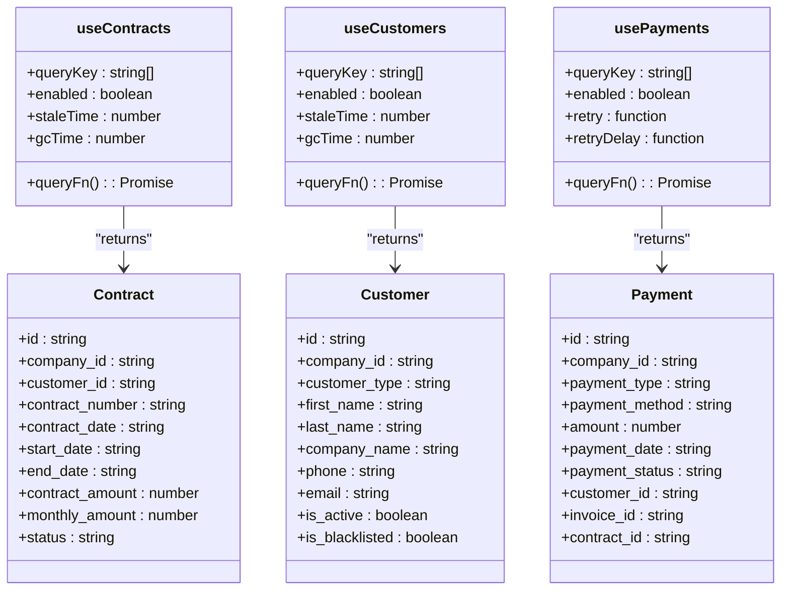
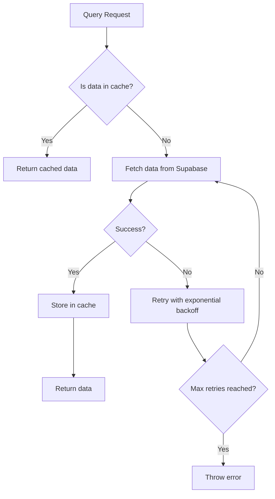
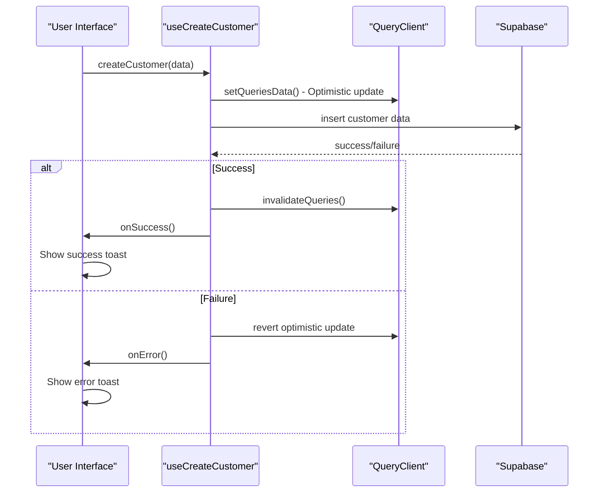
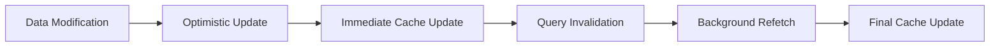
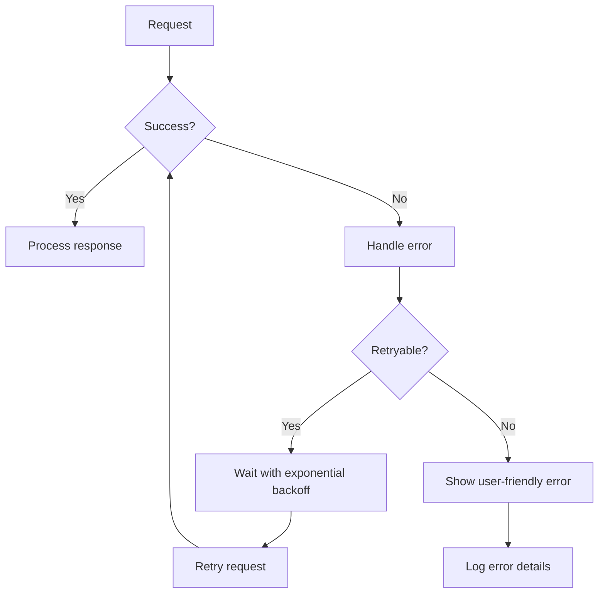
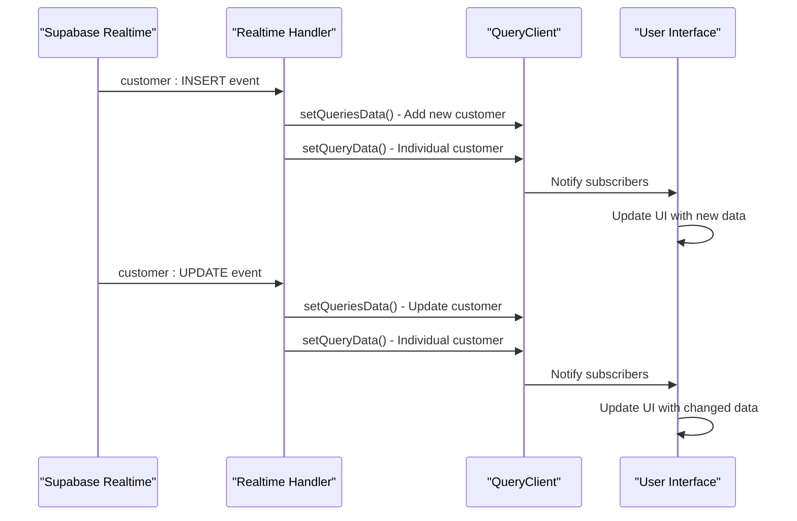
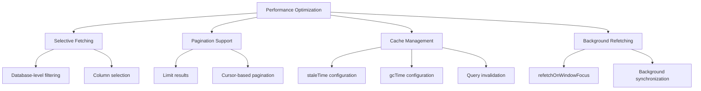
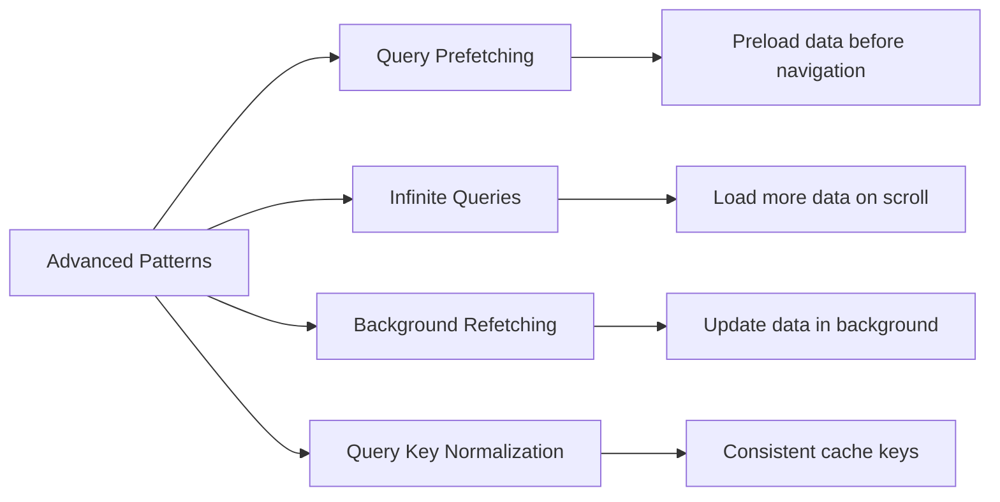
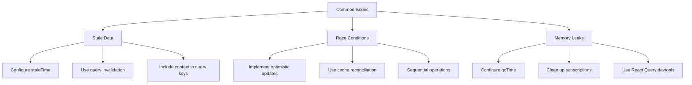

# React Query

<cite>
**Referenced Files in This Document**   
- [useContracts.ts](file://src/hooks/useContracts.ts)
- [useCustomers.ts](file://src/hooks/useCustomers.ts)
- [usePayments.ts](file://src/hooks/usePayments.ts)
- [useEnhancedCustomersRealtime.ts](file://src/hooks/useEnhancedCustomersRealtime.ts)
- [useUnifiedCompanyAccess.ts](file://src/hooks/useUnifiedCompanyAccess.ts)
- [client.ts](file://src/integrations/supabase/client.ts)
</cite>

## Table of Contents
1. [Introduction](#introduction)
2. [Core Query Hooks Implementation](#core-query-hooks-implementation)
3. [Data Fetching and Caching Strategy](#data-fetching-and-caching-strategy)
4. [Mutation and Optimistic Updates](#mutation-and-optimistic-updates)
5. [Query Invalidation and Cache Management](#query-invalidation-and-cache-management)
6. [Error Handling and Retry Mechanisms](#error-handling-and-retry-mechanisms)
7. [Real-time Data Synchronization](#real-time-data-synchronization)
8. [Performance Optimization](#performance-optimization)
9. [Advanced Patterns](#advanced-patterns)
10. [Common Issues and Solutions](#common-issues-and-solutions)

## Introduction
The FleetifyApp implements a robust server state management system using @tanstack/react-query for handling data fetching, caching, synchronization, and background updates across the application. This documentation details the implementation of custom query hooks that encapsulate data fetching logic with proper typing from Supabase types, providing a consistent and efficient approach to managing server state throughout the application.

**Section sources**
- [useContracts.ts](file://src/hooks/useContracts.ts#L1-L128)
- [useCustomers.ts](file://src/hooks/useCustomers.ts#L1-L675)
- [usePayments.ts](file://src/hooks/usePayments.ts#L1-L605)

## Core Query Hooks Implementation
The application implements custom query hooks such as useContracts, useCustomers, and usePayments that encapsulate data fetching logic with proper typing from Supabase types. These hooks provide a consistent interface for accessing server state across the application.

The useContracts hook retrieves contract data from Supabase with support for filtering by customer ID, vehicle ID, and company ID. It implements proper error handling and caching strategies to ensure data consistency.

The useCustomers hook provides comprehensive customer data retrieval with support for various filters including search terms, customer type, blacklist status, and company context. It integrates with the unified company access system to ensure proper data isolation between companies.

The usePayments hook fetches payment data with support for filtering by payment method, status, type, and date ranges. It includes proper typing for payment data and related entities such as customers, vendors, invoices, and contracts.

**Diagram sources**
- [useContracts.ts](file://src/hooks/useContracts.ts#L34-L80)
- [useCustomers.ts](file://src/hooks/useCustomers.ts#L12-L113)
- [usePayments.ts](file://src/hooks/usePayments.ts#L47-L153)

**Section sources**
- [useContracts.ts](file://src/hooks/useContracts.ts#L1-L128)
- [useCustomers.ts](file://src/hooks/useCustomers.ts#L1-L675)
- [usePayments.ts](file://src/hooks/usePayments.ts#L1-L605)

## Data Fetching and Caching Strategy
The application implements a comprehensive data fetching and caching strategy using React Query's built-in caching mechanisms. Each query hook is configured with appropriate staleTime and gcTime values to balance data freshness with performance.

The useContracts hook implements a 5-minute stale time and 10-minute garbage collection time, ensuring that contract data is refreshed regularly while minimizing unnecessary network requests. The query key is structured to include company ID, customer ID, and vehicle ID to ensure proper cache invalidation when these parameters change.

The useCustomers hook uses a similar caching strategy with 5-minute stale time and 10-minute garbage collection time. The query key includes company ID, browsing mode, browsed company ID, and filters to ensure that different customer views are properly cached and invalidated.

The usePayments hook implements retry mechanisms with exponential backoff, attempting up to 3 retries with increasing delays between attempts. This ensures resilience against temporary network issues while preventing excessive server load.

**Diagram sources**
- [useContracts.ts](file://src/hooks/useContracts.ts#L34-L80)
- [useCustomers.ts](file://src/hooks/useCustomers.ts#L12-L113)
- [usePayments.ts](file://src/hooks/usePayments.ts#L47-L153)

**Section sources**
- [useContracts.ts](file://src/hooks/useContracts.ts#L1-L128)
- [useCustomers.ts](file://src/hooks/useCustomers.ts#L1-L675)
- [usePayments.ts](file://src/hooks/usePayments.ts#L1-L605)

## Mutation and Optimistic Updates
The application implements mutation hooks for data modifications with optimistic updates to provide immediate feedback to users. The useCreateCustomer, useUpdateCustomer, and useDeletePayment hooks demonstrate this pattern.

When creating a new customer, the application performs an optimistic update by immediately adding the new customer to the cache before the server request completes. This provides instant feedback to the user while the actual database operation runs in the background.

The useUpdateCustomer hook implements a similar optimistic update pattern, immediately updating the customer data in the cache before the server request completes. This ensures that the UI reflects the changes immediately, improving the user experience.

The useDeletePayment hook handles the deletion of payments and related invoice updates in a transactional manner, ensuring data consistency across related entities.

**Diagram sources**
- [useCustomers.ts](file://src/hooks/useCustomers.ts#L114-L220)
- [usePayments.ts](file://src/hooks/usePayments.ts#L154-L300)

**Section sources**
- [useCustomers.ts](file://src/hooks/useCustomers.ts#L114-L675)
- [usePayments.ts](file://src/hooks/usePayments.ts#L154-L605)

## Query Invalidation and Cache Management
The application implements a sophisticated query invalidation and cache management system to ensure data consistency across the application. The useUnifiedCompanyAccess hook plays a crucial role in this system by providing a consistent way to generate query keys that include company context.

When data is modified through mutations, the application invalidates relevant queries to ensure that stale data is not displayed. For example, when a new customer is created, the application invalidates the ['customers'] query to ensure that the updated list is fetched on the next render.

The application also implements manual cache updates using setQueryData and setQueriesData to immediately reflect changes in the UI without waiting for a refetch. This is particularly important for list views where adding or removing items should be reflected immediately.

**Diagram sources**
- [useCustomers.ts](file://src/hooks/useCustomers.ts#L114-L220)
- [usePayments.ts](file://src/hooks/usePayments.ts#L154-L300)
- [useEnhancedCustomersRealtime.ts](file://src/hooks/useEnhancedCustomersRealtime.ts#L134-L174)

**Section sources**
- [useCustomers.ts](file://src/hooks/useCustomers.ts#L114-L675)
- [usePayments.ts](file://src/hooks/usePayments.ts#L154-L605)
- [useEnhancedCustomersRealtime.ts](file://src/hooks/useEnhancedCustomersRealtime.ts#L134-L174)

## Error Handling and Retry Mechanisms
The application implements comprehensive error handling and retry mechanisms to ensure resilience against network issues and server errors. Each query and mutation includes proper error handling with user-friendly error messages.

The usePayments hook implements a retry mechanism with exponential backoff, attempting up to 3 retries with increasing delays between attempts. This ensures that temporary network issues do not result in failed operations.

All mutations include error handling that displays appropriate error messages to users through the toast notification system. The error messages are localized and provide actionable feedback to help users resolve issues.

**Diagram sources**
- [usePayments.ts](file://src/hooks/usePayments.ts#L47-L153)
- [useCustomers.ts](file://src/hooks/useCustomers.ts#L114-L220)

**Section sources**
- [usePayments.ts](file://src/hooks/usePayments.ts#L1-L605)
- [useCustomers.ts](file://src/hooks/useCustomers.ts#L1-L675)

## Real-time Data Synchronization
The application implements real-time data synchronization using Supabase's real-time capabilities combined with React Query's cache management. The useEnhancedCustomersRealtime hook demonstrates this pattern by listening to real-time changes in the customers table and updating the cache accordingly.

When a new customer is inserted, the application processes the real-time event and updates all relevant customer queries in the cache. This ensures that all views displaying customer data are immediately updated without requiring a manual refresh.

The real-time synchronization system handles insert, update, and delete operations, ensuring that the client-side cache remains consistent with the server-side data. This provides a seamless user experience where changes made by other users are immediately visible.

**Diagram sources**
- [useEnhancedCustomersRealtime.ts](file://src/hooks/useEnhancedCustomersRealtime.ts#L134-L174)

**Section sources**
- [useEnhancedCustomersRealtime.ts](file://src/hooks/useEnhancedCustomersRealtime.ts#L1-L174)

## Performance Optimization
The application implements several performance optimization techniques to ensure efficient data fetching and rendering. These include selective fetching, pagination support, and cache management strategies.

The useCustomers hook implements search filtering at the database level using Supabase's full-text search capabilities, reducing the amount of data transferred over the network. This is particularly important for large customer databases.

The application uses React Query's built-in garbage collection to automatically clean up unused query data after a configurable period. This prevents memory leaks and ensures that the application remains performant even with extensive data usage.

**Diagram sources**
- [useCustomers.ts](file://src/hooks/useCustomers.ts#L12-L113)
- [useContracts.ts](file://src/hooks/useContracts.ts#L34-L80)

**Section sources**
- [useCustomers.ts](file://src/hooks/useCustomers.ts#L1-L675)
- [useContracts.ts](file://src/hooks/useContracts.ts#L1-L128)

## Advanced Patterns
The application implements several advanced React Query patterns to enhance the user experience and application performance. These include query prefetching, infinite queries, and background refetching.

The useUnifiedCompanyAccess hook enables query key normalization by providing a consistent way to generate query keys that include company context. This ensures that data from different companies is properly isolated in the cache.

The application uses React Query's prefetchQuery feature to load data before it is needed, reducing perceived latency when navigating between views. This is particularly effective for dashboard views that display multiple data sets.

**Diagram sources**
- [useUnifiedCompanyAccess.ts](file://src/hooks/useUnifiedCompanyAccess.ts)
- [useCustomers.ts](file://src/hooks/useCustomers.ts#L12-L113)

**Section sources**
- [useUnifiedCompanyAccess.ts](file://src/hooks/useUnifiedCompanyAccess.ts)
- [useCustomers.ts](file://src/hooks/useCustomers.ts#L1-L675)

## Common Issues and Solutions
The application addresses several common issues related to server state management, including stale data, race conditions, and memory leaks.

To prevent stale data, the application implements appropriate staleTime values and uses query invalidation to ensure that data is refreshed when necessary. The useUnifiedCompanyAccess hook helps prevent stale data by including company context in query keys.

Race conditions are mitigated through the use of optimistic updates and proper cache management. When multiple operations occur simultaneously, the application ensures that the cache is updated in a consistent manner.

Memory leaks are prevented through React Query's built-in garbage collection and proper cleanup of subscriptions. The application configures appropriate gcTime values to ensure that unused query data is cleaned up automatically.

**Diagram sources**
- [useContracts.ts](file://src/hooks/useContracts.ts#L34-L80)
- [useCustomers.ts](file://src/hooks/useCustomers.ts#L12-L113)
- [usePayments.ts](file://src/hooks/usePayments.ts#L47-L153)

**Section sources**
- [useContracts.ts](file://src/hooks/useContracts.ts#L1-L128)
- [useCustomers.ts](file://src/hooks/useCustomers.ts#L1-L675)
- [usePayments.ts](file://src/hooks/usePayments.ts#L1-L605)