# State Management

<cite>
**Referenced Files in This Document**   
- [AuthContext.tsx](file://src\contexts\AuthContext.tsx) - *Updated in recent commit*
- [CompanyContext.tsx](file://src\contexts\CompanyContext.tsx) - *Updated in recent commit*
- [FeatureFlagsContext.tsx](file://src\contexts\FeatureFlagsContext.tsx) - *Updated in recent commit*
- [App.tsx](file://src\App.tsx) - *Updated in recent commit*
- [useCompany.ts](file://src\hooks\useCompany.ts) - *Updated in recent commit*
- [useEnhancedCustomersRealtime.ts](file://src\hooks\useEnhancedCustomersRealtime.ts) - *Updated in recent commit*
- [useContracts.ts](file://src\hooks\useContracts.ts) - *Updated in recent commit*
- [useInvoiceMatching.ts](file://src\hooks\useInvoiceMatching.ts) - *Added in commit 973ebdb560f0ed689880d88a5add238f358cef71*
- [useBulkInvoiceGeneration.ts](file://src\hooks\useBulkInvoiceGeneration.ts) - *Added in commit dea00f44ff6792398ad0383ab9bdc8b52cb8c3aa*
- [useFinancialFixes.ts](file://src\hooks\useFinancialFixes.ts) - *Updated in commit 39*
- [useFinancialSystemAnalysis.ts](file://src\hooks\useFinancialSystemAnalysis.ts) - *Updated in commit 39*
</cite>

## Update Summary
**Changes Made**   
- Added new section on Financial Analysis and Fix System to document the new financial analysis and repair functionality
- Added new section on Invoice Processing System to cover the invoice scanning, matching, and bulk generation features
- Updated the Business Logic with Custom Hooks section to include new hooks for financial fixes and invoice processing
- Added new diagrams to visualize the financial analysis workflow and invoice matching process
- Updated section sources to include newly added and modified files

## Table of Contents
1. [Introduction](#introduction)
2. [Three-Tiered State Management Architecture](#three-tiered-state-management-architecture)
3. [Global State with React Context](#global-state-with-react-context)
4. [Server State with React Query](#server-state-with-react-query)
5. [Business Logic with Custom Hooks](#business-logic-with-custom-hooks)
6. [Financial Analysis and Fix System](#financial-analysis-and-fix-system)
7. [Invoice Processing System](#invoice-processing-system)
8. [State Persistence and Configuration](#state-persistence-and-configuration)
9. [Common State Consistency Issues and Solutions](#common-state-consistency-issues-and-solutions)
10. [Conclusion](#conclusion)

## Introduction
The FleetifyApp state management system is designed to handle complex application state across authentication, multi-tenancy, feature flags, and business logic. The system employs a three-tiered approach combining React Context for global state, React Query for server state management, and custom hooks for encapsulating business logic. This architecture ensures consistent state management across the application while providing scalability and maintainability.

**Section sources**
- [App.tsx](file://src\App.tsx#L1-L420)

## Three-Tiered State Management Architecture
FleetifyApp implements a comprehensive three-tiered state management strategy that separates concerns and optimizes performance:

1. **React Context Layer**: Manages global application state including authentication, company context, and feature flags
2. **React Query Layer**: Handles server state management with caching, background updates, and data synchronization
3. **Custom Hooks Layer**: Encapsulates complex business logic and provides reusable stateful behavior

This layered approach allows for clear separation of concerns, improved performance through intelligent caching, and enhanced developer experience through reusable abstractions.

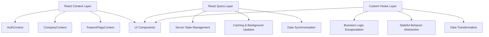
```mermaid
graph TD
A[React Context Layer] --> B[AuthContext]
A --> C[CompanyContext]
A --> D[FeatureFlagsContext]
E[React Query Layer] --> F[Server State Management]
E --> G[Caching & Background Updates]
E --> H[Data Synchronization]
I[Custom Hooks Layer] --> J[Business Logic Encapsulation]
I --> K[Stateful Behavior Abstraction]
I --> L[Data Transformation]
A --> M[UI Components]
E --> M
I --> M
```

**Diagram sources**
- [App.tsx](file://src\App.tsx#L1-L420)
- [AuthContext.tsx](file://src\contexts\AuthContext.tsx#L1-L250)
- [CompanyContext.tsx](file://src\contexts\CompanyContext.tsx#L1-L81)

## Global State with React Context
The application uses React Context to manage global state across three primary contexts: authentication, company context, and feature flags.

### Authentication Context
The AuthContext provides authentication state and related functionality throughout the application. It manages user sessions, profile data, and authentication status using Supabase authentication.

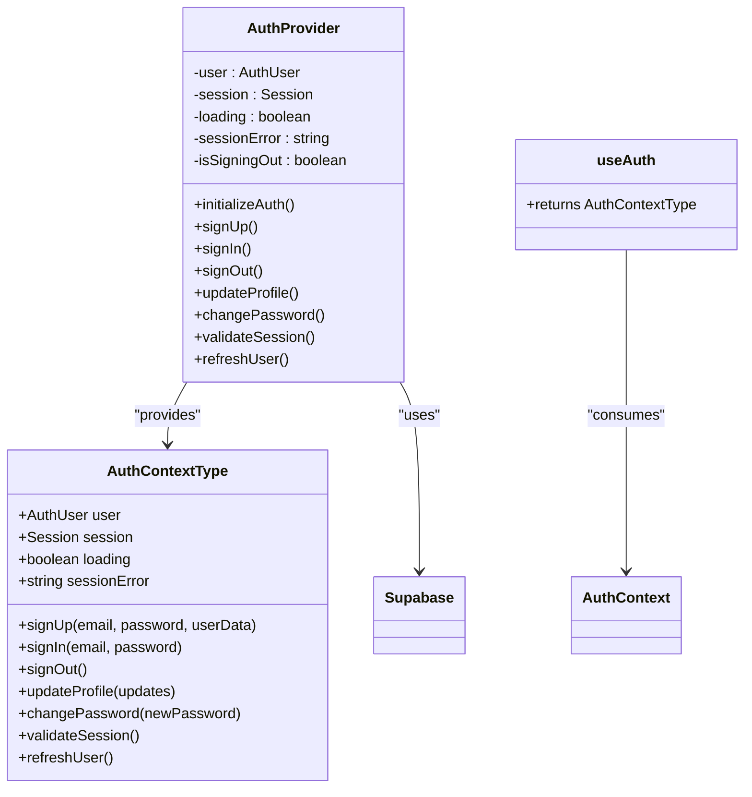
```mermaid
classDiagram
class AuthContextType {
+AuthUser user
+Session session
+boolean loading
+string sessionError
+signUp(email, password, userData)
+signIn(email, password)
+signOut()
+updateProfile(updates)
+changePassword(newPassword)
+validateSession()
+refreshUser()
}
class AuthProvider {
-user : AuthUser
-session : Session
-loading : boolean
-sessionError : string
-isSigningOut : boolean
+initializeAuth()
+signUp()
+signIn()
+signOut()
+updateProfile()
+changePassword()
+validateSession()
+refreshUser()
}
class useAuth {
+returns AuthContextType
}
AuthProvider --> AuthContextType : "provides"
useAuth --> AuthContext : "consumes"
AuthProvider --> Supabase : "uses"
```

**Diagram sources**
- [AuthContext.tsx](file://src\contexts\AuthContext.tsx#L1-L250)

### Company Context
The CompanyContext enables multi-tenancy support by managing the current company context and browse mode functionality for super administrators.

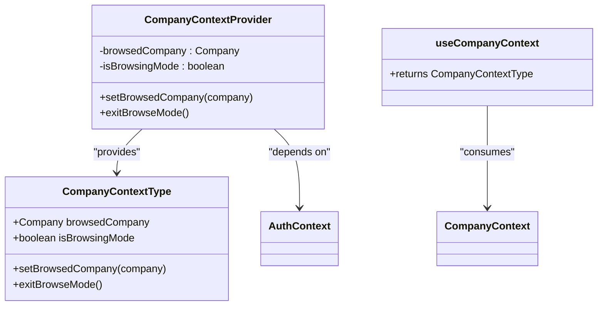
```mermaid
classDiagram
class CompanyContextType {
+Company browsedCompany
+setBrowsedCompany(company)
+boolean isBrowsingMode
+exitBrowseMode()
}
class CompanyContextProvider {
-browsedCompany : Company
-isBrowsingMode : boolean
+setBrowsedCompany(company)
+exitBrowseMode()
}
class useCompanyContext {
+returns CompanyContextType
}
CompanyContextProvider --> CompanyContextType : "provides"
useCompanyContext --> CompanyContext : "consumes"
CompanyContextProvider --> AuthContext : "depends on"
```

**Diagram sources**
- [CompanyContext.tsx](file://src\contexts\CompanyContext.tsx#L1-L81)

### Feature Flags Context
The FeatureFlagsContext implements a comprehensive feature flagging system that supports environment-based overrides, URL parameters, and localStorage persistence.

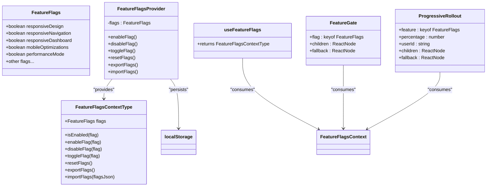
```mermaid
classDiagram
class FeatureFlags {
+boolean responsiveDesign
+boolean responsiveNavigation
+boolean responsiveDashboard
+boolean mobileOptimizations
+boolean performanceMode
+other flags...
}
class FeatureFlagsContextType {
+FeatureFlags flags
+isEnabled(flag)
+enableFlag(flag)
+disableFlag(flag)
+toggleFlag(flag)
+resetFlags()
+exportFlags()
+importFlags(flagsJson)
}
class FeatureFlagsProvider {
-flags : FeatureFlags
+enableFlag()
+disableFlag()
+toggleFlag()
+resetFlags()
+exportFlags()
+importFlags()
}
class useFeatureFlags {
+returns FeatureFlagsContextType
}
class FeatureGate {
+flag : keyof FeatureFlags
+children : ReactNode
+fallback : ReactNode
}
class ProgressiveRollout {
+feature : keyof FeatureFlags
+percentage : number
+userId : string
+children : ReactNode
+fallback : ReactNode
}
FeatureFlagsProvider --> FeatureFlagsContextType : "provides"
useFeatureFlags --> FeatureFlagsContext : "consumes"
FeatureGate --> FeatureFlagsContext : "consumes"
ProgressiveRollout --> FeatureFlagsContext : "consumes"
FeatureFlagsProvider --> localStorage : "persists"
```

**Diagram sources**
- [FeatureFlagsContext.tsx](file://src\contexts\FeatureFlagsContext.tsx#L1-L378)

**Section sources**
- [AuthContext.tsx](file://src\contexts\AuthContext.tsx#L1-L250)
- [CompanyContext.tsx](file://src\contexts\CompanyContext.tsx#L1-L81)
- [FeatureFlagsContext.tsx](file://src\contexts\FeatureFlagsContext.tsx#L1-L378)

## Server State with React Query
The application leverages @tanstack/react-query for efficient server state management, providing caching, background updates, and data synchronization capabilities.

### Query Configuration
React Query is configured at the application root with appropriate stale times and garbage collection settings to balance freshness and performance.

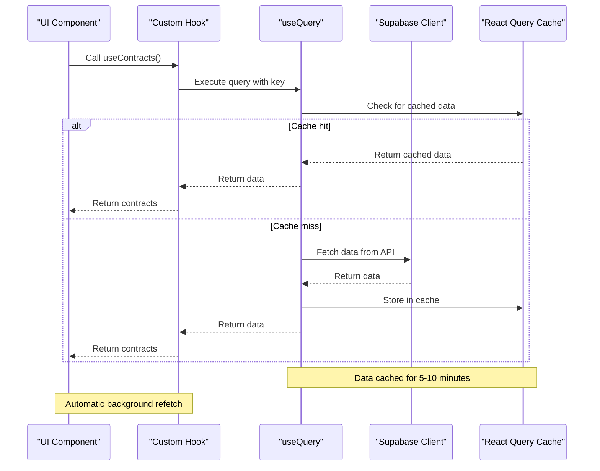
```mermaid
sequenceDiagram
participant Component as "UI Component"
participant Hook as "Custom Hook"
participant Query as "useQuery"
participant Supabase as "Supabase Client"
participant Cache as "React Query Cache"
Component->>Hook : Call useContracts()
Hook->>Query : Execute query with key
Query->>Cache : Check for cached data
alt Cache hit
Cache-->>Query : Return cached data
Query-->>Hook : Return data
Hook-->>Component : Return contracts
else Cache miss
Query->>Supabase : Fetch data from API
Supabase-->>Query : Return data
Query->>Cache : Store in cache
Query-->>Hook : Return data
Hook-->>Component : Return contracts
end
Note over Query,Cache : Data cached for 5-10 minutes
Note over Component,Hook : Automatic background refetch
```

**Diagram sources**
- [useContracts.ts](file://src\hooks\useContracts.ts#L1-L128)
- [useEnhancedCustomersRealtime.ts](file://src\hooks\useEnhancedCustomersRealtime.ts#L1-L174)

### Real-time Data Synchronization
The application implements real-time data synchronization using Supabase's real-time capabilities combined with React Query's cache manipulation methods.

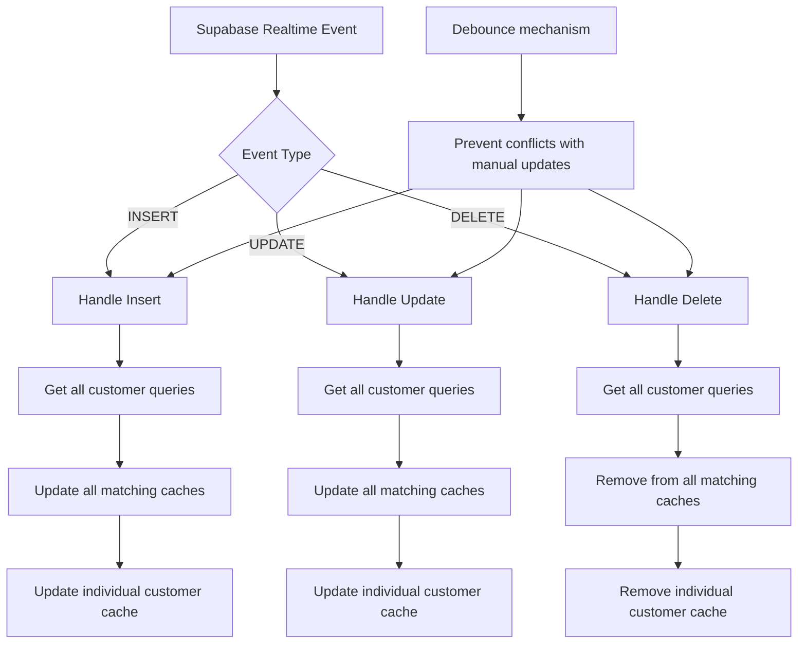
```mermaid
flowchart TD
A[Supabase Realtime Event] --> B{Event Type}
B --> |INSERT| C[Handle Insert]
B --> |UPDATE| D[Handle Update]
B --> |DELETE| E[Handle Delete]
C --> F[Get all customer queries]
F --> G[Update all matching caches]
G --> H[Update individual customer cache]
D --> I[Get all customer queries]
I --> J[Update all matching caches]
J --> K[Update individual customer cache]
E --> L[Get all customer queries]
L --> M[Remove from all matching caches]
M --> N[Remove individual customer cache]
O[Debounce mechanism] --> P[Prevent conflicts with manual updates]
P --> C
P --> D
P --> E
```

**Diagram sources**
- [useEnhancedCustomersRealtime.ts](file://src\hooks\useEnhancedCustomersRealtime.ts#L1-L174)

**Section sources**
- [useContracts.ts](file://src\hooks\useContracts.ts#L1-L128)
- [useEnhancedCustomersRealtime.ts](file://src\hooks\useEnhancedCustomersRealtime.ts#L1-L174)

## Business Logic with Custom Hooks
Custom hooks encapsulate complex business logic and provide reusable stateful behavior across the application.

### Company Context Hook
The useCompany hook retrieves the current company data with appropriate caching and error handling.

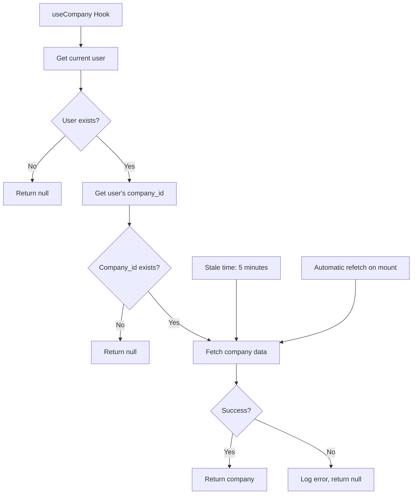
```mermaid
flowchart TD
A[useCompany Hook] --> B[Get current user]
B --> C{User exists?}
C --> |No| D[Return null]
C --> |Yes| E[Get user's company_id]
E --> F{Company_id exists?}
F --> |No| G[Return null]
F --> |Yes| H[Fetch company data]
H --> I{Success?}
I --> |Yes| J[Return company]
I --> |No| K[Log error, return null]
L[Stale time: 5 minutes] --> H
M[Automatic refetch on mount] --> H
```

**Diagram sources**
- [useCompany.ts](file://src\hooks\useCompany.ts#L1-L28)

### Module Configuration Hook
The useModuleConfig hook demonstrates advanced query configuration with conditional caching based on browsing mode.

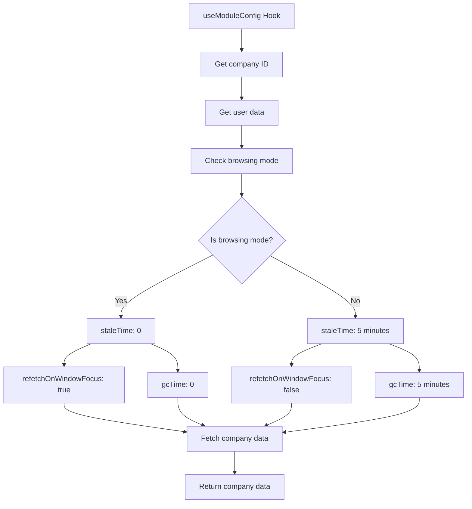
```mermaid
flowchart TD
A[useModuleConfig Hook] --> B[Get company ID]
B --> C[Get user data]
C --> D[Check browsing mode]
D --> E{Is browsing mode?}
E --> |Yes| F[staleTime: 0]
E --> |No| G[staleTime: 5 minutes]
F --> H[refetchOnWindowFocus: true]
G --> I[refetchOnWindowFocus: false]
F --> J[gcTime: 0]
G --> K[gcTime: 5 minutes]
H --> L[Fetch company data]
I --> L
J --> L
K --> L
L --> M[Return company data]
```

**Diagram sources**
- [useModuleConfig.ts](file://src\modules\core\hooks\useModuleConfig.ts#L1-L58)

**Section sources**
- [useCompany.ts](file://src\hooks\useCompany.ts#L1-L28)
- [useModuleConfig.ts](file://src\modules\core\hooks\useModuleConfig.ts#L1-L58)

## Financial Analysis and Fix System
The financial analysis and fix system provides comprehensive tools for analyzing and repairing financial data inconsistencies. This system consists of two main components: financial system analysis and automated financial fixes.

### Financial System Analysis
The useFinancialSystemAnalysis hook performs a comprehensive analysis of the financial system, evaluating multiple metrics and generating actionable insights.

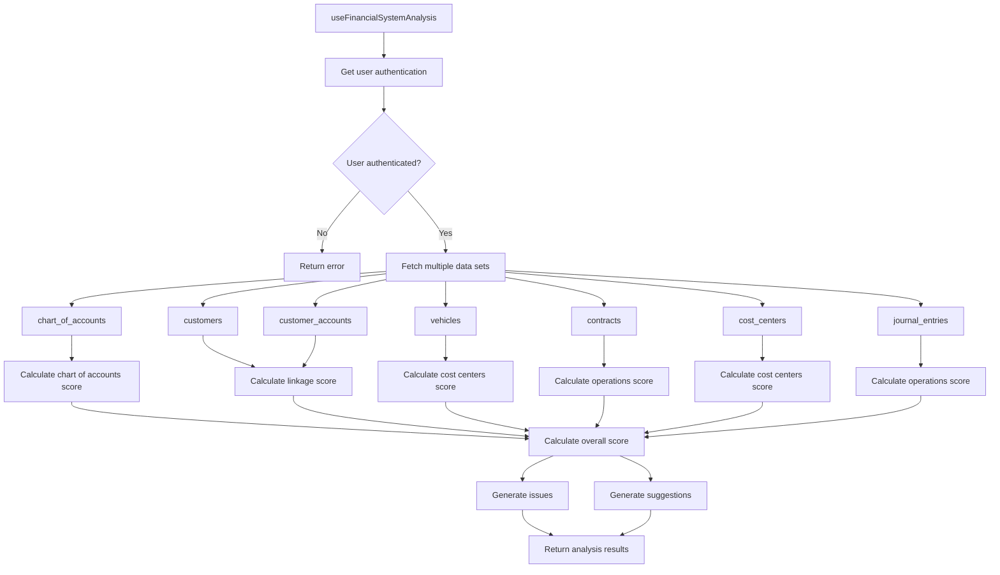
```mermaid
flowchart TD
A[useFinancialSystemAnalysis] --> B[Get user authentication]
B --> C{User authenticated?}
C --> |No| D[Return error]
C --> |Yes| E[Fetch multiple data sets]
E --> F[chart_of_accounts]
E --> G[customers]
E --> H[vehicles]
E --> I[contracts]
E --> J[cost_centers]
E --> K[journal_entries]
E --> L[customer_accounts]
F --> M[Calculate chart of accounts score]
G --> N[Calculate linkage score]
H --> O[Calculate cost centers score]
I --> P[Calculate operations score]
J --> Q[Calculate cost centers score]
K --> R[Calculate operations score]
L --> N
M --> S[Calculate overall score]
N --> S
O --> S
P --> S
Q --> S
R --> S
S --> T[Generate issues]
S --> U[Generate suggestions]
T --> V[Return analysis results]
U --> V
```

**Diagram sources**
- [useFinancialSystemAnalysis.ts](file://src\hooks\useFinancialSystemAnalysis.ts#L49-L154)

### Financial Fixes
The useFinancialFixes hook provides a suite of automated fixes for common financial data issues, including creating default accounts, copying cost centers, and linking unlinked contracts.

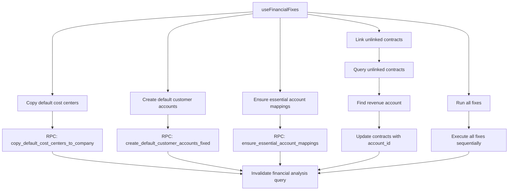
```mermaid
flowchart TD
A[useFinancialFixes] --> B[Copy default cost centers]
A --> C[Create default customer accounts]
A --> D[Ensure essential account mappings]
A --> E[Link unlinked contracts]
A --> F[Run all fixes]
B --> G[RPC: copy_default_cost_centers_to_company]
C --> H[RPC: create_default_customer_accounts_fixed]
D --> I[RPC: ensure_essential_account_mappings]
E --> J[Query unlinked contracts]
J --> K[Find revenue account]
K --> L[Update contracts with account_id]
F --> M[Execute all fixes sequentially]
G --> N[Invalidate financial analysis query]
H --> N
I --> N
L --> N
M --> N
```

**Diagram sources**
- [useFinancialFixes.ts](file://src\hooks\useFinancialFixes.ts#L5-L260)

**Section sources**
- [useFinancialSystemAnalysis.ts](file://src\hooks\useFinancialSystemAnalysis.ts#L49-L154)
- [useFinancialFixes.ts](file://src\hooks\useFinancialFixes.ts#L5-L260)

## Invoice Processing System
The invoice processing system handles both automated invoice matching from scanned documents and bulk invoice generation for payments without invoices.

### Invoice Matching
The useInvoiceMatching hook implements intelligent matching algorithms to connect scanned invoices with existing contracts and customers using multiple matching strategies.

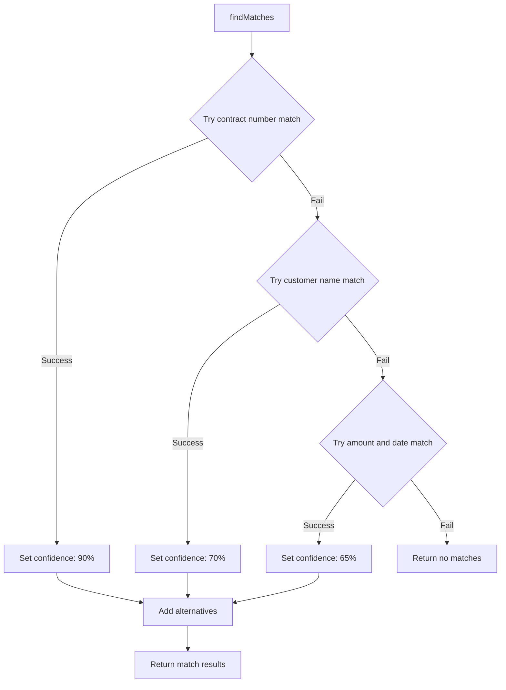
```mermaid
flowchart TD
A[findMatches] --> B{Try contract number match}
B --> |Success| C[Set confidence: 90%]
B --> |Fail| D{Try customer name match}
D --> |Success| E[Set confidence: 70%]
D --> |Fail| F{Try amount and date match}
F --> |Success| G[Set confidence: 65%]
F --> |Fail| H[Return no matches]
C --> I[Add alternatives]
E --> I
G --> I
I --> J[Return match results]
```

**Diagram sources**
- [useInvoiceMatching.ts](file://src\hooks\useInvoiceMatching.ts#L4-L162)

### Bulk Invoice Generation
The useBulkInvoiceGeneration hook provides functionality to generate invoices in bulk for payments that lack corresponding invoices, with comprehensive statistics and progress tracking.

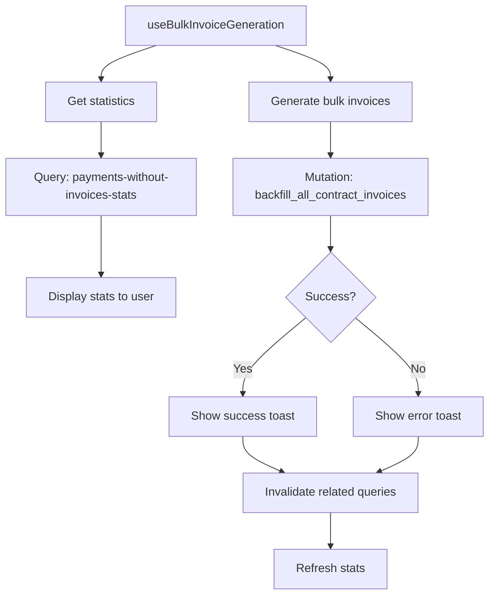
```mermaid
flowchart TD
A[useBulkInvoiceGeneration] --> B[Get statistics]
B --> C[Query: payments-without-invoices-stats]
C --> D[Display stats to user]
A --> E[Generate bulk invoices]
E --> F[Mutation: backfill_all_contract_invoices]
F --> G{Success?}
G --> |Yes| H[Show success toast]
G --> |No| I[Show error toast]
H --> J[Invalidate related queries]
I --> J
J --> K[Refresh stats]
```

**Diagram sources**
- [useBulkInvoiceGeneration.ts](file://src\hooks\useBulkInvoiceGeneration.ts#L29-L115)

**Section sources**
- [useInvoiceMatching.ts](file://src\hooks\useInvoiceMatching.ts#L4-L162)
- [useBulkInvoiceGeneration.ts](file://src\hooks\useBulkInvoiceGeneration.ts#L29-L115)

## State Persistence and Configuration
The state management system includes comprehensive configuration options for state persistence and synchronization.

### Feature Flag Persistence
Feature flags are persisted across sessions using localStorage with environment-based overrides.

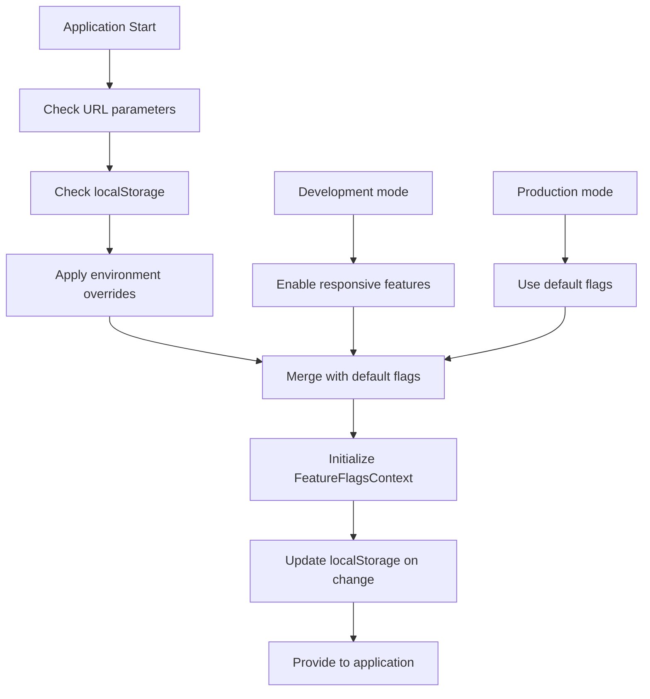
```mermaid
flowchart TD
A[Application Start] --> B[Check URL parameters]
B --> C[Check localStorage]
C --> D[Apply environment overrides]
D --> E[Merge with default flags]
E --> F[Initialize FeatureFlagsContext]
F --> G[Update localStorage on change]
G --> H[Provide to application]
I[Development mode] --> J[Enable responsive features]
J --> E
K[Production mode] --> L[Use default flags]
L --> E
```

**Diagram sources**
- [FeatureFlagsContext.tsx](file://src\contexts\FeatureFlagsContext.tsx#L1-L378)

### Query Cache Configuration
React Query is configured with appropriate stale times and garbage collection settings to balance data freshness and performance.

| Query Type | staleTime | gcTime | Refetch Behavior |
|------------|-----------|--------|------------------|
| Customer Data | 5 minutes | 10 minutes | On window focus |
| Active Contracts | 3 minutes | 10 minutes | Manual trigger |
| Company Data | 5 minutes | 10 minutes | On mount |
| Browse Mode | 0 (real-time) | 0 | On window focus |

**Diagram sources**
- [useContracts.ts](file://src\hooks\useContracts.ts#L1-L128)
- [useModuleConfig.ts](file://src\modules\core\hooks\useModuleConfig.ts#L1-L58)

**Section sources**
- [FeatureFlagsContext.tsx](file://src\contexts\FeatureFlagsContext.tsx#L1-L378)
- [useContracts.ts](file://src\hooks\useContracts.ts#L1-L128)
- [useModuleConfig.ts](file://src\modules\core\hooks\useModuleConfig.ts#L1-L58)

## Common State Consistency Issues and Solutions
The application addresses common state consistency challenges through various strategies.

### Race Condition Prevention
Real-time updates are debounced to prevent conflicts with manual updates.

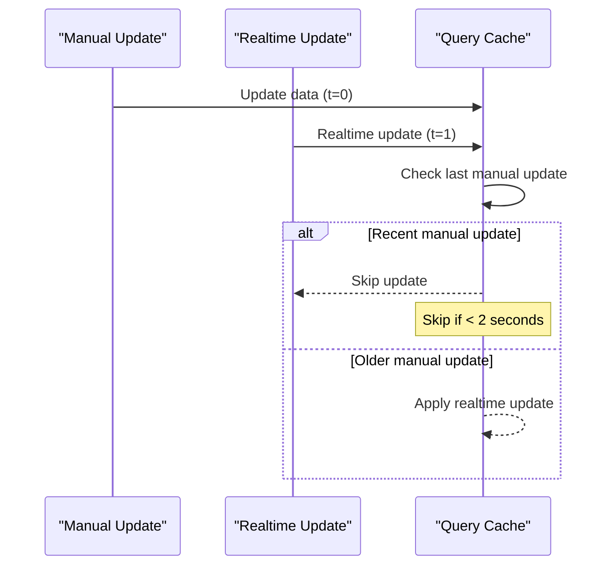
```mermaid
sequenceDiagram
participant Manual as "Manual Update"
participant Realtime as "Realtime Update"
participant Cache as "Query Cache"
Manual->>Cache : Update data (t=0)
Realtime->>Cache : Realtime update (t=1)
Cache->>Cache : Check last manual update
alt Recent manual update
Cache-->>Realtime : Skip update
Note over Cache : Skip if < 2 seconds
else Older manual update
Cache-->>Cache : Apply realtime update
end
```

**Diagram sources**
- [useEnhancedCustomersRealtime.ts](file://src\hooks\useEnhancedCustomersRealtime.ts#L1-L174)

### Authentication State Synchronization
The authentication context ensures state synchronization between Supabase and React state.

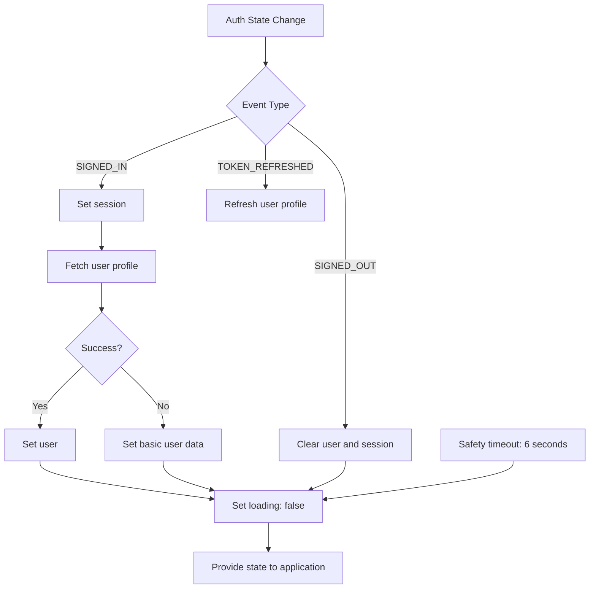
```mermaid
flowchart TD
A[Auth State Change] --> B{Event Type}
B --> |SIGNED_IN| C[Set session]
B --> |TOKEN_REFRESHED| D[Refresh user profile]
B --> |SIGNED_OUT| E[Clear user and session]
C --> F[Fetch user profile]
F --> G{Success?}
G --> |Yes| H[Set user]
G --> |No| I[Set basic user data]
H --> J[Set loading: false]
I --> J
E --> J
K[Safety timeout: 6 seconds] --> J
J --> L[Provide state to application]
```

**Diagram sources**
- [AuthContext.tsx](file://src\contexts\AuthContext.tsx#L1-L250)

**Section sources**
- [AuthContext.tsx](file://src\contexts\AuthContext.tsx#L1-L250)
- [useEnhancedCustomersRealtime.ts](file://src\hooks\useEnhancedCustomersRealtime.ts#L1-L174)

## Conclusion
The FleetifyApp state management system effectively combines React Context, React Query, and custom hooks to create a robust, scalable solution for managing application state. The three-tiered architecture provides clear separation of concerns while enabling seamless integration between global state, server state, and business logic. Key strengths include real-time data synchronization, comprehensive feature flagging, and thoughtful caching strategies that balance performance and data freshness. The system demonstrates best practices in state management, providing a solid foundation for the application's complex requirements.