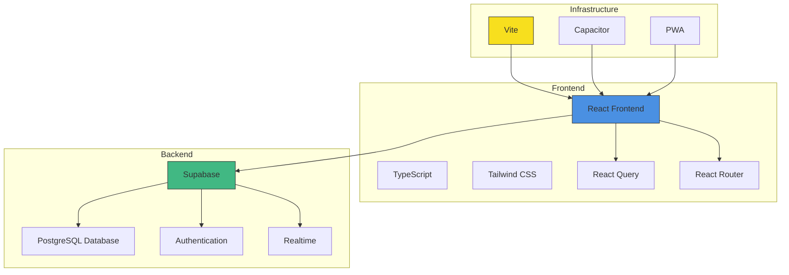
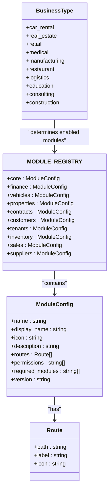
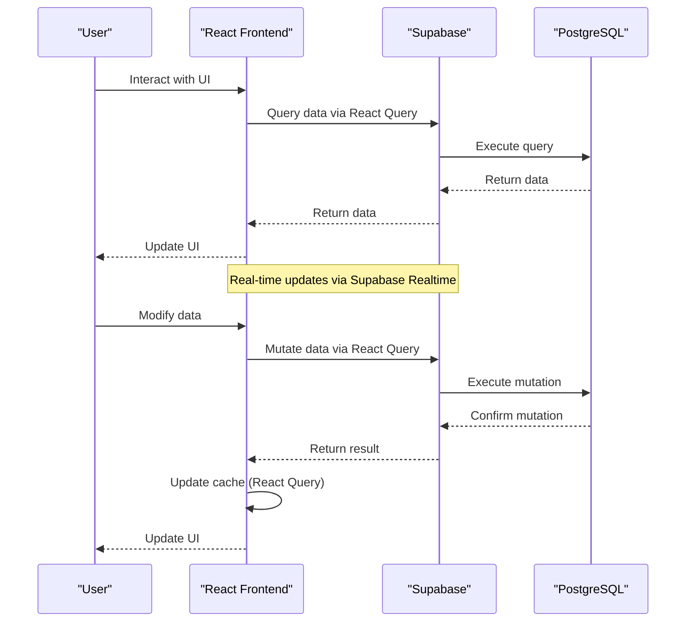

# System Overview

<cite>
**Referenced Files in This Document**   
- [App.tsx](file://src/App.tsx)
- [main.tsx](file://src/main.tsx)
- [moduleRegistry.ts](file://src/modules/moduleRegistry.ts)
- [client.ts](file://src/integrations/supabase/client.ts)
- [vite.config.ts](file://vite.config.ts)
- [tailwind.config.ts](file://tailwind.config.ts)
</cite>

## Table of Contents
1. [Introduction](#introduction)
2. [Architecture Overview](#architecture-overview)
3. [Core Components](#core-components)
4. [Module System and Business Types](#module-system-and-business-types)
5. [Authentication and Multi-Tenancy](#authentication-and-multi-tenancy)
6. [Frontend and Backend Integration](#frontend-and-backend-integration)
7. [Configuration and Styling](#configuration-and-styling)
8. [User Workflow Examples](#user-workflow-examples)
9. [Technical Implementation Details](#technical-implementation-details)

## Introduction
FleetifyApp is an enterprise management platform designed to streamline operations across multiple business domains including fleet, finance, HR, property, and contract management. The system provides a modular, component-based architecture that supports various business types such as car rental, real estate, retail, medical, and construction. Built with modern web technologies, FleetifyApp offers a responsive user interface with deep integration between frontend and backend systems. The platform supports multi-tenancy, role-based access control, and real-time data synchronization through React Query and Supabase.

**Section sources**
- [App.tsx](file://src/App.tsx#L1-L50)
- [main.tsx](file://src/main.tsx#L1-L10)

## Architecture Overview
FleetifyApp follows a modular component-based architecture with clear separation of concerns. The system is built on a React frontend with TypeScript, leveraging React Router for navigation and React Query for state management and data fetching. The backend is powered by Supabase, providing authentication, database, and real-time capabilities. The application uses a layered approach with components organized by feature and functionality, enabling maintainability and scalability.

**Diagram sources**
- [App.tsx](file://src/App.tsx#L1-L50)
- [client.ts](file://src/integrations/supabase/client.ts#L1-L16)

## Core Components
The core components of FleetifyApp include the main application shell, routing system, state management, and context providers. The application is initialized in main.tsx and rendered through App.tsx, which sets up essential providers including AuthContext, CompanyContext, ThemeProvider, and QueryClientProvider. The system uses ErrorBoundary for error handling and includes performance monitoring capabilities. The layout system supports multiple dashboard types including ResponsiveDashboardLayout, DashboardLayout, and SuperAdminLayout for different user roles and access levels.

**Section sources**
- [App.tsx](file://src/App.tsx#L1-L420)
- [main.tsx](file://src/main.tsx#L1-L10)

## Module System and Business Types
FleetifyApp implements a flexible module system centered around the MODULE_REGISTRY, which defines all available modules and their configurations. Each module has a name, display name, icon, description, routes, permissions, and version. The system supports business type-specific configurations through BUSINESS_TYPE_MODULES, which maps business types to their required modules. This enables tailored experiences for different industries including car rental, real estate, retail, medical, manufacturing, restaurant, logistics, education, consulting, and construction.

**Diagram sources**
- [moduleRegistry.ts](file://src/modules/moduleRegistry.ts#L1-L277)

## Authentication and Multi-Tenancy
FleetifyApp implements a robust authentication system using Supabase Auth with multi-tenancy support. The system uses AuthContext to manage user sessions and permissions across different companies and roles. Multi-tenancy is achieved through CompanyContext, which tracks the current company and user permissions within that context. The platform supports different user roles including regular users, admin users, and super admin users, each with distinct access levels and capabilities. Route protection is implemented through ProtectedRoute, AdminRoute, and SuperAdminRoute components that enforce access control based on user permissions.

**Section sources**
- [App.tsx](file://src/App.tsx#L1-L420)
- [client.ts](file://src/integrations/supabase/client.ts#L1-L16)

## Frontend and Backend Integration
The integration between frontend and backend in FleetifyApp is facilitated through Supabase client, which provides a type-safe interface to the PostgreSQL database. React Query is used extensively for data fetching, caching, and synchronization, enabling real-time updates and offline capabilities. The system uses environment variables to configure the Supabase connection, with the client initialized in src/integrations/supabase/client.ts. Data operations are performed through Supabase's query API, with React Query handling caching, deduplication, and background updates.

**Diagram sources**
- [client.ts](file://src/integrations/supabase/client.ts#L1-L16)
- [App.tsx](file://src/App.tsx#L1-L420)

## Configuration and Styling
FleetifyApp uses Vite as its build tool with configuration in vite.config.ts, which includes settings for development server, plugins, resolution aliases, and build optimization. The styling system is based on Tailwind CSS with extensive customization in tailwind.config.ts, including theme extensions for colors, spacing, typography, and animations. The configuration supports responsive design with breakpoints for various device sizes and includes mobile-specific optimizations for touch targets and safe areas. The system uses CSS variables for theming, enabling dark mode support through next-themes.

**Section sources**
- [vite.config.ts](file://vite.config.ts#L1-L49)
- [tailwind.config.ts](file://tailwind.config.ts#L1-L298)

## User Workflow Examples
Common user workflows in FleetifyApp follow a consistent pattern: login → dashboard → module navigation. After authentication, users are directed to their dashboard which provides an overview of key metrics and recent activities. From the dashboard, users can navigate to specific modules based on their permissions and business needs. For example, in a car rental business, a user might navigate from the dashboard to the vehicles module to manage the fleet, then to the contracts module to create rental agreements. In a real estate business, a user might navigate from the dashboard to the properties module to view property details, then to the tenants module to manage lease agreements.

**Section sources**
- [App.tsx](file://src/App.tsx#L1-L420)

## Technical Implementation Details
FleetifyApp implements several key technical patterns and practices. The module system uses dynamic imports and lazy loading to optimize performance, with modules registered in MODULE_REGISTRY and enabled based on business type. The system uses React Query for data management, providing features like caching, background updates, and automatic refetching. Form handling is implemented with react-hook-form for optimal performance. The application supports PWA capabilities through service workers and manifest.json. Mobile support is provided through Capacitor, enabling native mobile app generation. The codebase follows TypeScript best practices with comprehensive type definitions in the types directory.

**Section sources**
- [App.tsx](file://src/App.tsx#L1-L420)
- [moduleRegistry.ts](file://src/modules/moduleRegistry.ts#L1-L277)
- [client.ts](file://src/integrations/supabase/client.ts#L1-L16)