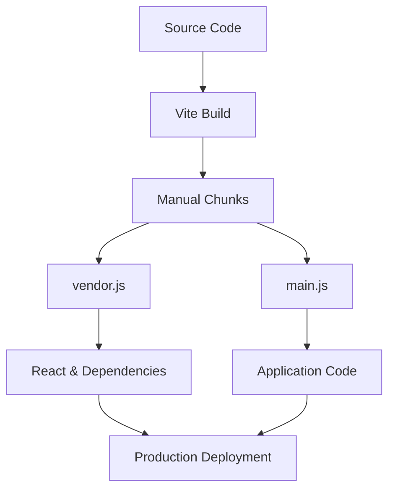
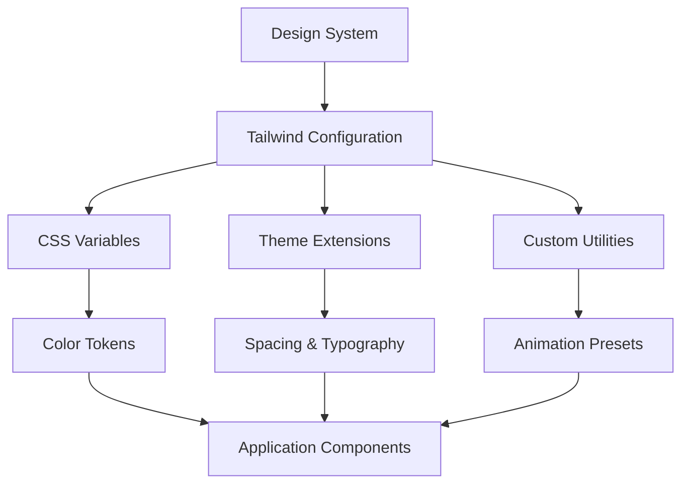
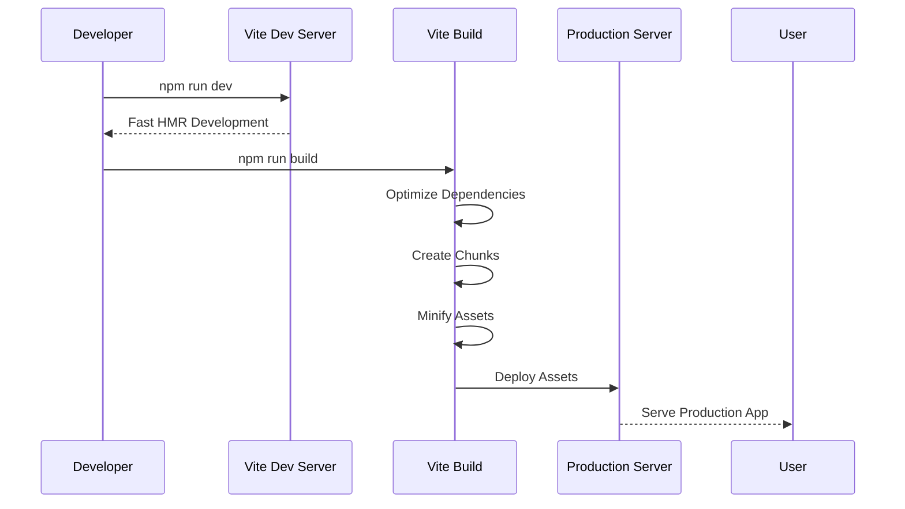

# Technology Stack & Dependencies

<cite>
**Referenced Files in This Document**   
- [package.json](file://package.json)
- [vite.config.ts](file://vite.config.ts)
- [tailwind.config.ts](file://tailwind.config.ts)
- [src/integrations/supabase/client.ts](file://src/integrations/supabase/client.ts)
- [src/hooks/useAISystemMonitor.ts](file://src/hooks/useAISystemMonitor.ts)
</cite>

## Table of Contents
1. [Introduction](#introduction)
2. [Core Technology Stack](#core-technology-stack)
3. [Dependency Management](#dependency-management)
4. [Build Tool Configuration](#build-tool-configuration)
5. [Styling System Configuration](#styling-system-configuration)
6. [Technology Integration Workflow](#technology-integration-workflow)
7. [Performance Optimization](#performance-optimization)
8. [Common Issues and Solutions](#common-issues-and-solutions)

## Introduction
This document provides a comprehensive overview of the technology stack used in FleetifyApp, a modern web application designed for fleet and contract management. The application leverages a carefully selected set of technologies to ensure type safety, efficient development workflows, responsive user interfaces, and robust backend integration. This documentation details the implementation and configuration of each core technology, their interrelationships, and practical usage patterns within the application.

## Core Technology Stack

### React for UI Components
React serves as the foundation for the user interface in FleetifyApp, enabling the creation of reusable, component-based UI elements. The application extensively uses React's component model to build a modular and maintainable interface, with components organized in the `src/components` directory. React's declarative approach allows developers to create complex UIs from simple building blocks, with state management handled through React hooks and context APIs.

**Section sources**
- [src/components](file://src/components)

### TypeScript for Type Safety
TypeScript is integrated throughout the codebase to provide static type checking and enhanced developer experience. The application uses TypeScript interfaces and types to define data structures, API responses, and component props, reducing runtime errors and improving code maintainability. Type definitions are organized in the `src/types` directory and within individual component files, with comprehensive type safety enforced through the `tsconfig.json` configuration.

**Section sources**
- [tsconfig.json](file://tsconfig.json)
- [src/types](file://src/types)

### Vite for Build Tooling
Vite is used as the build tool and development server, providing fast development server startup and instant hot module replacement (HMR). The Vite configuration is optimized for the application's needs, with specific settings for development and production environments. Vite's modern tooling approach leverages native ES modules, resulting in significantly faster build times compared to traditional bundlers.

**Section sources**
- [vite.config.ts](file://vite.config.ts)

### Supabase for Backend Services
Supabase provides the backend services for FleetifyApp, offering a PostgreSQL database, authentication, and real-time capabilities. The application connects to Supabase through the `@supabase/supabase-js` client library, with the connection configured in `src/integrations/supabase/client.ts`. Supabase enables the application to handle user authentication, data persistence, and real-time updates without requiring a custom backend server.

**Section sources**
- [src/integrations/supabase/client.ts](file://src/integrations/supabase/client.ts)
- [package.json](file://package.json#L50)

### Tailwind CSS for Styling
Tailwind CSS is used as the utility-first CSS framework for styling the application. The configuration extends Tailwind's default theme with custom colors, spacing, breakpoints, and animations tailored to the application's design system. The styling approach enables rapid UI development with consistent design tokens and responsive behavior across different device sizes.

**Section sources**
- [tailwind.config.ts](file://tailwind.config.ts)

## Dependency Management

### Core Dependencies in package.json
The `package.json` file defines the application's dependencies, with a focus on modern, well-maintained libraries that support the application's requirements. Key dependencies include:

- `@supabase/supabase-js`: For connecting to the Supabase backend
- `@tanstack/react-query`: For data fetching and state management
- `react-router-dom`: For client-side routing
- `openai`: For AI capabilities and integrations

```mermaid
graph TD
A[Frontend Application] --> B[@supabase/supabase-js]
A --> C[@tanstack/react-query]
A --> D[react-router-dom]
A --> E[openai]
B --> F[Supabase Backend]
C --> G[Data Caching]
D --> H[Client-Side Routing]
E --> I[AI Capabilities]
```

**Diagram sources**
- [package.json](file://package.json)
- [src/integrations/supabase/client.ts](file://src/integrations/supabase/client.ts)

### Data Fetching with @tanstack/react-query
The application uses @tanstack/react-query for data fetching, caching, and synchronization. This library provides a robust solution for managing server state, with features like automatic caching, background refetching, and pagination. The query client is configured to work seamlessly with the Supabase integration, enabling efficient data retrieval and mutation operations.

**Section sources**
- [package.json](file://package.json#L51)
- [src/hooks](file://src/hooks)

### Routing with react-router-dom
Client-side routing is implemented using react-router-dom, enabling navigation between different views without full page reloads. The routing configuration supports nested routes, route guards, and dynamic parameters, providing a seamless user experience. The application structure in the `src/pages` directory aligns with the routing hierarchy.

**Section sources**
- [package.json](file://package.json#L52)
- [src/pages](file://src/pages)

### AI Capabilities with openai
The openai package enables AI-powered features within the application, such as intelligent suggestions, natural language processing, and automated content generation. The integration allows the application to leverage OpenAI's models for enhancing user productivity and providing advanced analytics capabilities.

**Section sources**
- [package.json](file://package.json#L53)
- [src/hooks/useAISystemMonitor.ts](file://src/hooks/useAISystemMonitor.ts)

## Build Tool Configuration

### Vite Configuration Options
The Vite configuration in `vite.config.ts` is customized to optimize the development and production experience. Key configuration options include:

- **Server settings**: Configured to host on all network interfaces with a specific port
- **Plugins**: React plugin and development-only component tagger
- **Alias resolution**: Path alias for easier imports
- **Dependency optimization**: Explicit inclusion of critical dependencies

```typescript
// Example from vite.config.ts
export default defineConfig(({ mode }) => ({
  server: {
    host: "::",
    port: 8080,
  },
  plugins: [
    react(),
    mode === 'development' && componentTagger(),
  ].filter(Boolean),
  resolve: {
    alias: {
      '@': path.resolve(__dirname, './src'),
    },
  },
  // ... additional configuration
}));
```

**Section sources**
- [vite.config.ts](file://vite.config.ts)

### Development Server Configuration
The development server is configured for optimal developer experience with specific settings:

- **Host**: Set to "::" to accept connections from all network interfaces
- **Port**: Fixed at 8080 for consistency across development environments
- **Conditional plugins**: Development-only plugins are enabled based on the mode

These settings ensure that the development server is accessible and performs optimally during development.

**Section sources**
- [vite.config.ts](file://vite.config.ts#L4-L10)

### Production Build Optimization
The build configuration includes optimizations for production deployment:

- **Target**: ES2020 for modern browser compatibility
- **Manual chunks**: Vendor chunking to separate React and dependencies
- **Dependency optimization**: Forced optimization with specific inclusion

These optimizations improve load performance by creating efficient bundle splits and leveraging browser caching.



**Diagram sources**
- [vite.config.ts](file://vite.config.ts#L40-L47)

## Styling System Configuration

### Tailwind CSS Configuration
The Tailwind configuration in `tailwind.config.ts` extends the default theme with custom design tokens and responsive breakpoints. The configuration includes:

- **Custom colors**: Theme colors using CSS variables
- **Extended breakpoints**: Mobile, tablet, and desktop sizes
- **Custom spacing**: Touch-friendly sizes and safe area insets
- **Animations**: Custom keyframes and animation presets

```typescript
// Example from tailwind.config.ts
export default {
  darkMode: ["class"],
  content: [
    "./pages/**/*.{ts,tsx}",
    "./components/**/*.{ts,tsx}",
    "./app/**/*.{ts,tsx}",
    "./src/**/*.{ts,tsx}",
  ],
  theme: {
    extend: {
      colors: {
        primary: {
          DEFAULT: 'hsl(var(--primary))',
          foreground: 'hsl(var(--primary-foreground))'
        },
        // ... additional color definitions
      },
      // ... additional theme extensions
    }
  },
  plugins: [require("tailwindcss-animate")],
}
```

**Section sources**
- [tailwind.config.ts](file://tailwind.config.ts)

### Responsive Design Implementation
The application implements a comprehensive responsive design system with breakpoints tailored to different device categories:

- **Mobile**: Specific breakpoints for common smartphone sizes
- **Tablet**: Breakpoints for iPad and similar devices
- **Desktop**: Standard desktop screen sizes

The configuration also includes mobile-specific spacing values that account for safe areas and navigation elements, ensuring optimal touch target sizes and layout on mobile devices.

**Section sources**
- [tailwind.config.ts](file://tailwind.config.ts#L20-L35)

### Design System Integration
The Tailwind configuration integrates with the application's design system by:

- Using CSS variables for theme colors
- Defining consistent spacing and sizing scales
- Implementing custom animations and transitions
- Supporting dark mode through the "class" strategy

This approach ensures visual consistency across the application while allowing for theme customization and user preferences.



**Diagram sources**
- [tailwind.config.ts](file://tailwind.config.ts)

## Technology Integration Workflow

### Development Workflow
The development workflow in FleetifyApp integrates the various technologies into a cohesive process:

1. **Component development**: Using React and TypeScript for type-safe UI components
2. **Styling**: Applying Tailwind utility classes for rapid styling
3. **Data integration**: Connecting to Supabase using the client library
4. **State management**: Using React Query for server state and React hooks for client state
5. **Routing**: Implementing navigation with react-router-dom

This workflow enables rapid development with strong type safety and efficient data handling.

**Section sources**
- [src/components](file://src/components)
- [src/hooks](file://src/hooks)
- [src/pages](file://src/pages)

### Build and Deployment Process
The build process leverages Vite's optimized tooling to create production-ready assets:



**Diagram sources**
- [vite.config.ts](file://vite.config.ts)
- [package.json](file://package.json#L5-L8)

## Performance Optimization

### Bundle Optimization
The application implements several bundle optimization strategies:

- **Code splitting**: Manual chunks for vendor libraries
- **Dependency optimization**: Pre-bundling critical dependencies
- **Tree shaking**: ES modules enable dead code elimination
- **Minification**: Production builds are minified

The Vite configuration specifically optimizes the inclusion of React, React DOM, and Supabase client to improve initial load performance.

**Section sources**
- [vite.config.ts](file://vite.config.ts#L30-L39)

### Development Performance
Development performance is optimized through:

- **Native ES modules**: No bundling required during development
- **Instant HMR**: Changes are reflected immediately
- **Pre-bundled dependencies**: Common dependencies are pre-bundled

These features result in a fast and responsive development experience, with near-instant feedback for code changes.

**Section sources**
- [vite.config.ts](file://vite.config.ts)

## Common Issues and Solutions

### Version Compatibility
Version compatibility issues are managed through:

- **Specific version ranges**: Dependencies use caret ranges for minor updates
- **Lock file**: package-lock.json ensures consistent installations
- **Regular updates**: Dependencies are updated to maintain compatibility

When compatibility issues arise, the team follows a process of testing updates in isolated environments before deployment.

**Section sources**
- [package.json](file://package.json)
- [package-lock.json](file://package-lock.json)

### Configuration Conflicts
Configuration conflicts between tools are resolved by:

- **Standardized configuration**: Clear separation of concerns
- **Documentation**: Configuration options are well-documented
- **Testing**: Configuration changes are tested across environments

The integration between Vite, TypeScript, and Tailwind is particularly important, with configuration files working together to provide a seamless development experience.

**Section sources**
- [vite.config.ts](file://vite.config.ts)
- [tailwind.config.ts](file://tailwind.config.ts)
- [tsconfig.json](file://tsconfig.json)