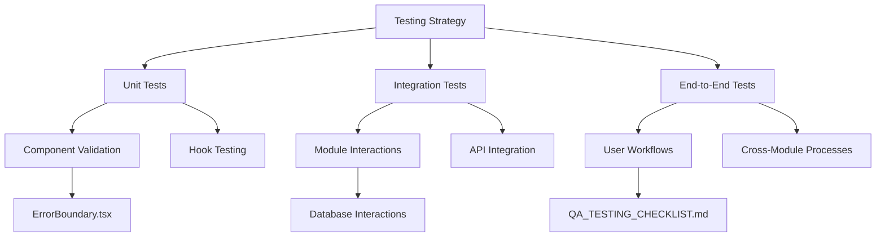
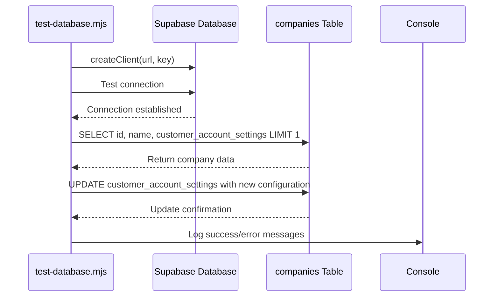
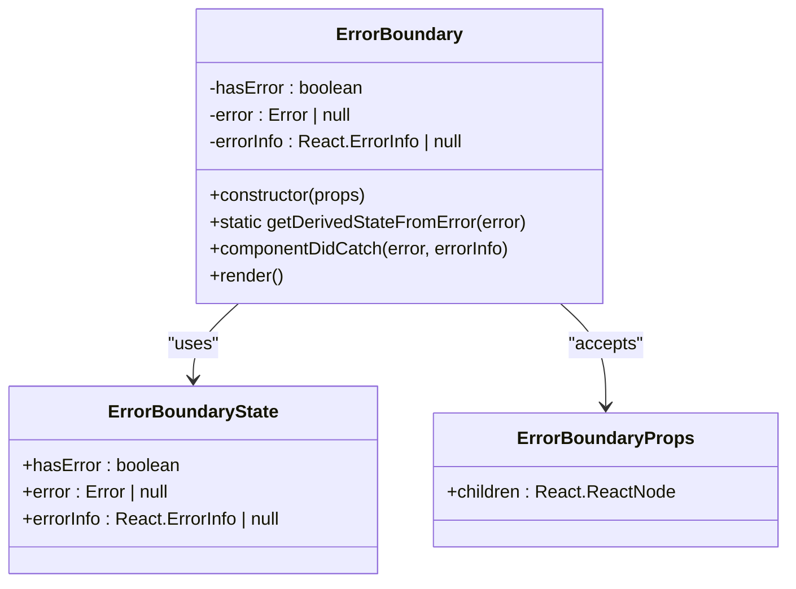

# Testing Strategy

<cite>
**Referenced Files in This Document**   
- [QA_TESTING_CHECKLIST.md](file://QA_TESTING_CHECKLIST.md)
- [test-database.mjs](file://test-database.mjs)
- [ErrorBoundary.tsx](file://src/components/ErrorBoundary.tsx)
- [responsiveTesting.ts](file://src/utils/responsiveTesting.ts)
</cite>

## Table of Contents
1. [Introduction](#introduction)
2. [Testing Coverage Architecture](#testing-coverage-architecture)
3. [Manual QA Processes](#manual-qa-processes)
4. [Database Testing Implementation](#database-testing-implementation)
5. [Error Boundary Handling](#error-boundary-handling)
6. [Testing Configuration and Execution](#testing-configuration-and-execution)
7. [Common Testing Issues and Solutions](#common-testing-issues-and-solutions)
8. [Conclusion](#conclusion)

## Introduction
The testing strategy for FleetifyApp ensures the reliability and quality of the enterprise management platform through a comprehensive approach that combines manual QA processes, automated database validation, and robust error handling mechanisms. This document details the implementation of the testing framework across unit, integration, and end-to-end tests, explaining how testing practices integrate with development workflows. The strategy encompasses both conceptual overviews for beginners and technical details for experienced developers, providing practical examples from the codebase to illustrate testing patterns and best practices.

## Testing Coverage Architecture
FleetifyApp implements a multi-layered testing architecture that ensures comprehensive coverage across different testing types. The framework includes unit tests for individual components, integration tests for component interactions, and end-to-end tests for complete user workflows. This layered approach validates functionality at multiple levels, from isolated functions to complete system behavior. The testing coverage is designed to catch issues early in the development cycle while ensuring that the final product meets quality standards across all enterprise management modules including fleet, finance, HR, and contracts.

**Diagram sources**
- [ErrorBoundary.tsx](file://src/components/ErrorBoundary.tsx)
- [QA_TESTING_CHECKLIST.md](file://QA_TESTING_CHECKLIST.md)

**Section sources**
- [QA_TESTING_CHECKLIST.md](file://QA_TESTING_CHECKLIST.md)
- [test-database.mjs](file://test-database.mjs)
- [ErrorBoundary.tsx](file://src/components/ErrorBoundary.tsx)

## Manual QA Processes
The manual QA processes in FleetifyApp are systematically documented in the QA_TESTING_CHECKLIST.md file, which provides a comprehensive framework for quality assurance across all platform features. The checklist implements a matrix-based approach that covers device compatibility, browser support, layout validation, interaction testing, performance metrics, accessibility standards, and error handling scenarios.

The device testing matrix includes comprehensive coverage of mobile devices (iPhone SE, iPhone 14 series, Samsung Galaxy S23, Google Pixel 7), tablets (iPad series, Samsung Galaxy Tab, Surface Pro), and desktop configurations (MacBook series, Windows Desktop, 4K displays). For each device category, specific layout requirements are defined, such as single-column statistics for mobile dashboards, 2×2 grid layouts for tablets, and comprehensive 4×1 or 3×2 arrangements for desktop views.

Browser compatibility testing ensures functionality across Chrome, Firefox, Safari, and Edge (including their latest two versions), with specific attention to mobile browsers like Safari iOS, Chrome Mobile, Samsung Internet, and Firefox Mobile. The checklist verifies critical performance metrics including page load times (under 2 seconds for homepages), memory usage (under 100MB on mobile), and Core Web Vitals compliance (FCP under 1.8 seconds, LCP under 2.5 seconds, CLS under 0.1).

Accessibility testing follows WCAG standards, validating screen reader compatibility with NVDA, JAWS, VoiceOver, TalkBack, and ORCA, while ensuring sufficient color contrast, text scalability up to 200%, and touch targets of at least 44×44 pixels. The testing process also includes network condition simulations for 3G, 4G, and WiFi connections, with verification of progressive loading and offline error handling.

**Section sources**
- [QA_TESTING_CHECKLIST.md](file://QA_TESTING_CHECKLIST.md)

## Database Testing Implementation
The database testing implementation in FleetifyApp is centered around the test-database.mjs script, which validates the Supabase database connection and tests critical data operations. The script establishes a connection to the Supabase database using environment variables for the URL and API key, then performs comprehensive validation of database schema and functionality.

The testing process begins with verifying the existence of the companies table by executing a SELECT query to retrieve company records with their customer account settings. Upon successful retrieval, the script demonstrates data modification capabilities by updating the customer_account_settings for a company, enabling features such as auto_create_account, enable_account_selection, and configuring account naming patterns and grouping.

**Diagram sources**
- [test-database.mjs](file://test-database.mjs)

The implementation includes robust error handling that logs detailed failure information when database operations encounter issues, providing clear feedback on connection problems, query failures, or permission errors. The script's output uses emoji indicators (🔍 for testing, ✅ for success, ❌ for errors) to provide immediate visual feedback on test status, making it easy to identify successful operations and troubleshoot failures.

**Section sources**
- [test-database.mjs](file://test-database.mjs)

## Error Boundary Handling
Error boundary handling in FleetifyApp is implemented through the ErrorBoundary.tsx component, which provides a robust mechanism for catching and managing JavaScript errors in the React component tree. This component acts as a safety net that prevents application crashes by gracefully handling errors that occur during rendering, in lifecycle methods, or in constructors of child components.

The ErrorBoundary class extends React.Component and maintains state to track error conditions, storing the error object and error information when exceptions occur. It implements the static getDerivedStateFromError method to update component state when an error is caught, and the componentDidCatch lifecycle method to log error details to the console for debugging purposes.

**Diagram sources**
- [ErrorBoundary.tsx](file://src/components/ErrorBoundary.tsx)

The component's render method displays a user-friendly error message when an error occurs, with special handling for React hook errors that might indicate environment issues. The error display includes a collapsible details section showing the error message, stack trace, and component stack for developers, while providing end-users with recovery options including page reload, data clearing with reload, and attempt to continue without reloading.

The implementation includes three recovery buttons that allow users to choose their preferred recovery strategy: "Reload Page" performs a standard page refresh, "Clear Data and Reload" clears localStorage and sessionStorage before reloading, and "Attempt to Continue" resets the error boundary state to attempt continued operation without a full reload. This multi-option approach accommodates different error scenarios and user preferences.

**Section sources**
- [ErrorBoundary.tsx](file://src/components/ErrorBoundary.tsx)

## Testing Configuration and Execution
The testing configuration and execution in FleetifyApp integrates multiple testing approaches through standardized processes and tools. The responsiveTesting.ts utility provides a comprehensive framework for responsive design testing, defining device configurations for various mobile, tablet, and desktop devices with specific viewport dimensions, user agents, and interaction capabilities.

The testing framework includes predefined test criteria for layout validation (no horizontal scroll, no overflowing elements, proper spacing), performance metrics (maximum load time, render time, and memory usage), accessibility requirements (contrast ratio, keyboard navigation, screen reader support), and functionality validation (working interactions, form submission, navigation accessibility). These criteria are used by the ResponsiveTester class to systematically evaluate application behavior across different devices and screen sizes.

Test execution follows a structured process where the ResponsiveTester class can test individual devices or run comprehensive tests across all configured devices. The testDevice method simulates device viewports, navigates to specified routes, and executes layout, performance, accessibility, and functionality tests before capturing screenshots and generating detailed reports. The testAllDevices method automates testing across the complete device matrix with appropriate delays between tests to ensure reliable results.

The framework generates comprehensive test reports that include generation timestamp, total tests, passed tests, failed tests, and success rate percentage. For each device, the report details test status, duration, and failed criteria, providing actionable insights for developers. The testing process is designed to be extensible, allowing teams to add custom test criteria and device configurations as needed.

**Section sources**
- [responsiveTesting.ts](file://src/utils/responsiveTesting.ts)
- [QA_TESTING_CHECKLIST.md](file://QA_TESTING_CHECKLIST.md)
- [test-database.mjs](file://test-database.mjs)

## Common Testing Issues and Solutions
FleetifyApp's testing strategy addresses several common testing issues through proactive solutions and robust implementation patterns. One frequent challenge is test reliability across different environments, which is mitigated through the use of standardized device configurations and consistent test criteria that ensure reproducible results.

Another common issue is handling asynchronous operations in tests, which the framework addresses through proper timing mechanisms and navigation event dispatching. The ResponsiveTester class includes waitForNavigation methods and deliberate delays between tests to accommodate asynchronous rendering and data loading, preventing timing-related test failures.

Memory management during testing is addressed through explicit resource cleanup and memory usage monitoring. The framework tracks JavaScript heap size during performance tests and verifies that memory usage stays within acceptable limits, helping identify potential memory leaks before they impact production users.

Cross-browser compatibility issues are minimized through comprehensive browser testing matrices and progressive enhancement techniques. The error boundary system provides graceful degradation when encountering browser-specific issues, while the responsive testing framework validates consistent behavior across different rendering engines.

Data dependency challenges in testing are resolved through the database testing script's ability to verify and modify test data. The test-database.mjs script not only validates database connectivity but also demonstrates the ability to update configuration settings, ensuring that tests can establish the necessary data state for comprehensive validation.

**Section sources**
- [test-database.mjs](file://test-database.mjs)
- [responsiveTesting.ts](file://src/utils/responsiveTesting.ts)
- [ErrorBoundary.tsx](file://src/components/ErrorBoundary.tsx)

## Conclusion
The testing strategy for FleetifyApp provides a comprehensive framework for ensuring the reliability and quality of the enterprise management platform. By combining systematic manual QA processes documented in the QA_TESTING_CHECKLIST.md, automated database validation through the test-database.mjs script, and robust error handling via the ErrorBoundary.tsx component, the platform maintains high standards of quality across all functionality. The multi-layered testing architecture covers unit, integration, and end-to-end tests, with particular emphasis on responsive design, performance, accessibility, and error recovery. This comprehensive approach ensures that FleetifyApp delivers a reliable, high-quality experience for enterprise users across diverse devices, browsers, and network conditions.