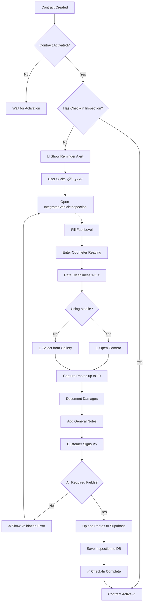
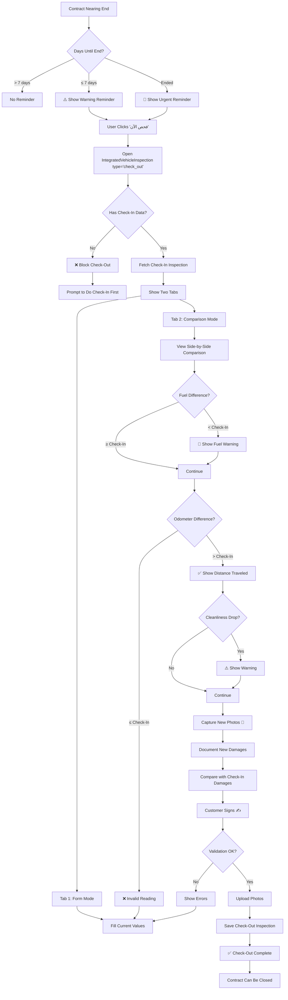

# 🔄 Integrated Check-In/Check-Out Workflow

Visual guide showing how the integrated inspection system works.

---

## 📊 System Architecture

```
┌─────────────────────────────────────────────────────────────────┐
│                    INTEGRATED INSPECTION SYSTEM                  │
└─────────────────────────────────────────────────────────────────┘
                              │
                              ▼
         ┌────────────────────┴────────────────────┐
         │                                         │
         ▼                                         ▼
┌────────────────────┐                  ┌────────────────────┐
│ IntegratedVehicle  │                  │  InspectionReminders│
│ Inspection.tsx     │                  │  .tsx               │
├────────────────────┤                  ├────────────────────┤
│ • Photo capture    │◄─────────────────┤ • Auto reminders   │
│ • Condition rating │                  │ • Status badges    │
│ • Comparison view  │                  │ • Pending list     │
│ • Signature        │                  │ • Toast alerts     │
└────────────────────┘                  └────────────────────┘
         │                                         │
         └──────────────┬──────────────────────────┘
                        ▼
              ┌──────────────────┐
              │ useVehicle       │
              │ Inspections      │
              ├──────────────────┤
              │ • Query data     │
              │ • Compare        │
              └──────────────────┘
                        │
                        ▼
              ┌──────────────────┐
              │  Supabase DB     │
              │  vehicle_        │
              │  inspections     │
              └──────────────────┘
```

---

## 🚦 Check-In Workflow



---

## 🔄 Check-Out Workflow



---

## 📱 Mobile Photo Capture Flow

```
┌─────────────────────────────────────────────┐
│         MOBILE PHOTO CAPTURE                │
└─────────────────────────────────────────────┘
                    │
                    ▼
          ┌─────────┴─────────┐
          │                   │
          ▼                   ▼
    ┌──────────┐      ┌──────────────┐
    │ Camera   │      │  Gallery     │
    │ Button   │      │  Button      │
    └──────────┘      └──────────────┘
          │                   │
          ▼                   ▼
    ┌──────────┐      ┌──────────────┐
    │ Opens    │      │ Opens File   │
    │ Native   │      │ Picker       │
    │ Camera   │      │ (Multi)      │
    └──────────┘      └──────────────┘
          │                   │
          └─────────┬─────────┘
                    ▼
          ┌──────────────────┐
          │ Preview Images   │
          │ (2-4 columns)    │
          └──────────────────┘
                    │
                    ▼
          ┌──────────────────┐
          │ User Actions:    │
          │ • View full size │
          │ • Remove photo   │
          │ • Add more (10x) │
          └──────────────────┘
                    │
                    ▼
          ┌──────────────────┐
          │ On Submit:       │
          │ Upload to        │
          │ Supabase Storage │
          └──────────────────┘
                    │
                    ▼
          ┌──────────────────┐
          │ Store URLs in    │
          │ photo_urls[]     │
          └──────────────────┘
```

---

## 🔍 Comparison View Layout

```
┌─────────────────────────────────────────────────────────────┐
│  COMPARISON MODE (Check-Out Only)                           │
├─────────────────────────────────────────────────────────────┤
│                                                             │
│  ┌────────────┐    ┌────────────┐    ┌────────────┐       │
│  │ 🛢️ Fuel     │    │ ⏱️ Odometer │    │ ✨ Clean    │       │
│  ├────────────┤    ├────────────┤    ├────────────┤       │
│  │ Check-In:  │    │ Check-In:  │    │ Check-In:  │       │
│  │   100%     │    │  50,000 km │    │  ⭐⭐⭐⭐⭐    │       │
│  │            │    │            │    │            │       │
│  │ Current:   │    │ Current:   │    │ Current:   │       │
│  │   75%      │    │  52,450 km │    │  ⭐⭐⭐      │       │
│  │            │    │            │    │            │       │
│  │ ─────────  │    │ ─────────  │    │ ─────────  │       │
│  │ Diff:      │    │ Distance:  │    │ Diff:      │       │
│  │ -25% 🔴    │    │ 2,450 km   │    │ -2 ⭐ 🔴    │       │
│  └────────────┘    └────────────┘    └────────────┘       │
│                                                             │
│  ┌──────────────────────────────────────────────────────┐  │
│  │ 🔧 Damages Recorded at Check-In                      │  │
│  ├──────────────────────────────────────────────────────┤  │
│  │ • [Minor] خدش بسيط على الباب الأمامي الأيمن          │  │
│  │ • [Moderate] كسر في المرآة اليسرى                    │  │
│  └──────────────────────────────────────────────────────┘  │
│                                                             │
│  ┌──────────────────────────────────────────────────────┐  │
│  │ 📸 Check-In Photos                                   │  │
│  ├──────────────────────────────────────────────────────┤  │
│  │  [img1] [img2] [img3] [img4]                         │  │
│  │  [img5] [img6] [img7] [img8]                         │  │
│  └──────────────────────────────────────────────────────┘  │
│                                                             │
└─────────────────────────────────────────────────────────────┘
```

---

## ⏰ Reminder Timeline

```
Contract Lifecycle:
─────────────────────────────────────────────────────────────►

Created          Activated         7 Days Left      Ended
   │                │                   │              │
   │                ▼                   │              │
   │        ┌───────────────┐           │              │
   │        │ 🔴 CHECK-IN    │           │              │
   │        │   REMINDER     │           │              │
   │        │   (Urgent)     │           │              │
   │        └───────────────┘           │              │
   │                                    │              │
   │                                    ▼              │
   │                            ┌───────────────┐      │
   │                            │ ⚠️ CHECK-OUT   │      │
   │                            │   REMINDER     │      │
   │                            │   (Warning)    │      │
   │                            └───────────────┘      │
   │                                                   │
   │                                                   ▼
   │                                           ┌───────────────┐
   │                                           │ 🔴 CHECK-OUT   │
   │                                           │   OVERDUE      │
   │                                           │   (Urgent)     │
   │                                           └───────────────┘

Legend:
🔴 Red Alert (Urgent, persistent)
⚠️ Yellow Warning (Important)
✅ Green Success (Completed)
```

---

## 💾 Data Flow

```
┌──────────────┐
│   User       │
│   Actions    │
└──────┬───────┘
       │
       ▼
┌──────────────────────────────┐
│ IntegratedVehicleInspection  │
│ Component State:             │
│ • fuelLevel                  │
│ • odometerReading            │
│ • cleanlinessRating          │
│ • photos[]                   │
│ • damageNotes                │
│ • customerSignature          │
└──────┬───────────────────────┘
       │
       ▼
┌──────────────────────────────┐
│ useCreateInspection Hook     │
│ • Validate inputs            │
│ • Upload photos              │
│ • Generate photo URLs        │
└──────┬───────────────────────┘
       │
       ▼
┌──────────────────────────────┐
│ Supabase Storage API         │
│ Bucket: vehicle-documents    │
│ Path: {company}/{contract}/  │
│       {type}/{timestamp}.jpg │
└──────┬───────────────────────┘
       │ Returns photo URLs
       ▼
┌──────────────────────────────┐
│ Supabase Database            │
│ Table: vehicle_inspections   │
│ INSERT:                      │
│ {                            │
│   contract_id,               │
│   vehicle_id,                │
│   inspection_type,           │
│   fuel_level,                │
│   odometer_reading,          │
│   cleanliness_rating,        │
│   exterior_condition: [...], │
│   photo_urls: [url1, ...],   │
│   customer_signature,        │
│   ...                        │
│ }                            │
└──────┬───────────────────────┘
       │
       ▼
┌──────────────────────────────┐
│ React Query Cache Update     │
│ • Invalidate queries         │
│ • Trigger re-fetch           │
│ • Update UI                  │
└──────┬───────────────────────┘
       │
       ▼
┌──────────────────────────────┐
│ UI Updates:                  │
│ • Hide reminder alert        │
│ • Show success toast         │
│ • Update status badge        │
│ • Close dialog               │
│ • Refresh contract data      │
└──────────────────────────────┘
```

---

## 🎯 User Journey Map

### Check-In Journey

```
1. Contract Created
   └─► User sees contract in "Draft" status

2. User Activates Contract
   └─► System checks: Has check-in inspection?
       ├─► Yes: ✅ Activate immediately
       └─► No:  🔴 Block activation, show reminder

3. User Sees Reminder
   └─► Red alert: "يجب إجراء فحص الاستلام أولاً"
       └─► Button: "فحص الآن"

4. User Clicks "فحص الآن"
   └─► Dialog opens with IntegratedVehicleInspection

5. User Fills Inspection
   ├─► Fuel: Slide to 100%
   ├─► Odometer: Type 50,000
   ├─► Cleanliness: Click 5 stars
   ├─► Photos: Tap camera 📸 → Take 6 photos
   ├─► Damages: Type any damages
   └─► Signature: Customer signs ✍️

6. User Submits
   └─► System validates
       ├─► Missing signature? ❌ Error
       ├─► No photos? ❌ Error
       ├─► Odometer = 0? ❌ Error
       └─► All good? ✅ Upload & Save

7. Inspection Saved
   └─► ✅ Success toast
       └─► Dialog closes
           └─► Reminder disappears
               └─► Contract can now be activated
```

### Check-Out Journey

```
1. Contract Active
   └─► 7 days before end date
       └─► ⚠️ Warning reminder appears

2. User Sees Reminder
   └─► Yellow alert: "العقد سينتهي خلال X أيام"
       └─► Button: "فحص الآن"

3. User Clicks "فحص الآن"
   └─► Dialog opens with IntegratedVehicleInspection type="check_out"
       └─► System fetches check-in data

4. User Sees Comparison Tab
   └─► Toggle between "Form" and "Comparison"
       ├─► Form: Fill current values
       └─► Comparison: See check-in vs current

5. User Fills Check-Out
   ├─► Fuel: 75% (system shows: -25% from check-in 🔴)
   ├─► Odometer: 52,450 (system shows: +2,450 km traveled)
   ├─► Cleanliness: 3 stars (system shows: -2 stars 🔴)
   ├─► Photos: Take 8 new photos
   ├─► Damages: Document any new damages
   └─► Signature: Customer signs

6. User Reviews Comparison
   └─► See all differences highlighted
       ├─► Fuel drop: Charge refuel fee?
       ├─► Distance: Normal usage
       └─► Cleanliness drop: Charge cleaning fee?

7. User Submits
   └─► System validates & saves
       └─► ✅ Check-out complete
           └─► Contract can be closed
```

---

## 🔐 Permission Flow

```
┌─────────────────────────────────────┐
│  User Authentication                │
└─────────────┬───────────────────────┘
              │
              ▼
┌─────────────────────────────────────┐
│  Company Access Check               │
│  (useUnifiedCompanyAccess)          │
└─────────────┬───────────────────────┘
              │
              ▼
┌─────────────────────────────────────┐
│  Database RLS Policies              │
│  • User can only see own company    │
│  • User can create inspections      │
│  • User can view own inspections    │
└─────────────┬───────────────────────┘
              │
              ▼
┌─────────────────────────────────────┐
│  Storage Policies                   │
│  • Authenticated users can upload   │
│  • Company-specific folders         │
│  • Public read access               │
└─────────────────────────────────────┘
```

---

## 📊 Database Schema Flow

```
┌──────────────────────────────────────┐
│ vehicle_inspections                  │
├──────────────────────────────────────┤
│ id: UUID (PK)                        │
│ company_id: UUID (FK → companies)    │
│ contract_id: UUID (FK → contracts)   │
│ vehicle_id: UUID (FK → vehicles)     │
│ inspection_type: ENUM                │
│   • 'check_in'                       │
│   • 'check_out'                      │
│ ──────────────────────────────────   │
│ Measurements:                        │
│ • fuel_level: INT (0-100)            │
│ • odometer_reading: INT (km)         │
│ • cleanliness_rating: INT (1-5)      │
│ ──────────────────────────────────   │
│ Condition:                           │
│ • exterior_condition: JSONB[]        │
│ • interior_condition: JSONB[]        │
│ ──────────────────────────────────   │
│ Evidence:                            │
│ • photo_urls: TEXT[]                 │
│ • customer_signature: TEXT           │
│ • notes: TEXT                        │
│ ──────────────────────────────────   │
│ Metadata:                            │
│ • inspected_by: UUID (FK → profiles) │
│ • inspection_date: TIMESTAMP         │
│ • created_at: TIMESTAMP              │
└──────────────────────────────────────┘
          │
          ├──► Indexes:
          │    • company_id
          │    • contract_id
          │    • vehicle_id
          │    • inspection_type
          │
          └──► RLS Policies:
               • SELECT: Own company only
               • INSERT: Authenticated users
               • UPDATE: Own company only
```

---

**Ready to implement!** Follow this workflow to understand how all pieces work together. 🚀
