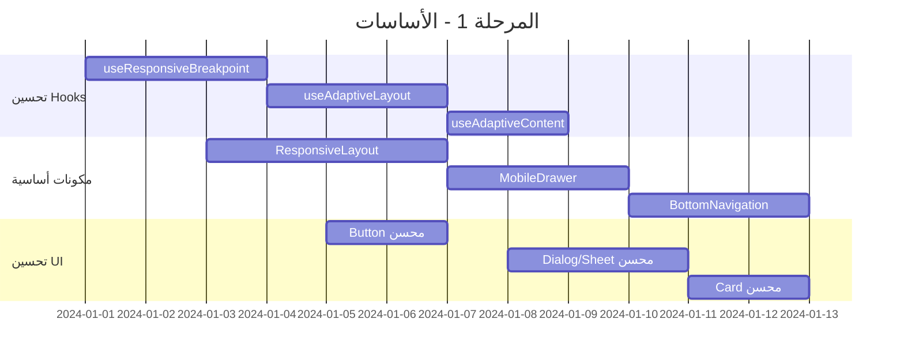
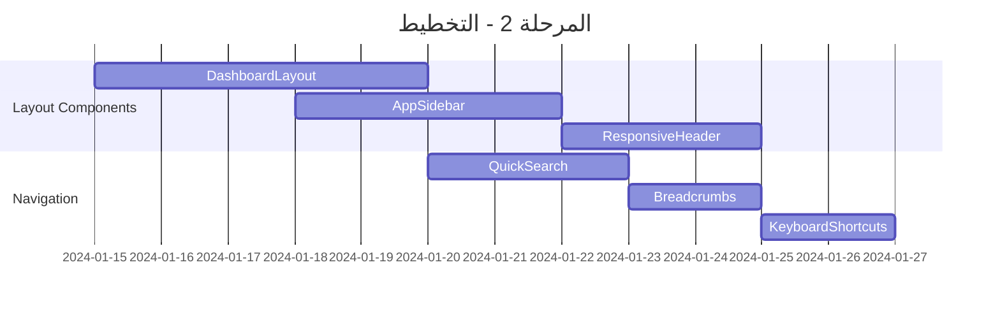
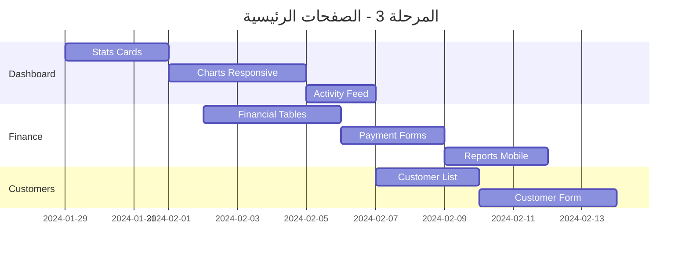
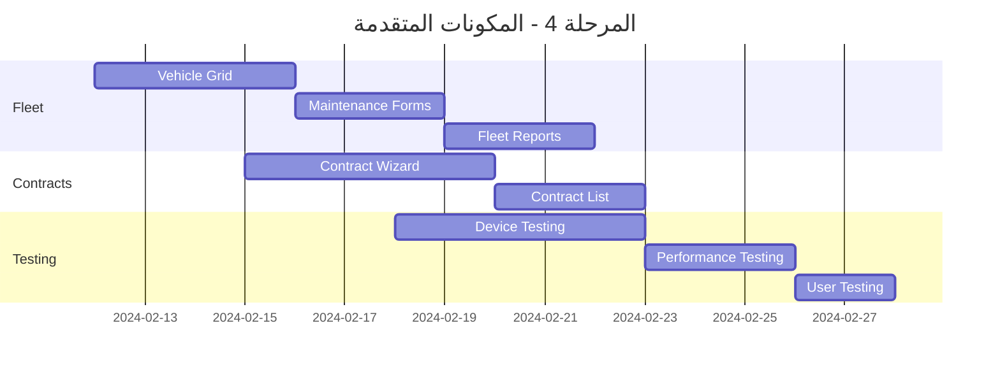

# Business Requirements Document (BRD)
## تحويل نظام Fleetify إلى Mobile Responsive

---

### 📋 معلومات المشروع

| العنصر | التفاصيل |
|---------|----------|
| **اسم المشروع** | تحويل نظام Fleetify إلى Mobile Responsive |
| **نوع المشروع** | تحسين وتطوير النظام الحالي |
| **الهدف الرئيسي** | جعل النظام متجاوباً مع جميع أحجام الشاشات |
| **التاريخ** | ${new Date().toLocaleDateString('ar-SA')} |
| **الأولوية** | عالية |
| **المدة المتوقعة** | 6-8 أسابيع |

---

## 🎯 الأهداف الاستراتيجية

### الهدف الأساسي
تحويل نظام Fleetify الحالي إلى نظام متجاوب بالكامل مع الأجهزة المحمولة والأجهزة اللوحية، مع الحفاظ على:
- **التصميم الحالي** والهوية البصرية
- **الوظائف الموجودة** دون أي تعطيل
- **الأداء العالي** عبر جميع الأجهزة
- **تجربة المستخدم المتميزة**

### الأهداف الفرعية
1. **تحسين إمكانية الوصول** للمستخدمين على الأجهزة المحمولة
2. **زيادة الإنتاجية** للمستخدمين في الميدان
3. **تقليل وقت التحميل** على الشبكات البطيئة
4. **تحسين تجربة المستخدم** عبر جميع الأجهزة
5. **ضمان التوافق** مع معايير الويب الحديثة

---

## 📊 تحليل النظام الحالي

### البنية التقنية الموجودة

#### التقنيات الأساسية ✅
```typescript
// التقنيات المستخدمة حالياً
{
  "frontend": "React 18 + TypeScript",
  "styling": "Tailwind CSS + shadcn-ui",
  "build": "Vite",
  "backend": "Supabase",
  "state": "React Context API",
  "routing": "React Router v7",
  "mobile": "Capacitor (للتطبيقات الأصلية)"
}
```

#### نقاط القوة الحالية ✅
- **نظام Breakpoints متقدم** مع 5 مستويات
- **Hooks متخصصة** للتجاوب (`useResponsiveBreakpoint`, `useAdaptiveLayout`)
- **مكونات UI موحدة** مع shadcn-ui
- **تصميم RTL** مدعوم بالكامل
- **نظام ألوان متسق** مع CSS Variables

#### التحديات الحالية ❌
- **التخطيط الثابت** غير متجاوب مع الشاشات الصغيرة
- **الجداول الكبيرة** لا تعمل بشكل جيد على الموبايل
- **النوافذ المنبثقة** كبيرة جداً للشاشات الصغيرة
- **التنقل الجانبي** يحتاج تحسين للموبايل
- **النماذج الطويلة** تحتاج إعادة تصميم

---

## 🏗️ الأنظمة والمكونات الرئيسية

### 1. أنظمة التخطيط (Layout Systems)

#### 🔧 المكونات الحالية
```typescript
// مكونات التخطيط الموجودة
src/components/layouts/
├── DashboardLayout.tsx      // التخطيط الرئيسي
├── SuperAdminLayout.tsx     // تخطيط الإدارة العليا  
├── CompanyBrowserLayout.tsx // تخطيط تصفح الشركات
└── AppSidebar.tsx          // الشريط الجانبي
```

#### 📱 التحسينات المطلوبة
- **تحويل الشريط الجانبي** إلى drawer على الموبايل
- **إضافة شريط تنقل سفلي** للوظائف الأساسية
- **تحسين الهيدر** ليكون أكثر إحكاماً
- **إضافة نمط الكروت** للمحتوى على الشاشات الصغيرة

### 2. الصفحات الرئيسية (Main Pages)

#### 📊 لوحة التحكم (Dashboard)
```typescript
// الملفات المتأثرة
src/pages/Dashboard.tsx
src/components/dashboard/
├── EnhancedDashboardHeader.tsx
├── EnhancedStatsCard.tsx
├── QuickActionsDashboard.tsx
├── EnhancedActivityFeed.tsx
└── SmartMetricsPanel.tsx
```

**التحسينات المطلوبة:**
- [ ] تحويل الإحصائيات إلى شبكة متجاوبة
- [ ] تحسين الرسوم البيانية للشاشات الصغيرة
- [ ] إضافة وضع الكروت للإجراءات السريعة
- [ ] تحسين عرض الأنشطة الأخيرة

#### 💰 النظام المالي (Finance)
```typescript
// الملفات المتأثرة  
src/pages/Finance.tsx
src/components/finance/
├── UnifiedFinancialDashboard.tsx
├── UnifiedPaymentForm.tsx
├── AdvancedFinancialReports.tsx
└── AccountingSystemWizard.tsx
```

**التحسينات المطلوبة:**
- [ ] تحويل الجداول المالية إلى كروت على الموبايل
- [ ] تحسين نماذج الدفع للشاشات الصغيرة
- [ ] إضافة وضع التمرير الأفقي للتقارير
- [ ] تحسين معالج الإعداد المحاسبي

#### 👥 إدارة العملاء (Customers)
```typescript
// الملفات المتأثرة
src/pages/Customers.tsx
src/pages/EditCustomer.tsx
src/components/customers/
└── EnhancedCustomerForm.tsx
```

**التحسينات المطلوبة:**
- [ ] تحويل قائمة العملاء إلى كروت
- [ ] تحسين نموذج العميل متعدد الخطوات
- [ ] إضافة البحث السريع
- [ ] تحسين عرض تفاصيل العميل

#### 📄 إدارة العقود (Contracts)
```typescript
// الملفات المتأثرة
src/pages/Contracts.tsx
src/components/contracts/
├── ContractWizard.tsx
├── ContractWizardProvider.tsx
└── ContractWizardSteps/
```

**التحسينات المطلوبة:**
- [ ] تحسين معالج العقود للموبايل
- [ ] إضافة مؤشر التقدم المحسن
- [ ] تحسين عرض العقود في قائمة
- [ ] إضافة وضع المعاينة السريعة

#### 🚗 إدارة الأسطول (Fleet)
```typescript
// الملفات المتأثرة
src/pages/Fleet.tsx
src/pages/fleet/
├── Maintenance.tsx
├── TrafficViolations.tsx
├── FleetReports.tsx
└── VehicleConditionCheck.tsx
```

**التحسينات المطلوبة:**
- [ ] تحويل قائمة المركبات إلى شبكة كروت
- [ ] تحسين نماذج الصيانة
- [ ] إضافة وضع الخريطة للموبايل
- [ ] تحسين تقارير الأسطول

### 3. مكونات واجهة المستخدم (UI Components)

#### 🎨 المكونات الأساسية
```typescript
// مكونات shadcn-ui المستخدمة
src/components/ui/
├── button.tsx           // الأزرار
├── card.tsx            // الكروت
├── dialog.tsx          // النوافذ المنبثقة
├── sheet.tsx           // الأوراق الجانبية
├── table.tsx           // الجداول
├── form.tsx            // النماذج
├── tabs.tsx            // التبويبات
└── sidebar.tsx         // الشريط الجانبي
```

**التحسينات المطلوبة:**
- [ ] إضافة أحجام متجاوبة للأزرار
- [ ] تحسين الكروت للشاشات المختلفة
- [ ] تحويل النوافذ إلى sheets على الموبايل
- [ ] إضافة وضع التمرير للجداول
- [ ] تحسين النماذج للمس

---

## 📱 استراتيجية التصميم المتجاوب

### نقاط التوقف (Breakpoints)

```typescript
// نظام Breakpoints المحسن
const BREAKPOINTS = {
  xs: '320px',    // الهواتف الصغيرة
  sm: '640px',    // الهواتف الكبيرة
  md: '768px',    // الأجهزة اللوحية الصغيرة
  lg: '1024px',   // الأجهزة اللوحية الكبيرة
  xl: '1280px',   // أجهزة سطح المكتب
  '2xl': '1536px' // الشاشات الكبيرة
}
```

### أنماط التصميم

#### 📱 الموبايل (xs - sm)
- **التخطيط:** عمود واحد
- **التنقل:** drawer + bottom navigation
- **المحتوى:** كروت مكدسة عمودياً
- **الجداول:** تحويل إلى كروت أو تمرير أفقي
- **النماذج:** خطوة واحدة في كل مرة

#### 📱 الأجهزة اللوحية (md - lg)
- **التخطيط:** عمودين
- **التنقل:** sidebar قابل للطي
- **المحتوى:** شبكة 2x2
- **الجداول:** تمرير أفقي مع أعمدة مخفية
- **النماذج:** خطوتين جنباً إلى جنب

#### 🖥️ سطح المكتب (xl - 2xl)
- **التخطيط:** ثلاثة أعمدة أو أكثر
- **التنقل:** sidebar ثابت
- **المحتوى:** شبكة مرنة
- **الجداول:** عرض كامل
- **النماذج:** متعددة الأعمدة

---

## 🛠️ خطة التنفيذ التفصيلية

### المرحلة 1: الأساسات (الأسبوع 1-2)

#### ✅ المهام الأساسية

##### 1.1 تحسين نظام Breakpoints
```typescript
// تحسين useResponsiveBreakpoint
interface EnhancedBreakpoint {
  // الخصائص الموجودة
  isMobile: boolean
  isTablet: boolean  
  isDesktop: boolean
  
  // خصائص جديدة
  deviceType: 'mobile' | 'tablet' | 'desktop'
  orientation: 'portrait' | 'landscape'
  touchDevice: boolean
  screenSize: 'xs' | 'sm' | 'md' | 'lg' | 'xl' | '2xl'
  
  // وظائف مساعدة
  isPortraitMobile: boolean
  isLandscapeTablet: boolean
  canHover: boolean
}
```

##### 1.2 إنشاء مكونات التخطيط المتجاوبة
- [ ] `ResponsiveLayout` - تخطيط أساسي متجاوب
- [ ] `MobileDrawer` - drawer للتنقل على الموبايل  
- [ ] `BottomNavigation` - شريط تنقل سفلي
- [ ] `ResponsiveGrid` - شبكة متجاوبة
- [ ] `AdaptiveCard` - كروت تتكيف مع الشاشة

##### 1.3 تحسين مكونات UI الأساسية
```typescript
// تحسين Button
interface ResponsiveButtonProps {
  size?: 'xs' | 'sm' | 'md' | 'lg' | 'xl'
  mobileSize?: 'sm' | 'md' | 'lg' // حجم مخصص للموبايل
  touchOptimized?: boolean // تحسين للمس
  fullWidthOnMobile?: boolean
}

// تحسين Dialog
interface ResponsiveDialogProps {
  mobileMode?: 'sheet' | 'fullscreen' | 'dialog'
  adaptiveSize?: boolean
}
```

### المرحلة 2: مكونات التخطيط (الأسبوع 3-4)

#### 🏗️ تحديث Layout Components

##### 2.1 DashboardLayout المحسن
```typescript
// الميزات الجديدة
- ✅ Sidebar قابل للطي تلقائياً
- ✅ Bottom navigation للموبايل
- ✅ Header مضغوط للشاشات الصغيرة
- ✅ Quick actions drawer
- ✅ Notification panel محسن
```

##### 2.2 AppSidebar المتجاوب
```typescript
// التحسينات
- ✅ تحويل تلقائي إلى drawer على الموبايل
- ✅ أيقونات أكبر للمس
- ✅ تجميع العناصر في فئات
- ✅ بحث سريع مدمج
- ✅ وضع مضغوط للأجهزة اللوحية
```

##### 2.3 ResponsiveHeader جديد
```typescript
interface ResponsiveHeaderProps {
  showMenuButton?: boolean // زر القائمة للموبايل
  compactMode?: boolean // وضع مضغوط
  showSearch?: boolean // البحث السريع
  showNotifications?: boolean // الإشعارات
  showProfile?: boolean // الملف الشخصي
}
```

### المرحلة 3: الصفحات الرئيسية (الأسبوع 5-6)

#### 📊 Dashboard متجاوب

##### 3.1 تحسين الإحصائيات
```typescript
// EnhancedStatsCard المحسن
- ✅ تخطيط متجاوب (1 عمود على الموبايل، 2-4 على الأكبر)
- ✅ أيقونات أكبر للمس
- ✅ نصوص قابلة للقراءة على الشاشات الصغيرة
- ✅ ألوان محسنة للتباين
```

##### 3.2 الرسوم البيانية المتجاوبة
```typescript
// تحسينات Recharts
- ✅ حجم تلقائي حسب الشاشة
- ✅ تبسيط البيانات على الموبايل
- ✅ تفاعل محسن للمس
- ✅ وضع landscape للرسوم المعقدة
```

#### 💰 Finance متجاوب

##### 3.3 الجداول المالية
```typescript
// ResponsiveTable جديد
interface ResponsiveTableProps {
  mobileMode: 'cards' | 'scroll' | 'accordion'
  priorityColumns: string[] // الأعمدة المهمة للموبايل
  cardTemplate?: React.ComponentType // قالب الكرت للموبايل
  maxMobileColumns?: number
}
```

##### 3.4 نماذج الدفع المحسنة
```typescript
// UnifiedPaymentForm المحسن
- ✅ خطوات مبسطة للموبايل
- ✅ تحقق تلقائي من صحة البيانات
- ✅ لوحة مفاتيح رقمية للمبالغ
- ✅ اختيار التاريخ محسن للمس
```

#### 👥 Customers متجاوب

##### 3.5 قائمة العملاء
```typescript
// CustomerList المحسن
- ✅ عرض كروت على الموبايل
- ✅ بحث سريع مع فلترة
- ✅ تحميل تدريجي (pagination)
- ✅ إجراءات سريعة (swipe actions)
```

##### 3.6 نموذج العميل
```typescript
// EnhancedCustomerForm المحسن
- ✅ خطوات مبسطة للموبايل
- ✅ تحقق فوري من البيانات
- ✅ رفع الصور محسن للموبايل
- ✅ حفظ تلقائي للمسودات
```

### المرحلة 4: المكونات المتقدمة (الأسبوع 7-8)

#### 🚗 Fleet Management

##### 4.1 قائمة المركبات
```typescript
// VehicleGrid المحسن
- ✅ كروت مركبات تفاعلية
- ✅ فلترة متقدمة
- ✅ خريطة مدمجة للموقع
- ✅ حالة المركبة بصرياً
```

##### 4.2 نماذج الصيانة
```typescript
// MaintenanceForm المحسن
- ✅ إدخال بيانات مبسط
- ✅ التقاط صور للأعطال
- ✅ توقيع رقمي
- ✅ إشعارات فورية
```

#### 📄 Contract Management

##### 4.3 معالج العقود
```typescript
// ContractWizard المحسن
- ✅ تقدم بصري محسن
- ✅ معاينة فورية للعقد
- ✅ توقيع إلكتروني
- ✅ مشاركة العقد مباشرة
```

---

## 🎨 دليل التصميم المتجاوب

### نظام الألوان المحسن

```css
/* متغيرات CSS محسنة للتجاوب */
:root {
  /* أحجام النصوص المتجاوبة */
  --text-xs: clamp(0.75rem, 0.7rem + 0.25vw, 0.875rem);
  --text-sm: clamp(0.875rem, 0.8rem + 0.375vw, 1rem);
  --text-base: clamp(1rem, 0.9rem + 0.5vw, 1.125rem);
  --text-lg: clamp(1.125rem, 1rem + 0.625vw, 1.25rem);
  --text-xl: clamp(1.25rem, 1.1rem + 0.75vw, 1.5rem);
  
  /* مسافات متجاوبة */
  --spacing-xs: clamp(0.25rem, 0.2rem + 0.25vw, 0.5rem);
  --spacing-sm: clamp(0.5rem, 0.4rem + 0.5vw, 1rem);
  --spacing-md: clamp(1rem, 0.8rem + 1vw, 2rem);
  --spacing-lg: clamp(1.5rem, 1.2rem + 1.5vw, 3rem);
  
  /* أحجام اللمس */
  --touch-target-min: 44px;
  --touch-target-comfortable: 48px;
  --touch-target-large: 56px;
}
```

### أنماط التفاعل

#### 🖱️ سطح المكتب
- **Hover effects** للأزرار والروابط
- **Tooltips** للمساعدة السريعة
- **Context menus** بالنقر الأيمن
- **Keyboard shortcuts** للإجراءات السريعة

#### 👆 الأجهزة اللوحية
- **Touch targets** بحد أدنى 44px
- **Swipe gestures** للتنقل
- **Long press** للقوائم السياقية
- **Pinch to zoom** للرسوم البيانية

#### 📱 الموبايل
- **Large touch targets** (48px+)
- **Thumb-friendly** navigation
- **Pull to refresh** للقوائم
- **Bottom sheet** للإجراءات

---

## 🧪 استراتيجية الاختبار

### اختبار التجاوب

#### 📱 الأجهزة المستهدفة
```typescript
const TEST_DEVICES = {
  mobile: [
    { name: 'iPhone SE', width: 375, height: 667 },
    { name: 'iPhone 12', width: 390, height: 844 },
    { name: 'Samsung Galaxy S21', width: 384, height: 854 },
    { name: 'Google Pixel 6', width: 393, height: 851 }
  ],
  tablet: [
    { name: 'iPad Mini', width: 768, height: 1024 },
    { name: 'iPad Pro 11"', width: 834, height: 1194 },
    { name: 'Samsung Galaxy Tab', width: 800, height: 1280 }
  ],
  desktop: [
    { name: 'MacBook Air', width: 1280, height: 800 },
    { name: 'Full HD', width: 1920, height: 1080 },
    { name: '4K Display', width: 2560, height: 1440 }
  ]
}
```

#### 🔍 معايير الاختبار
- [ ] **سرعة التحميل** < 3 ثوانٍ على 3G
- [ ] **حجم اللمس** ≥ 44px لجميع العناصر التفاعلية
- [ ] **قابلية القراءة** نسبة تباين ≥ 4.5:1
- [ ] **التنقل** سهل بيد واحدة على الموبايل
- [ ] **الوظائف** تعمل بنفس الكفاءة على جميع الأجهزة

### اختبار الأداء

#### ⚡ مؤشرات الأداء الرئيسية (KPIs)
```typescript
const PERFORMANCE_TARGETS = {
  // Core Web Vitals
  LCP: '< 2.5s',    // Largest Contentful Paint
  FID: '< 100ms',   // First Input Delay  
  CLS: '< 0.1',     // Cumulative Layout Shift
  
  // إضافية
  FCP: '< 1.8s',    // First Contentful Paint
  TTI: '< 3.8s',    // Time to Interactive
  TBT: '< 200ms',   // Total Blocking Time
  
  // حجم الحزمة
  bundleSize: '< 500KB', // الحزمة الأولية
  totalSize: '< 2MB'     // إجمالي الموارد
}
```

---

## 📊 مؤشرات النجاح (Success Metrics)

### مؤشرات تجربة المستخدم

#### 📈 المؤشرات الكمية
- **زمن التحميل الأولي** ≤ 3 ثوانٍ
- **معدل الارتداد** انخفاض بنسبة 25%
- **وقت البقاء** زيادة بنسبة 40%
- **معدل إكمال المهام** ≥ 90%
- **رضا المستخدمين** ≥ 4.5/5

#### 📱 مؤشرات الموبايل
- **استخدام الموبايل** زيادة بنسبة 60%
- **إكمال النماذج** زيادة بنسبة 35%
- **استخدام الميزات** توزيع متساوٍ عبر الأجهزة
- **أخطاء التفاعل** انخفاض بنسبة 50%

### مؤشرات تقنية

#### ⚡ الأداء
- **نقاط Lighthouse** ≥ 90 لجميع المعايير
- **حجم الحزمة** تقليل بنسبة 20%
- **استهلاك البيانات** تقليل بنسبة 30%
- **استهلاك البطارية** تحسين بنسبة 25%

#### 🔧 الصيانة
- **سهولة التطوير** تقليل وقت التطوير 30%
- **إعادة الاستخدام** زيادة بنسبة 50%
- **الأخطاء** انخفاض بنسبة 40%
- **وقت الإصلاح** تقليل بنسبة 35%

---

## 🗓️ الجدول الزمني التفصيلي

### الأسبوع 1-2: الأساسات


### الأسبوع 3-4: التخطيط


### الأسبوع 5-6: الصفحات الرئيسية


### الأسبوع 7-8: المكونات المتقدمة


---

## 🔧 التفاصيل التقنية

### بنية الملفات المحسنة

```
src/
├── components/
│   ├── responsive/           # مكونات التجاوب الجديدة
│   │   ├── ResponsiveLayout.tsx
│   │   ├── MobileDrawer.tsx
│   │   ├── BottomNavigation.tsx
│   │   ├── ResponsiveGrid.tsx
│   │   └── AdaptiveCard.tsx
│   ├── layouts/             # تخطيطات محسنة
│   │   ├── DashboardLayout.tsx    # محسن
│   │   ├── MobileLayout.tsx       # جديد
│   │   └── TabletLayout.tsx       # جديد
│   ├── ui/                  # مكونات UI محسنة
│   │   ├── responsive-button.tsx  # جديد
│   │   ├── responsive-dialog.tsx  # جديد
│   │   ├── responsive-table.tsx   # جديد
│   │   └── mobile-sheet.tsx       # جديد
│   └── mobile/              # مكونات خاصة بالموبايل
│       ├── MobileHeader.tsx
│       ├── MobileNavigation.tsx
│       ├── SwipeableCard.tsx
│       └── TouchOptimizedButton.tsx
├── hooks/
│   ├── responsive/          # hooks التجاوب المحسنة
│   │   ├── useResponsiveBreakpoint.ts  # محسن
│   │   ├── useAdaptiveLayout.ts        # محسن
│   │   ├── useDeviceDetection.ts       # جديد
│   │   ├── useTouchDevice.ts           # جديد
│   │   └── useScreenOrientation.ts     # جديد
│   └── mobile/              # hooks خاصة بالموبايل
│       ├── useSwipeGestures.ts
│       ├── usePullToRefresh.ts
│       └── useVirtualKeyboard.ts
├── styles/
│   ├── responsive/          # أنماط التجاوب
│   │   ├── breakpoints.css
│   │   ├── mobile.css
│   │   ├── tablet.css
│   │   └── desktop.css
│   └── components/          # أنماط المكونات
│       ├── mobile-navigation.css
│       ├── responsive-grid.css
│       └── touch-targets.css
└── utils/
    ├── responsive/          # وظائف مساعدة للتجاوب
    │   ├── breakpoint-utils.ts
    │   ├── device-utils.ts
    │   └── layout-utils.ts
    └── mobile/              # وظائف خاصة بالموبايل
        ├── touch-utils.ts
        ├── gesture-utils.ts
        └── performance-utils.ts
```

### مكونات جديدة مطلوبة

#### 1. ResponsiveLayout
```typescript
interface ResponsiveLayoutProps {
  children: React.ReactNode
  sidebar?: React.ReactNode
  header?: React.ReactNode
  footer?: React.ReactNode
  mobileNavigation?: React.ReactNode
  
  // خيارات التخطيط
  sidebarCollapsible?: boolean
  showMobileDrawer?: boolean
  showBottomNav?: boolean
  
  // خيارات التجاوب
  breakpoint?: 'sm' | 'md' | 'lg'
  mobileFirst?: boolean
}
```

#### 2. ResponsiveTable
```typescript
interface ResponsiveTableProps<T> {
  data: T[]
  columns: ColumnDef<T>[]
  
  // خيارات الموبايل
  mobileMode: 'cards' | 'scroll' | 'accordion'
  cardTemplate?: React.ComponentType<{item: T}>
  priorityColumns?: string[]
  maxMobileColumns?: number
  
  // خيارات التفاعل
  onRowClick?: (item: T) => void
  swipeActions?: SwipeAction<T>[]
  pullToRefresh?: () => Promise<void>
}
```

#### 3. AdaptiveForm
```typescript
interface AdaptiveFormProps {
  children: React.ReactNode
  
  // تخطيط متجاوب
  mobileLayout: 'single-column' | 'accordion'
  tabletLayout: 'two-column' | 'single-column'
  desktopLayout: 'multi-column' | 'two-column'
  
  // ميزات الموبايل
  showProgress?: boolean
  enableAutoSave?: boolean
  optimizeForTouch?: boolean
}
```

### تحسينات الأداء

#### Code Splitting محسن
```typescript
// تحميل تدريجي للمكونات حسب الجهاز
const MobileComponents = lazy(() => 
  import('./components/mobile').then(module => ({
    default: module.MobileComponents
  }))
)

const DesktopComponents = lazy(() =>
  import('./components/desktop').then(module => ({
    default: module.DesktopComponents  
  }))
)

// استخدام شرطي حسب الجهاز
const AdaptiveComponent = () => {
  const { isMobile } = useResponsiveBreakpoint()
  
  return (
    <Suspense fallback={<LoadingSpinner />}>
      {isMobile ? <MobileComponents /> : <DesktopComponents />}
    </Suspense>
  )
}
```

#### تحسين الصور
```typescript
// مكون صورة متجاوب
interface ResponsiveImageProps {
  src: string
  alt: string
  
  // أحجام مختلفة للأجهزة
  mobileSrc?: string
  tabletSrc?: string
  desktopSrc?: string
  
  // تحسينات الأداء
  lazy?: boolean
  webp?: boolean
  quality?: number
}
```

---

## 📋 قائمة المهام التفصيلية

### المرحلة 1: الأساسات (14 مهمة)

#### تحسين Hooks (5 مهام)
- [ ] **1.1** تحسين `useResponsiveBreakpoint` بخصائص جديدة
- [ ] **1.2** إضافة `useDeviceDetection` للكشف عن نوع الجهاز
- [ ] **1.3** إنشاء `useTouchDevice` للكشف عن الأجهزة اللمسية
- [ ] **1.4** إضافة `useScreenOrientation` لتتبع اتجاه الشاشة
- [ ] **1.5** تحسين `useAdaptiveLayout` بخيارات إضافية

#### مكونات التخطيط الأساسية (5 مهام)
- [ ] **1.6** إنشاء `ResponsiveLayout` كمكون تخطيط رئيسي
- [ ] **1.7** بناء `MobileDrawer` للتنقل على الموبايل
- [ ] **1.8** إضافة `BottomNavigation` للوصول السريع
- [ ] **1.9** إنشاء `ResponsiveGrid` للشبكات المتجاوبة
- [ ] **1.10** بناء `AdaptiveCard` للكروت المتكيفة

#### تحسين مكونات UI (4 مهام)
- [ ] **1.11** تحسين `Button` بأحجام متجاوبة وتحسين اللمس
- [ ] **1.12** تطوير `ResponsiveDialog` مع وضع Sheet للموبايل
- [ ] **1.13** إنشاء `ResponsiveTable` مع أوضاع مختلفة للأجهزة
- [ ] **1.14** تحسين `Form` components للتفاعل اللمسي

### المرحلة 2: التخطيط (12 مهمة)

#### تحديث Layout Components (6 مهام)
- [ ] **2.1** تحديث `DashboardLayout` ليكون متجاوباً بالكامل
- [ ] **2.2** تحسين `AppSidebar` مع وضع drawer للموبايل
- [ ] **2.3** إنشاء `ResponsiveHeader` مع أوضاع مختلفة
- [ ] **2.4** تحديث `SuperAdminLayout` للتجاوب
- [ ] **2.5** تحسين `CompanyBrowserLayout` للأجهزة المحمولة
- [ ] **2.6** إضافة `MobileLayout` كتخطيط مخصص للموبايل

#### تحسين التنقل (6 مهام)
- [ ] **2.7** تحديث `QuickSearch` للعمل على الأجهزة اللمسية
- [ ] **2.8** تحسين `Breadcrumbs` للشاشات الصغيرة
- [ ] **2.9** تطوير `MobileNavigation` مع إيماءات التمرير
- [ ] **2.10** إضافة `KeyboardShortcuts` متكيفة مع الجهاز
- [ ] **2.11** إنشاء `CompanySelector` محسن للموبايل
- [ ] **2.12** تحسين `EnhancedAlertsSystem` للإشعارات المتجاوبة

### المرحلة 3: الصفحات الرئيسية (18 مهمة)

#### Dashboard متجاوب (6 مهام)
- [ ] **3.1** تحويل `EnhancedStatsCard` إلى شبكة متجاوبة
- [ ] **3.2** تحسين `SmartMetricsPanel` للشاشات المختلفة
- [ ] **3.3** تطوير `QuickActionsDashboard` بتخطيط كروت للموبايل
- [ ] **3.4** تحديث `EnhancedActivityFeed` بعرض مضغوط للموبايل
- [ ] **3.5** تحسين الرسوم البيانية (Recharts) للتجاوب
- [ ] **3.6** إضافة `DocumentExpiryAlerts` محسنة للموبايل

#### Finance متجاوب (6 مهام)
- [ ] **3.7** تحويل `UnifiedFinancialDashboard` للتجاوب الكامل
- [ ] **3.8** تحسين `UnifiedPaymentForm` بخطوات مبسطة للموبايل
- [ ] **3.9** تطوير `AdvancedFinancialReports` بعرض كروت للموبايل
- [ ] **3.10** تحديث جداول Finance بوضع التمرير الأفقي
- [ ] **3.11** تحسين `AccountingSystemWizard` للشاشات الصغيرة
- [ ] **3.12** إضافة `FinancialCalculator` محسن للمس

#### Customers متجاوب (6 مهام)
- [ ] **3.13** تحويل قائمة العملاء إلى عرض كروت على الموبايل
- [ ] **3.14** تحسين `EnhancedCustomerForm` بتخطيط خطوة واحدة للموبايل
- [ ] **3.15** إضافة بحث سريع وفلترة محسنة للمس
- [ ] **3.16** تطوير عرض تفاصيل العميل بوضع ملء الشاشة للموبايل
- [ ] **3.17** تحسين `EditCustomer` بنماذج متجاوبة
- [ ] **3.18** إضافة إجراءات سريعة (swipe actions) لقائمة العملاء

### المرحلة 4: المكونات المتقدمة (16 مهمة)

#### Fleet Management (6 مهام)
- [ ] **4.1** تحويل قائمة المركبات إلى شبكة كروت تفاعلية
- [ ] **4.2** تحسين نماذج الصيانة للإدخال اللمسي
- [ ] **4.3** إضافة عرض خريطة محسن للموبايل
- [ ] **4.4** تطوير `TrafficViolations` بعرض كروت
- [ ] **4.5** تحسين `FleetReports` برسوم بيانية متجاوبة
- [ ] **4.6** إضافة `VehicleConditionCheck` محسن للموبايل

#### Contract Management (5 مهام)
- [ ] **4.7** تحسين `ContractWizard` بتقدم بصري محسن للموبايل
- [ ] **4.8** تطوير عرض العقود بتخطيط كروت
- [ ] **4.9** إضافة معاينة سريعة للعقود على الموبايل
- [ ] **4.10** تحسين `ContractWizardSteps` للشاشات الصغيرة
- [ ] **4.11** إضافة توقيع إلكتروني محسن للمس

#### اختبار وتحسين (5 مهام)
- [ ] **4.12** اختبار شامل على الأجهزة المختلفة
- [ ] **4.13** تحسين الأداء وسرعة التحميل
- [ ] **4.14** اختبار تجربة المستخدم مع مستخدمين حقيقيين
- [ ] **4.15** إصلاح الأخطاء وتحسين التفاعلات
- [ ] **4.16** توثيق النظام الجديد وإرشادات الاستخدام

---

## 🚀 خطة النشر والتطبيق

### استراتيجية النشر التدريجي

#### المرحلة الأولى: Beta Testing (أسبوع 9)
```typescript
// تفعيل الميزات تدريجياً
const FEATURE_FLAGS = {
  responsiveLayout: true,      // تخطيط متجاوب
  mobileNavigation: true,      // تنقل موبايل
  responsiveTables: false,     // جداول متجاوبة (قيد الاختبار)
  touchOptimization: true,     // تحسين اللمس
  adaptiveCards: true          // كروت متكيفة
}
```

#### المرحلة الثانية: Soft Launch (أسبوع 10)
- **نشر محدود** لمجموعة من المستخدمين المختارين
- **جمع التعليقات** وتحليل الاستخدام
- **إصلاح سريع** للمشاكل المكتشفة
- **تحسين الأداء** بناءً على البيانات الحقيقية

#### المرحلة الثالثة: Full Release (أسبوع 11)
- **نشر كامل** لجميع المستخدمين
- **مراقبة مستمرة** للأداء والأخطاء
- **دعم فني** مكثف في الأسابيع الأولى
- **تحديثات سريعة** حسب الحاجة

### خطة التدريب والدعم

#### للمستخدمين النهائيين
- [ ] **دليل المستخدم** المحدث مع لقطات الشاشة الجديدة
- [ ] **فيديوهات تعليمية** للميزات الجديدة
- [ ] **ورش عمل** للفرق الأساسية
- [ ] **دعم فني** مخصص خلال فترة الانتقال

#### للمطورين
- [ ] **وثائق تقنية** شاملة للمكونات الجديدة
- [ ] **أمثلة عملية** لاستخدام المكونات المتجاوبة
- [ ] **إرشادات التطوير** للميزات المستقبلية
- [ ] **ورشة عمل تقنية** للفريق التقني

---

## 💰 تقدير التكلفة والموارد

### الموارد البشرية المطلوبة

#### فريق التطوير (8 أسابيع)
- **مطور Frontend رئيسي** (1 شخص، دوام كامل)
- **مطور UI/UX** (1 شخص، دوام كامل)
- **مطور Mobile** (1 شخص، نصف دوام)
- **مختبر QA** (1 شخص، نصف دوام)

#### فريق الدعم
- **مصمم UX** (استشاري، حسب الحاجة)
- **مختص أداء** (استشاري، أسبوع واحد)
- **مدير مشروع** (نصف دوام)

### الأدوات والتقنيات

#### أدوات التطوير
- **Figma** لتصميم الواجهات المتجاوبة
- **Storybook** لتطوير واختبار المكونات
- **Chromatic** للاختبار البصري
- **Lighthouse CI** لمراقبة الأداء

#### أدوات الاختبار
- **BrowserStack** للاختبار على أجهزة متعددة
- **Cypress** للاختبار الآلي
- **Jest** لاختبار الوحدات
- **React Testing Library** لاختبار المكونات

---

## 📈 خطة المتابعة والتحسين

### مراقبة الأداء المستمرة

#### مؤشرات يومية
- **سرعة التحميل** عبر الأجهزة المختلفة
- **معدل الأخطاء** والمشاكل التقنية
- **استخدام الميزات** الجديدة
- **رضا المستخدمين** من خلال التقييمات

#### تقارير أسبوعية
- **تحليل الاستخدام** حسب نوع الجهاز
- **أداء الصفحات** الأكثر استخداماً
- **التعليقات والاقتراحات** من المستخدمين
- **المشاكل المكتشفة** وحلولها

#### مراجعة شهرية
- **تحليل شامل** لتأثير التحديثات
- **خطة التحسينات** للشهر القادم
- **تحديث الأولويات** حسب احتياجات المستخدمين
- **تخطيط الميزات** الجديدة

### خطة التحسين المستمر

#### الشهر الأول بعد النشر
- [ ] **إصلاح فوري** للمشاكل الحرجة
- [ ] **تحسين الأداء** للصفحات البطيئة
- [ ] **تحسين التفاعلات** بناءً على ملاحظات المستخدمين
- [ ] **إضافة ميزات صغيرة** مطلوبة بكثرة

#### الأشهر 2-3
- [ ] **تحسينات متقدمة** للتفاعل اللمسي
- [ ] **إضافة إيماءات جديدة** للتنقل السريع
- [ ] **تحسين الرسوم البيانية** للأجهزة المحمولة
- [ ] **تطوير ميزات PWA** للعمل دون اتصال

#### الأشهر 4-6
- [ ] **تحليل عميق** لسلوك المستخدمين
- [ ] **إعادة تصميم** الصفحات الأقل استخداماً
- [ ] **إضافة ميزات ذكية** مدعومة بالذكاء الاصطناعي
- [ ] **تحسين الأمان** للأجهزة المحمولة

---

## 🎯 الخلاصة والتوصيات

### النقاط الرئيسية

#### ✅ نقاط القوة الحالية
- **بنية تقنية قوية** مع React 18 و TypeScript
- **نظام تصميم متسق** مع Tailwind CSS
- **مكونات UI موحدة** مع shadcn-ui
- **أساسيات التجاوب** موجودة بالفعل

#### 🚀 الفرص المتاحة
- **تحسين كبير** في تجربة المستخدم على الموبايل
- **زيادة الاستخدام** من الأجهزة المحمولة
- **تحسين الإنتاجية** للمستخدمين في الميدان
- **ميزة تنافسية** في السوق

#### ⚠️ التحديات المتوقعة
- **تعقيد التطبيق** الحالي يتطلب تخطيط دقيق
- **الحاجة لاختبار شامل** على أجهزة متعددة
- **تدريب المستخدمين** على الواجهة الجديدة
- **ضمان الأداء** عبر جميع الأجهزة

### التوصيات النهائية

#### للإدارة
1. **الموافقة على الخطة** والميزانية المقترحة
2. **تخصيص الفريق** المطلوب للمشروع
3. **وضع جدول زمني واقعي** مع مرونة للتعديل
4. **الاستثمار في الأدوات** اللازمة للتطوير والاختبار

#### للفريق التقني
1. **البدء بالمرحلة الأولى** فوراً لإنشاء الأساسات
2. **التركيز على الجودة** أكثر من السرعة
3. **الاختبار المستمر** على أجهزة حقيقية
4. **التوثيق الشامل** لجميع المكونات الجديدة

#### للمستخدمين
1. **التحضير للتغيير** والتدريب على الميزات الجديدة
2. **تقديم التعليقات** أثناء مرحلة الاختبار
3. **الصبر خلال فترة الانتقال** والتكيف مع الواجهة الجديدة
4. **الاستفادة من الميزات الجديدة** لتحسين الإنتاجية

---

## 📞 معلومات الاتصال والدعم

### فريق المشروع
- **مدير المشروع**: [اسم المدير]
- **المطور الرئيسي**: [اسم المطور]
- **مصمم UX**: [اسم المصمم]
- **مختص QA**: [اسم المختبر]

### قنوات التواصل
- **البريد الإلكتروني**: responsive-project@fleetify.com
- **Slack Channel**: #responsive-redesign
- **اجتماعات أسبوعية**: كل يوم اثنين 10:00 ص
- **تقارير التقدم**: كل يوم جمعة 4:00 م

---

**تاريخ الإنشاء**: ${new Date().toLocaleDateString('ar-SA')}  
**الإصدار**: 1.0  
**الحالة**: جاهز للتنفيذ  
**المراجعة القادمة**: بعد أسبوعين من بدء التنفيذ

---

*هذا المستند يحتوي على خطة شاملة لتحويل نظام Fleetify إلى نظام متجاوب بالكامل. يرجى مراجعة جميع الأقسام بعناية والموافقة على الخطة قبل البدء في التنفيذ.*
