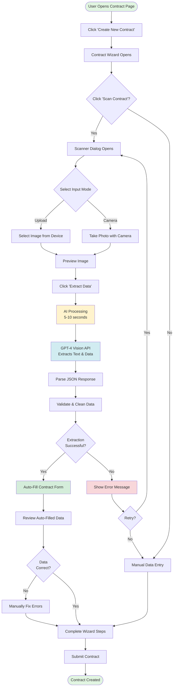
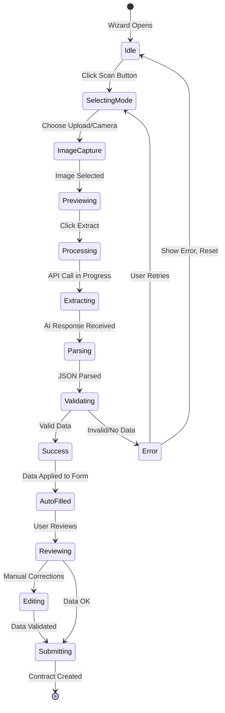

# 🔄 Contract Scanning Workflow

## Visual Flow Diagram



---

## Detailed Step-by-Step Process

### Phase 1: Initiation
```
┌──────────────────────────────────────┐
│  1. User navigates to Contracts page │
│  2. Clicks "Create New Contract"     │
│  3. Contract Wizard dialog opens     │
└──────────────────────────────────────┘
                  │
                  ▼
         ┌────────────────┐
         │ Scan Contract? │
         └────────────────┘
         │              │
    ┌────┘              └────┐
    │                        │
    ▼                        ▼
 [YES]                    [NO]
Scan Mode              Manual Entry
```

### Phase 2: Image Capture
```
┌─────────────────────────────────────┐
│     Select Input Method:            │
│                                     │
│  ┌──────────────┐  ┌─────────────┐ │
│  │ 📁 Upload    │  │ 📷 Camera   │ │
│  │   File       │  │   Capture   │ │
│  └──────────────┘  └─────────────┘ │
└─────────────────────────────────────┘
           │                │
           └────────┬───────┘
                    │
                    ▼
           ┌────────────────┐
           │ Image Selected │
           │   & Previewed  │
           └────────────────┘
```

### Phase 3: OCR Processing
```
┌────────────────────────────────────────┐
│  OCR Processing Pipeline               │
│                                        │
│  1. Convert image to base64           │
│          │                             │
│          ▼                             │
│  2. Fetch OpenAI API key              │
│          │                             │
│          ▼                             │
│  3. Call GPT-4 Vision API             │
│     ┌─────────────────┐               │
│     │ AI Analyzes     │               │
│     │ Document Image  │               │
│     │ Extracts Text   │               │
│     │ Structures Data │               │
│     └─────────────────┘               │
│          │                             │
│          ▼                             │
│  4. Parse JSON response               │
│          │                             │
│          ▼                             │
│  5. Validate & clean data             │
│          │                             │
│          ▼                             │
│  6. Calculate confidence score        │
└────────────────────────────────────────┘
```

### Phase 4: Data Mapping & Auto-Fill
```
┌─────────────────────────────────────────┐
│  Extracted Data → Form Fields           │
│                                         │
│  contract_number    → contract_number   │
│  contract_date      → contract_date     │
│  monthly_rent       → monthly_amount    │
│  guarantee_amount   → guarantee_amount  │
│  start_date         → start_date        │
│  end_date           → end_date          │
│  customer_name      → (for matching)    │
│  vehicle_plate      → (for matching)    │
│                                         │
│  Auto-populated into Contract Wizard   │
└─────────────────────────────────────────┘
```

### Phase 5: Review & Submit
```
┌──────────────────────────────────┐
│  User Reviews Auto-Filled Data   │
│                                  │
│  ✓ Agreement Number: WRN-2025... │
│  ✓ Monthly Rent: 1,500 QAR      │
│  ✓ Duration: 30 months          │
│  ⚠ Customer: [Select from list] │
│  ⚠ Vehicle: [Select from list]  │
│                                  │
│  [Manual adjustments if needed]  │
└──────────────────────────────────┘
           │
           ▼
    ┌─────────────┐
    │   Submit    │
    │  Contract   │
    └─────────────┘
```

---

## State Machine Diagram



---

## Data Flow Architecture

```
┌──────────────┐
│   Browser    │
│  (Frontend)  │
└──────┬───────┘
       │
       │ 1. Image upload
       │
       ▼
┌──────────────────┐
│ ContractScanner  │◄─── User Interface Component
│     Dialog       │
└──────┬───────────┘
       │
       │ 2. Trigger extraction
       │
       ▼
┌──────────────────┐
│ useContractOCR   │◄─── React Hook (Business Logic)
│      Hook        │
└──────┬───────────┘
       │
       ├──► 3a. Convert to base64
       │
       ├──► 3b. Fetch API key
       │         │
       │         ▼
       │    ┌─────────────┐
       │    │  Supabase   │
       │    │  companies  │
       │    │   table     │
       │    └─────────────┘
       │
       ├──► 3c. Call OpenAI
       │         │
       │         ▼
       │    ┌──────────────┐
       │    │ OpenAI API   │
       │    │ GPT-4 Vision │
       │    └──────────────┘
       │
       └──► 3d. Return extracted data
                │
                ▼
       ┌──────────────────┐
       │ Contract Wizard  │◄─── Auto-fill form fields
       │   (Form State)   │
       └──────────────────┘
```

---

## Error Handling Flow

```
┌─────────────┐
│   Error     │
│  Occurred   │
└──────┬──────┘
       │
       ├──► Image too large
       │    └──► Show error: "File must be under 10MB"
       │
       ├──► Invalid format
       │    └──► Show error: "Only JPG, PNG, HEIC allowed"
       │
       ├──► API key missing
       │    └──► Show error: "OpenAI API not configured"
       │
       ├──► API call failed
       │    └──► Show error: "Network error, retry?"
       │
       ├──► Low confidence
       │    └──► Warning: "Please verify extracted data"
       │
       └──► No data extracted
            └──► Show error: "Could not read document"
                  │
                  ├──► [Retry] → Back to image capture
                  └──► [Manual Entry] → Skip to form
```

---

## Performance Optimization

```
┌─────────────────────────────────────┐
│  Optimization Strategies            │
│                                     │
│  1. Image Compression               │
│     - Resize large images           │
│     - Compress to optimal size      │
│     - Maintain readability          │
│                                     │
│  2. Lazy Loading                    │
│     - Load scanner only when needed │
│     - Defer API calls               │
│                                     │
│  3. Caching                         │
│     - Cache API key locally         │
│     - Reuse for session             │
│                                     │
│  4. Progress Indicators             │
│     - Show processing steps         │
│     - Real-time progress updates    │
│                                     │
│  5. Error Recovery                  │
│     - Retry mechanism               │
│     - Fallback to manual entry      │
└─────────────────────────────────────┘
```

---

This workflow ensures a smooth, user-friendly experience while maintaining data accuracy and system reliability.
