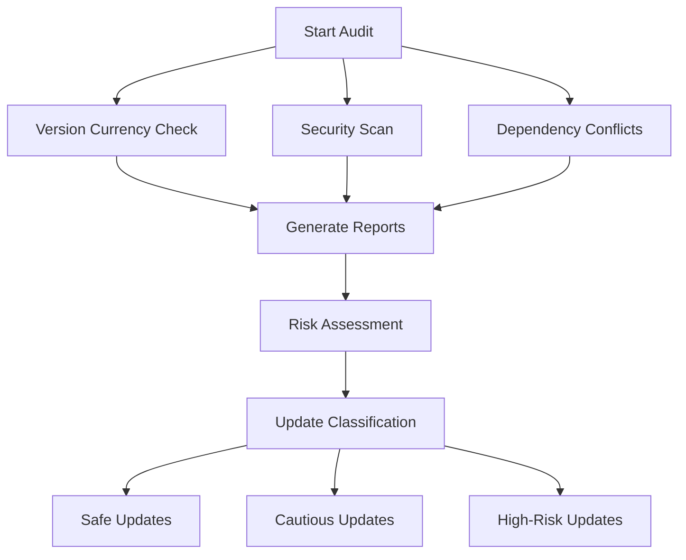

# Fleetify Dependency Management Guide

## Overview

This guide provides comprehensive instructions for managing dependencies in the Fleetify Fleet Management Application. It covers dependency auditing, security monitoring, update strategies, and maintenance procedures.

## Table of Contents

1. [System Architecture](#system-architecture)
2. [Quick Start](#quick-start)
3. [Dependency Audit Process](#dependency-audit-process)
4. [Update Strategies](#update-strategies)
5. [Security Management](#security-management)
6. [Monitoring and Maintenance](#monitoring-and-maintenance)
7. [Troubleshooting](#troubleshooting)
8. [Best Practices](#best-practices)

---

## System Architecture

### Technology Stack

The Fleetify application uses the following core technologies:

| Category | Technology | Version | Purpose |
|----------|-----------|---------|---------|
| **Frontend Framework** | React | ^18.3.1 | UI library |
| **Build Tool** | Vite | ^5.4.1 | Development and build |
| **Type System** | TypeScript | ^5.9.2 | Type safety |
| **Backend** | Supabase | ^2.57.4 | Database and auth |
| **State Management** | React Query | ^5.87.4 | Server state |
| **Styling** | Tailwind CSS | ^3.4.15 | CSS framework |
| **Mobile** | Capacitor | ^6.1.2 | Mobile deployment |

### Dependency Categories

**Production Dependencies (67 packages)**
- UI Components: Radix UI suite, Lucide React
- State Management: React Query, React Hook Form
- Data Visualization: Recharts, React Three Fiber
- Mobile: Capacitor plugins
- Utilities: date-fns, papaparse, xlsx

**Development Dependencies (17 packages)**
- Build Tools: Vite, PostCSS, Autoprefixer
- Code Quality: ESLint, TypeScript
- Mobile Build: Capacitor CLI
- Development: Supabase CLI

---

## Quick Start

### Initial Setup

```bash
# 1. Navigate to project directory
cd /data/workspace/fleetifyapp

# 2. Run setup script
chmod +x scripts/dependency-audit/setup-dependencies.sh
./scripts/dependency-audit/setup-dependencies.sh

# 3. Generate initial reports
chmod +x scripts/dependency-audit/generate-reports.sh
./scripts/dependency-audit/generate-reports.sh

# 4. Review reports
cat scripts/dependency-audit/reports/summary-latest.md
```

### Daily Operations

```bash
# Check for security vulnerabilities
npm audit

# Check for outdated packages
ncu

# Run monitoring script
./scripts/dependency-audit/monitor-dependencies.sh
```

---

## Dependency Audit Process

### Automated Audit Workflow

The dependency audit system performs comprehensive analysis across multiple dimensions:



### Running Full Audit

```bash
# Generate comprehensive audit reports
./scripts/dependency-audit/generate-reports.sh

# Reports generated:
# - version-currency-{timestamp}.txt - Outdated packages
# - security-audit-{timestamp}.txt - Security vulnerabilities
# - dependency-tree-{timestamp}.txt - Full dependency tree
# - outdated-packages-{timestamp}.txt - Outdated list
# - duplicate-deps-{timestamp}.txt - Duplicate dependencies
# - summary-{timestamp}.md - Comprehensive summary
```

### Report Analysis

#### Version Currency Report
Shows packages that have newer versions available:
- **Green**: Up to date
- **Yellow**: Minor/patch updates available
- **Red**: Major updates available

#### Security Audit Report
Lists vulnerabilities by severity:
- **Critical** (CVSS 9.0-10.0): Immediate action required
- **High** (CVSS 7.0-8.9): Priority update within 7 days
- **Moderate** (CVSS 4.0-6.9): Schedule update within 30 days
- **Low** (CVSS 0.1-3.9): Routine update cycle

---

## Update Strategies

### Update Classification Framework

#### Safe Updates (Automated)
Updates that can be applied automatically with minimal risk:

- **Patch versions** (1.0.x → 1.0.y)
- **Minor versions** (1.x.0 → 1.y.0)
- Well-maintained packages with semver compliance

```bash
# Update patch versions only
./scripts/dependency-audit/update-dependencies.sh safe

# Update minor and patch versions
./scripts/dependency-audit/update-dependencies.sh minor
```

#### Cautious Updates (Manual Review)
Updates requiring review before application:

- **Major versions** (x.0.0 → y.0.0)
- Core framework updates (React, Vite, TypeScript)
- Packages with breaking changes

```bash
# Update all including major versions (with confirmation)
./scripts/dependency-audit/update-dependencies.sh major
```

#### High-Risk Updates (Careful Testing)
Updates requiring extensive testing:

- Security-critical packages with known issues
- Packages affecting mobile build compatibility
- Dependencies with limited maintenance

**Process:**
1. Review changelog and migration guides
2. Test in development environment
3. Validate mobile builds
4. Run comprehensive test suite
5. Deploy to staging
6. Monitor for issues

### Update Execution Process

```bash
# 1. Create backup (automatic)
# 2. Update dependencies
./scripts/dependency-audit/update-dependencies.sh minor

# 3. Validate updates
./scripts/dependency-audit/validate.sh

# 4. If validation fails, rollback
./scripts/dependency-audit/rollback.sh <timestamp>
```

### Update Workflow

1. **Pre-Update**
   - Backup current state
   - Review update list
   - Check for breaking changes

2. **Update Execution**
   - Apply updates via script
   - Install dependencies
   - Generate update log

3. **Validation**
   - Run build process
   - Execute test suite
   - Check for errors/warnings

4. **Post-Update**
   - Test application functionality
   - Validate mobile builds
   - Monitor for issues

---

## Security Management

### Security Vulnerability Assessment

#### Priority Matrix

| Severity | CVSS Score | Response Time | Action |
|----------|------------|---------------|--------|
| Critical | 9.0 - 10.0 | < 24 hours | Immediate update |
| High | 7.0 - 8.9 | < 7 days | Priority update |
| Moderate | 4.0 - 6.9 | < 30 days | Scheduled update |
| Low | 0.1 - 3.9 | Next cycle | Routine update |

#### Security Scanning

```bash
# Run security audit
npm audit

# Generate detailed security report
npm audit --json > security-report.json

# Attempt automatic fixes
npm audit fix

# Force fixes (may include breaking changes)
npm audit fix --force
```

### Security Response Procedures

#### Critical Vulnerability Response

1. **Immediate Assessment**
   ```bash
   npm audit
   # Review affected packages and exploit details
   ```

2. **Update Affected Packages**
   ```bash
   # Try automatic fix first
   npm audit fix
   
   # If unsuccessful, manual update
   npm update <package-name>
   ```

3. **Validation**
   ```bash
   ./scripts/dependency-audit/validate.sh
   ```

4. **Emergency Deployment**
   - Test critical paths
   - Deploy to production
   - Monitor for issues

#### Dependency Chain Analysis

```bash
# View full dependency tree
npm ls <package-name>

# Check for duplicate versions
npm dedupe --dry-run

# Optimize dependency tree
npm dedupe
```

---

## Monitoring and Maintenance

### Automated Monitoring

#### Monitoring Schedule

| Frequency | Task | Script |
|-----------|------|--------|
| Daily | Security vulnerability check | `monitor-dependencies.sh` |
| Weekly | Version currency assessment | `generate-reports.sh` |
| Monthly | Comprehensive dependency audit | Full audit process |
| Quarterly | License compliance review | Manual review |

#### Setting Up Automated Monitoring

**Option 1: Cron Job (Linux/Mac)**

```bash
# Edit crontab
crontab -e

# Add daily monitoring at 9 AM
0 9 * * * cd /data/workspace/fleetifyapp && ./scripts/dependency-audit/monitor-dependencies.sh
```

**Option 2: GitHub Actions (CI/CD)**

```yaml
# .github/workflows/dependency-audit.yml
name: Dependency Audit

on:
  schedule:
    - cron: '0 9 * * *'  # Daily at 9 AM
  workflow_dispatch:

jobs:
  audit:
    runs-on: ubuntu-latest
    steps:
      - uses: actions/checkout@v3
      - uses: actions/setup-node@v3
        with:
          node-version: '18'
      - run: npm install
      - run: ./scripts/dependency-audit/monitor-dependencies.sh
      - uses: actions/upload-artifact@v3
        with:
          name: audit-reports
          path: scripts/dependency-audit/reports/
```

### Monitoring Reports

```bash
# View latest monitoring report
cat scripts/dependency-audit/monitoring/monitoring-report-latest.md

# View alert history
cat scripts/dependency-audit/monitoring/alerts-*.log
```

### Regular Maintenance Tasks

#### Weekly Maintenance

```bash
# 1. Check for security vulnerabilities
npm audit

# 2. Review outdated packages
ncu

# 3. Check monitoring reports
cat scripts/dependency-audit/monitoring/monitoring-report-latest.md
```

#### Monthly Maintenance

```bash
# 1. Full dependency audit
./scripts/dependency-audit/generate-reports.sh

# 2. Update safe packages
./scripts/dependency-audit/update-dependencies.sh minor

# 3. Validate updates
./scripts/dependency-audit/validate.sh

# 4. Clean up old backups (keep last 10)
cd scripts/dependency-audit/backups
ls -t | tail -n +11 | xargs rm -f
```

#### Quarterly Maintenance

1. **Major Version Review**
   - Review changelog for major version updates
   - Plan breaking change migrations
   - Schedule major updates

2. **License Compliance**
   - Review license changes
   - Update license documentation
   - Ensure compliance

3. **Dependency Health**
   - Remove unused dependencies
   - Replace deprecated packages
   - Optimize dependency tree

---

## Troubleshooting

### Common Issues and Solutions

#### Issue: Build Fails After Update

```bash
# 1. Check build errors
npm run build

# 2. Review error messages for incompatible packages

# 3. Rollback to previous state
./scripts/dependency-audit/rollback.sh <timestamp>

# 4. Update packages individually
npm update <package-name>
npm run build
```

#### Issue: Peer Dependency Conflicts

```bash
# 1. Identify conflicting packages
npm ls <package-name>

# 2. Install specific version
npm install <package-name>@<version>

# 3. Use --legacy-peer-deps if needed
npm install --legacy-peer-deps
```

#### Issue: Security Vulnerabilities Won't Fix

```bash
# 1. Try automatic fix
npm audit fix

# 2. Try force fix (may break)
npm audit fix --force

# 3. Manual package update
npm update <package-name>

# 4. Check for alternative packages
# Review package alternatives
```

#### Issue: Mobile Build Breaks

```bash
# 1. Check Capacitor compatibility
npx cap doctor

# 2. Sync mobile projects
npm run mobile:sync

# 3. Clean and rebuild
rm -rf android/app/build ios/App/build
npm run build:mobile
```

### Recovery Procedures

#### Emergency Rollback

```bash
# 1. List available backups
./scripts/dependency-audit/rollback.sh

# 2. Rollback to specific timestamp
./scripts/dependency-audit/rollback.sh <timestamp>

# 3. Validate rollback
./scripts/dependency-audit/validate.sh
```

#### Clean Install

```bash
# 1. Backup current state
cp package.json package.json.backup
cp package-lock.json package-lock.json.backup

# 2. Clean install
rm -rf node_modules package-lock.json
npm install

# 3. Validate
npm run build
```

---

## Best Practices

### Dependency Selection

#### Evaluation Criteria

Before adding a new dependency, evaluate:

1. **Security Record**
   - Check CVE history
   - Review security policy
   - Assess response time to vulnerabilities

2. **Maintenance Activity**
   - Recent commits (< 6 months)
   - Active issue resolution
   - Regular releases

3. **Community Support**
   - GitHub stars (> 1000 for critical packages)
   - npm weekly downloads
   - Active community

4. **Documentation Quality**
   - Comprehensive API docs
   - Migration guides
   - Code examples

5. **Performance Impact**
   - Bundle size
   - Runtime performance
   - Tree-shaking support

6. **License Compatibility**
   - Compatible with commercial use
   - No GPL/copyleft conflicts

#### Package Vetting Process

```bash
# 1. Check package stats
npm view <package-name>

# 2. Check security history
npm audit <package-name>

# 3. Review on npm registry
# Visit: https://www.npmjs.com/package/<package-name>

# 4. Check GitHub repository
# Review issues, PRs, commit history
```

### Version Management

#### Semantic Versioning

Follow semver guidelines:
- **Patch** (1.0.x): Bug fixes, no API changes
- **Minor** (1.x.0): New features, backward compatible
- **Major** (x.0.0): Breaking changes

#### Lock File Management

```bash
# Always commit package-lock.json
git add package-lock.json
git commit -m "Update dependencies"

# Regenerate if corrupted
rm package-lock.json
npm install
```

### Update Cadence

#### Recommended Schedule

- **Daily**: Security monitoring
- **Weekly**: Review security advisories
- **Monthly**: Update patch/minor versions
- **Quarterly**: Review major updates
- **Annually**: Dependency health audit

### Testing Strategy

#### Pre-Update Testing

1. Ensure all tests pass
2. Document current functionality
3. Create baseline metrics

#### Post-Update Testing

1. **Unit Tests**: Automated test suite
2. **Integration Tests**: API and database
3. **E2E Tests**: Critical user flows
4. **Manual Testing**: UI/UX validation
5. **Performance Testing**: Load time, bundle size
6. **Mobile Testing**: Android and iOS builds

---

## Scripts Reference

### Available Scripts

| Script | Purpose | Usage |
|--------|---------|-------|
| `setup-dependencies.sh` | Initial setup | `./scripts/dependency-audit/setup-dependencies.sh` |
| `generate-reports.sh` | Generate audit reports | `./scripts/dependency-audit/generate-reports.sh` |
| `update-dependencies.sh` | Update dependencies | `./scripts/dependency-audit/update-dependencies.sh [safe\|minor\|major]` |
| `validate.sh` | Validate updates | `./scripts/dependency-audit/validate.sh` |
| `rollback.sh` | Rollback updates | `./scripts/dependency-audit/rollback.sh <timestamp>` |
| `monitor-dependencies.sh` | Run monitoring | `./scripts/dependency-audit/monitor-dependencies.sh` |

### Script Permissions

```bash
# Make scripts executable
chmod +x scripts/dependency-audit/*.sh
```

---

## Success Metrics

### Key Performance Indicators

| Metric | Target | Measurement |
|--------|--------|-------------|
| Security vulnerability resolution | < 24 hours (critical) | Time from detection to fix |
| Dependency freshness score | > 80% | Up-to-date packages / total |
| Build success rate post-update | > 95% | Successful builds / total updates |
| Rollback frequency | < 2% | Rollbacks / total updates |
| License compliance | 100% | Compliant packages / total |

### Monitoring Dashboard

Track these metrics over time:
- Vulnerability count by severity
- Outdated package count
- Update frequency
- Build failure rate
- Time to patch critical issues

---

## Additional Resources

### Documentation
- [npm Documentation](https://docs.npmjs.com/)
- [Semantic Versioning](https://semver.org/)
- [Vite Documentation](https://vitejs.dev/)
- [React Documentation](https://react.dev/)

### Security Resources
- [npm Security Advisories](https://www.npmjs.com/advisories)
- [Snyk Vulnerability Database](https://snyk.io/vuln/)
- [CVE Database](https://cve.mitre.org/)

### Tools
- [npm-check-updates](https://www.npmjs.com/package/npm-check-updates)
- [depcheck](https://www.npmjs.com/package/depcheck)
- [license-checker](https://www.npmjs.com/package/license-checker)

---

## Support and Contact

For issues or questions:
1. Check troubleshooting section
2. Review generated reports
3. Consult development team
4. Refer to official documentation

---

*Last Updated: 2025-10-12*
*Version: 1.0.0*
*Maintained by: Fleetify Development Team*
