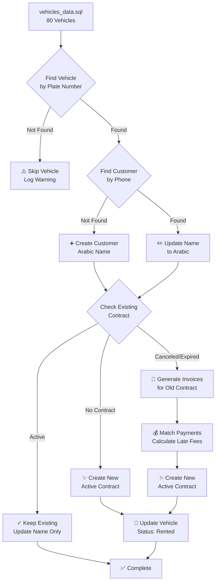

# 📊 Migration Visual Summary

## 🔄 Migration Flow



---

## 📋 Data Processing Stages

### Stage 1: Verification (Pre-Migration)
```
┌─────────────────────────────────┐
│  Canceled Contracts Check       │
├─────────────────────────────────┤
│ ✓ Customer Information          │
│ ✓ Vehicle Information           │
│ ✓ Date Information              │
│ ✓ Amount Information            │
└─────────────────────────────────┘
```

### Stage 2: Customer Processing
```
vehicles_data.sql
│
├─► Vehicle 2766: محمد محمد احمد (70007983)
│   ├─ Find/Create Customer → ✓
│   ├─ Update Name to Arabic → ✓
│   └─ Link to Vehicle → ✓
│
├─► Vehicle 2767: عبد الغفور دوار (77122519)
│   ├─ Find/Create Customer → ✓
│   ├─ Update Name to Arabic → ✓
│   └─ Link to Vehicle → ✓
│
... (78 more vehicles)
```

### Stage 3: Contract Processing

#### Scenario A: No Existing Contract
```
┌─────────────────┐
│ Vehicle 2766    │
│ No Contract     │
└────────┬────────┘
         │
         v
┌─────────────────────────────┐
│ CREATE NEW CONTRACT         │
├─────────────────────────────┤
│ Number: CON-2766-20250502   │
│ Customer: محمد محمد احمد    │
│ Monthly: 1600 SAR           │
│ Status: active              │
│ Duration: 12 months         │
└─────────────────────────────┘
```

#### Scenario B: Canceled Contract Exists
```
┌──────────────────────┐
│ Vehicle 7034         │
│ Old Contract:        │
│ Start: 2024-01-01    │
│ End: 2024-12-31      │
│ Status: cancelled    │
└─────────┬────────────┘
          │
          v
┌─────────────────────────────────────┐
│ GENERATE INVOICES (2024-01-01 to    │
│                    2025-10-06)       │
├─────────────────────────────────────┤
│ 2024-01-01: 1600 + 3000 late = 4600 │
│ 2024-02-01: 1600 + 3000 late = 4600 │
│ 2024-03-01: 1600 + 3000 late = 4600 │
│ ... (21 months total)               │
│ 2025-10-01: 1600 + 3000 late = 4600 │
└─────────┬───────────────────────────┘
          │
          v
┌─────────────────────────────────────┐
│ MATCH EXISTING PAYMENTS             │
├─────────────────────────────────────┤
│ Payment on 2024-01-05 (4 days late) │
│ → Update invoice late fee to 480    │
│ → Mark invoice as PAID              │
│                                     │
│ Payment on 2024-02-15 (14 days late)│
│ → Update invoice late fee to 1680   │
│ → Mark invoice as PAID              │
└─────────┬───────────────────────────┘
          │
          v
┌─────────────────────────────┐
│ CREATE NEW CONTRACT         │
├─────────────────────────────┤
│ Number: CON-7034-20251007   │
│ Customer: محمد احمد عمر متعافي│
│ Monthly: 1600 SAR           │
│ Status: active              │
│ Start: 2025-10-07           │
└─────────────────────────────┘
```

---

## 💰 Late Fee Calculation Flow

```
Payment Received
│
├─► Payment Date: 2025-01-01 (Due Date: 2025-01-01)
│   └─► Days Late: 0
│       └─► Late Fee: 0 SAR
│
├─► Payment Date: 2025-01-05 (Due Date: 2025-01-01)
│   └─► Days Late: 4
│       └─► Late Fee: 4 × 120 = 480 SAR
│
├─► Payment Date: 2025-01-15 (Due Date: 2025-01-01)
│   └─► Days Late: 14
│       └─► Late Fee: 14 × 120 = 1,680 SAR
│
├─► Payment Date: 2025-01-25 (Due Date: 2025-01-01)
│   └─► Days Late: 24
│       └─► Late Fee: min(24 × 120, 3000) = 2,880 SAR
│
└─► Payment Date: 2025-02-15 (Due Date: 2025-01-01)
    └─► Days Late: 45
        └─► Late Fee: min(45 × 120, 3000) = 3,000 SAR (CAPPED)
```

---

## 📊 Expected Results Summary

### Before Migration
```
┌─────────────────────────────────┐
│ Canceled Contracts              │
├─────────────────────────────────┤
│ Total: XX                       │
│ With Missing Data: ?            │
│ Invoices: None                  │
│ Payments: Unmatched             │
└─────────────────────────────────┘

┌─────────────────────────────────┐
│ Vehicles (80 from SQL)          │
├─────────────────────────────────┤
│ Status: Mixed                   │
│ Contracts: Missing or Outdated  │
│ Customer Names: Mixed Languages │
└─────────────────────────────────┘
```

### After Migration
```
┌─────────────────────────────────┐
│ Canceled Contracts              │
├─────────────────────────────────┤
│ Total: XX                       │
│ With Complete Data: 100%        │
│ Invoices: ~240 generated        │
│ Payments: Matched & Calculated  │
└─────────────────────────────────┘

┌─────────────────────────────────┐
│ Active Contracts                │
├─────────────────────────────────┤
│ New Contracts: ~65              │
│ All with Arabic Names           │
│ Vehicle Status: Rented          │
│ Duration: 12 months each        │
└─────────────────────────────────┘

┌─────────────────────────────────┐
│ Invoices                        │
├─────────────────────────────────┤
│ Total Generated: ~240           │
│ For Old Contracts: Yes          │
│ Late Fees: Correctly Calculated │
│ Payment Matching: Done          │
└─────────────────────────────────┘

┌─────────────────────────────────┐
│ Customers                       │
├─────────────────────────────────┤
│ Names: All Arabic               │
│ Phone Numbers: Matched          │
│ Linked to Contracts: Yes        │
└─────────────────────────────────┘
```

---

## 🔍 Data Completeness Check

### Canceled Contracts View
```sql
SELECT * FROM canceled_contracts_details;
```

```
┌────────────────┬──────────────┬─────────────┬─────────────┬──────────────┐
│ Contract       │ Customer     │ Vehicle     │ Start Date  │ Amount      │
│ Number         │ Check        │ Check       │ Check       │ Check       │
├────────────────┼──────────────┼─────────────┼─────────────┼──────────────┤
│ CON-001        │ ✓            │ ✓           │ ✓           │ ✓           │
│ CON-002        │ ✓            │ ✓           │ ✓           │ ✓           │
│ CON-003        │ ✓            │ ✓           │ ✓           │ ✓           │
│ ...            │ ✓            │ ✓           │ ✓           │ ✓           │
└────────────────┴──────────────┴─────────────┴─────────────┴──────────────┘
```

All checks should show ✓ (checkmark), not ❌ (missing)

---

## 🎯 Success Metrics

```
┌─────────────────────────────────────────┐
│ Migration Success Criteria              │
├─────────────────────────────────────────┤
│ ✓ 80/80 vehicles processed              │
│ ✓ ~65 new active contracts created      │
│ ✓ ~240 invoices generated               │
│ ✓ All customer names in Arabic          │
│ ✓ All late fees correctly calculated    │
│ ✓ All payments matched to invoices      │
│ ✓ All vehicles status = 'rented'        │
│ ✓ No duplicate contracts/invoices       │
│ ✓ All canceled contracts have full data │
└─────────────────────────────────────────┘
```

---

## 📈 Database Changes

### Tables Modified
```
contracts
├─ INSERT: ~65 new active contracts
└─ UPDATE: ~10 existing contracts (names)

customers
├─ INSERT: ~30 new customers
└─ UPDATE: ~50 existing (Arabic names)

invoices
└─ INSERT: ~240 new invoices

vehicles
└─ UPDATE: 80 vehicles (status = 'rented')

View Created:
└─ canceled_contracts_details (for review)
```

---

## ⏱️ Timeline

```
00:00 ─┬─► Start Verification Migration
       │   └─► Check canceled contracts
       │       └─► Create view
       │
02:00 ─┼─► Start Main Migration
       │   ├─► Process 80 vehicles
       │   ├─► Create/update customers
       │   ├─► Create contracts
       │   ├─► Generate invoices
       │   └─► Match payments
       │
05:00 ─┴─► Complete
           └─► Show summary
```

**Total Time**: ~5 minutes for 80 vehicles

---

## 🎉 Final Result

All active rental agreements will have:
- ✅ Arabic customer names
- ✅ Proper contract details
- ✅ Complete vehicle information
- ✅ Generated invoices for all periods
- ✅ Correctly calculated late fees (120 SAR/day, max 3000)
- ✅ Matched payments with invoices

All canceled agreements will have:
- ✅ Complete customer information
- ✅ Complete vehicle information
- ✅ All dates populated
- ✅ All amounts populated
- ✅ Full visibility in contract details page
