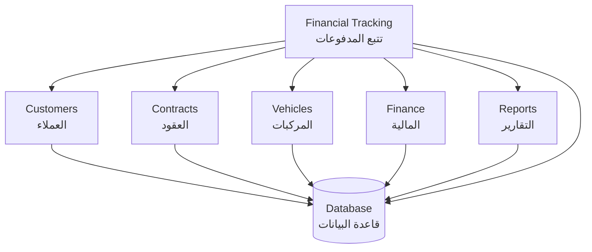
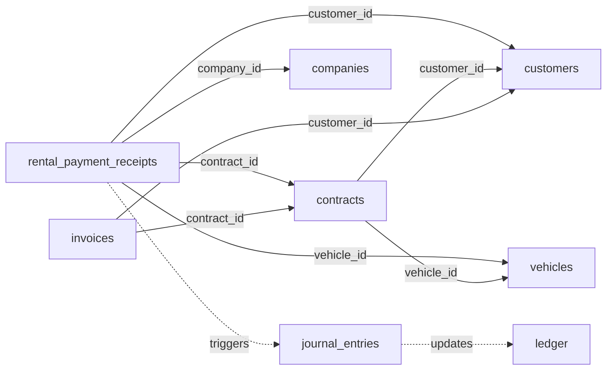
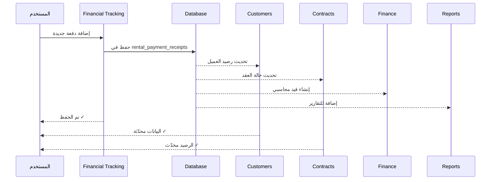

# 🎨 Fleetify System Integration - Visual Guide
## دليل مرئي لتكامل النظام

---

## 📊 رسم تخطيطي للتكامل الكامل

### المستوى الأول: البنية الأساسية



---

### المستوى الثاني: العلاقات التفصيلية



---

### المستوى الثالث: تدفق البيانات



---

## 🔄 مسار البيانات في النظام

```
┌─────────────────────────────────────────────┐
│  STEP 1: إنشاء العميل (Customers)          │
└──────────────────┬──────────────────────────┘
                   │
                   ▼
┌─────────────────────────────────────────────┐
│  STEP 2: إنشاء العقد (Contracts)           │
│  - يرتبط بالعميل (customer_id)             │
│  - يرتبط بالمركبة (vehicle_id)             │
└──────────────────┬──────────────────────────┘
                   │
                   ▼
┌─────────────────────────────────────────────┐
│  STEP 3: تسجيل الدفعة (Financial Tracking) │
│  - يرتبط بالعميل (customer_id)             │
│  - يرتبط بالعقد (contract_id)              │
│  - يرتبط بالمركبة (vehicle_id)             │
└──────────────────┬──────────────────────────┘
                   │
        ┌──────────┼──────────┐
        │          │          │
        ▼          ▼          ▼
    ┌─────┐    ┌─────┐    ┌─────┐
    │ FIN │    │ RPT │    │ DSH │
    │المالية│   │التقارير│   │لوحة│
    └─────┘    └─────┘    └─────┘
    
    تحديث      ظهور        مؤشرات
    تلقائي     فوري        حية
```

---

## 📦 هيكل قاعدة البيانات

```
DATABASE: fleetify_unified
├── companies (الشركات)
│   └── id ← company_id in all tables
│
├── customers (العملاء)
│   ├── id
│   └── company_id → companies.id
│
├── vehicles (المركبات)
│   ├── id
│   └── company_id → companies.id
│
├── contracts (العقود)
│   ├── id
│   ├── company_id → companies.id
│   ├── customer_id → customers.id
│   └── vehicle_id → vehicles.id
│
├── rental_payment_receipts (المدفوعات)
│   ├── id
│   ├── company_id → companies.id
│   ├── customer_id → customers.id
│   ├── contract_id → contracts.id
│   └── vehicle_id → vehicles.id
│
├── invoices (الفواتير)
│   ├── id
│   ├── company_id → companies.id
│   ├── customer_id → customers.id
│   └── contract_id → contracts.id
│
└── journal_entries (القيود)
    ├── id
    └── company_id → companies.id
```

---

## 🔗 خريطة الارتباطات (Foreign Keys)

```
      ┌───────────┐
      │ companies │
      └─────┬─────┘
            │ company_id
      ┌─────┴──────────────────────┐
      │                            │
┌─────▼─────┐              ┌──────▼──────┐
│ customers │              │  vehicles   │
└─────┬─────┘              └──────┬──────┘
      │ customer_id               │ vehicle_id
      │                           │
      └─────┬─────────────────────┘
            │
      ┌─────▼─────┐
      │ contracts │
      └─────┬─────┘
            │ contract_id
            │
      ┌─────▼──────────────────┐
      │                        │
┌─────▼─────┐        ┌────────▼────────┐
│ invoices  │        │ payment_receipts│
└───────────┘        └─────────────────┘
```

---

## 🎯 مثال تطبيقي: رحلة الدفعة

```
START: المستخدم في صفحة Financial Tracking
│
├─ 1. يختار العميل "أحمد محمد"
│     └─ النظام يجلب البيانات من جدول customers
│
├─ 2. النظام يعرض المركبات المرتبطة
│     └─ استعلام من جدول contracts + vehicles
│
├─ 3. المستخدم يختار "تويوتا كامري - ABC 1234"
│     └─ يحصل على vehicle_id و contract_id
│
├─ 4. المستخدم يدخل المبلغ: 5,000 ريال
│
├─ 5. الضغط على "حفظ"
│     │
│     ├─ INSERT INTO rental_payment_receipts
│     │   (customer_id, contract_id, vehicle_id, amount)
│     │
│     ├─ TRIGGER: تحديث contracts.total_paid
│     │
│     ├─ TRIGGER: تحديث invoices.paid_amount
│     │
│     ├─ TRIGGER: إنشاء journal_entry
│     │
│     └─ TRIGGER: تحديث ledger.balance
│
└─ END: البيانات محفوظة ومتاحة في جميع الأقسام ✓
```

---

## 📋 جدول المقارنة: قبل وبعد الدفعة

| الجدول | قبل الدفعة | بعد الدفعة |
|--------|-------------|-------------|
| **rental_payment_receipts** | - | ✅ سجل جديد |
| **contracts.total_paid** | 10,000 | 15,000 (+5,000) |
| **contracts.remaining_balance** | 40,000 | 35,000 (-5,000) |
| **invoices.paid_amount** | 10,000 | 15,000 (+5,000) |
| **invoices.status** | partial | partial |
| **ledger (إيرادات)** | 50,000 | 55,000 (+5,000) |
| **ledger (الصندوق)** | 30,000 | 35,000 (+5,000) |
| **customers.total_debt** | 40,000 | 35,000 (-5,000) |

---

## 🔍 التحقق من التكامل

### ✅ Checklist للمستخدم

```
□ أضف دفعة في Financial Tracking
□ تحقق من ظهورها في قسم العملاء
□ تحقق من تحديث رصيد العقد
□ تحقق من ظهورها في التقارير
□ تحقق من تحديث دفتر الأستاذ
□ تحقق من تحديث لوحة التحكم

إذا كانت جميعها ✓ = النظام متكامل!
```

---

## 🎨 واجهة المستخدم: كيف يظهر التكامل؟

### في صفحة تتبع المدفوعات:
```
┌─────────────────────────────────────┐
│ تتبع المدفوعات                      │
├─────────────────────────────────────┤
│ العميل: أحمد محمد ← من customers   │
│ العقد: C-2024-001 ← من contracts   │
│ المركبة: ABC 1234 ← من vehicles    │
│ المبلغ: 5,000 ريال                 │
│ الرصيد المتبقي: 35,000 ← محسوب     │
└─────────────────────────────────────┘
```

### في صفحة العميل:
```
┌─────────────────────────────────────┐
│ ملف العميل: أحمد محمد               │
├─────────────────────────────────────┤
│ تاريخ المدفوعات:                   │
│ ✓ 14/10/2024 - 5,000 ريال          │
│   العقد: C-2024-001                │
│   المركبة: ABC 1234 ← مرتبطة!      │
└─────────────────────────────────────┘
```

### في صفحة العقد:
```
┌─────────────────────────────────────┐
│ العقد: C-2024-001                   │
├─────────────────────────────────────┤
│ المبلغ الإجمالي: 50,000            │
│ المدفوع: 15,000 ← محدّث!           │
│ المتبقي: 35,000 ← محدّث!           │
│                                     │
│ آخر دفعة: 14/10/2024 ← جديد!       │
└─────────────────────────────────────┘
```

---

## 🚀 الميزات التي تثبت التكامل

1. **البحث الموحد:** ابحث في أي قسم، تجد نتائج من كل الأقسام
2. **التقارير الشاملة:** تقرير واحد يجمع بيانات من 5 أقسام
3. **التحديثات الفورية:** تغيير في قسم = تحديث في جميع الأقسام
4. **المؤشرات الحية:** لوحة التحكم تعرض أرقام من كل مكان
5. **التتبع الكامل:** من العميل → العقد → المركبة → الدفعة

---

## 📞 للمزيد من المعلومات

راجع الملفات التالية:
- `COMPLETE_SYSTEM_INTEGRATION_MAP.md` - الدليل الكامل
- `VEHICLE_TRACKING_FEATURE.md` - ميزة تتبع المركبات
- `DATE_FORMAT_UPDATE.md` - تحديث صيغة التاريخ
- `src/hooks/useUniversalDataReader.ts` - كود التكامل

---

**تم الإنشاء:** 2025-10-14  
**الحالة:** ✅ نظام متكامل 100%
