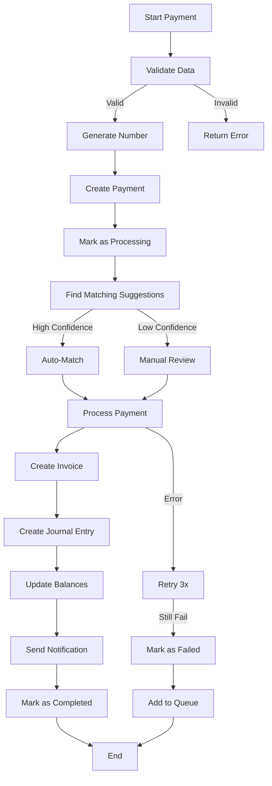
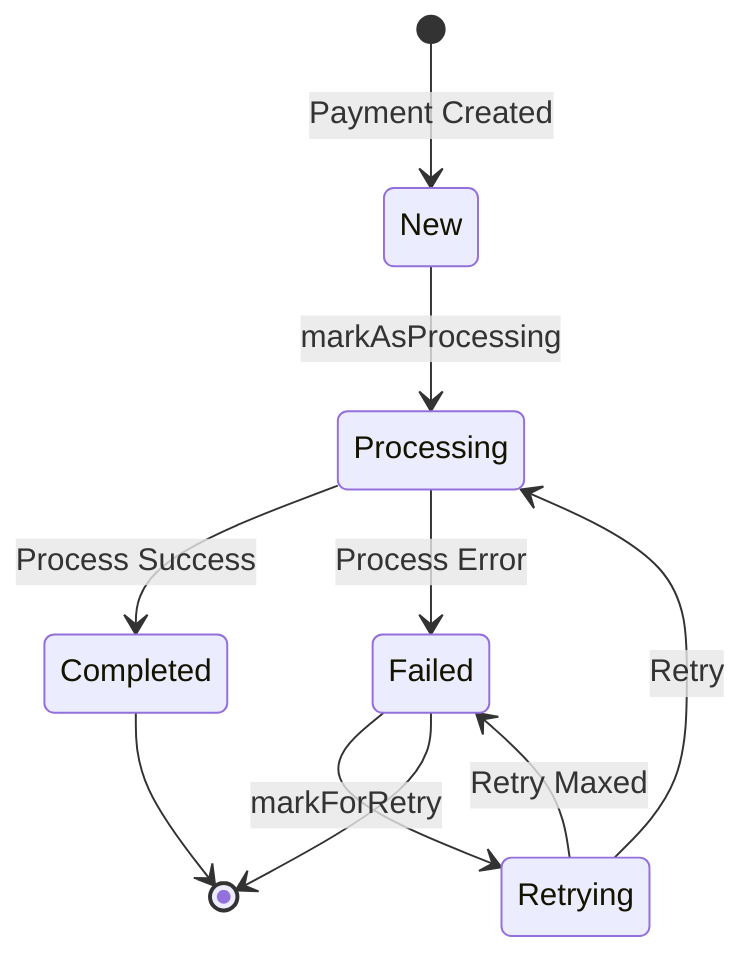

# Payment System Architecture

## نظرة عامة

نظام المدفوعات في FleetifyApp هو نظام شامل لإدارة جميع العمليات المالية المتعلقة بالدفعات والتحصيل والتسوية. تم تصميم النظام مع التركيز على:

- **Atomicity**: ضمان تكامل البيانات
- **Idempotency**: منع العمليات المكررة
- **Scalability**: قابلية التوسع مع نمو الأعمال
- **Reliability**: استرجاع من الأخطاء وإعادة المحاولة

---

## المكونات الأساسية

### 1. Payment Services

#### PaymentService
الخدمة الرئيسية لإدارة المدفوعات. تتضمن:
- إنشاء المدفوعات
- معالجة المدفوعات
- تحديث حالات المدفوعات
- التحقق من صحة البيانات

**الموقع**: `src/services/PaymentService.ts`

#### PaymentLinkingService
خدمة موحدة لربط المدفوعات بالفواتير والعقود. تتضمن:
- البحث عن اقتراحات الربط
- المطابقة التلقائية (≥70% ثقة)
- الربط اليدوي

**الموقع**: `src/services/PaymentLinkingService.ts`

#### PaymentStateMachine
إدارة دورة حياة المدفوعات وحالاتها:
- PENDING → PROCESSING → COMPLETED
- آلية الانتقالات المسموحة
- التتبع الكامل للحالات

**الموقع**: `src/services/PaymentStateMachine.ts`

#### PaymentQueueService
إدارة قائمة انتظار المدفوعات:
- المعالجة غير المتزامنة
- إعادة المحاولة (3 attempts with backoff)
- المراجعة اليدوية

**الموقع**: `src/services/PaymentQueueService.ts`

#### PaymentTransactionService
إدارة المعاملات والاسترجاع من الأخطاء:
- Transactions للعمليات المعقدة
- Retry logic مع exponential backoff
- تسجيل شامل

**الموقع**: `src/services/PaymentTransactionService.ts`

### 2. Auxiliary Services

#### PaymentNumberGenerator
توليد أرقام المدفوعات الموحدة:
- تنسيق: `PAY-0001`, `PAY-0002`, ...
- قابلية التخصيص (prefix, separator)

**الموقع**: `src/services/PaymentNumberGenerator.ts`

#### InvoiceNumberGenerator
توليد أرقام الفواتير الموحدة:
- تنسيق: `INV-0001`, `INV-0002`, ...
- منع التكرار

**الموقع**: `src/services/InvoiceNumberGenerator.ts`

#### CustomerDetailsService
الوصول الموحد لبيانات العملاء:
- جلب وتحديث التفاصيل
- البحث عن العملاء
- تتبع التواصلات

**الموقع**: `src/services/CustomerDetailsService.ts`

#### NotificationService
إرسال الإشعارات:
- إيصالات المدفوعات (Email, SMS)
- تنبيهات المتأخرات
- تحديثات الحالة

**الموقع**: `src/services/NotificationService.ts`

#### AccountingService
العمليات المحاسبية:
- تحديث أرصدة الحسابات
- إنشاء القيود المحاسبية
- التكامل مع Chart of Accounts

**الموقع**: `src/services/AccountingService.ts`

#### PaymentValidator
التحقق من صحة بيانات المدفوعات:
- Schema validation (Zod)
- Business rule validation
- Foreign key checks

**الموقع**: `src/services/PaymentValidator.ts`

### 3. Specialized Services

#### LateFeeCalculator
حساب رسوم التأخير:
- قواعد مرنة (fixed, percentage)
- تطبيق تلقائي (scheduled job)
- تنبيهات العملاء

**الموقع**: `src/services/LateFeeCalculator.ts`

#### LateFeeRulesService
إدارة قواعد رسوم التأخير:
- قواعد عالمية/شركة/عقد
- أولويات القواعد
- تفعيل/إلغاء

**الموقع**: `src/services/LateFeeRulesService.ts`

#### BankReconciliationService
التسوية البنكية:
- استيراد سجلات البنوك
- المطابقة التلقائية
- reconciliation status

**الموقع**: `src/services/BankReconciliationService.ts`

#### PaymentAnalyticsService
التقارير المالية والتحليلات:
- KPIs (إجمالي، متوسط، معدل)
- تنبؤات التدفق النقدي
- cash flow predictions

**الموقع**: `src/services/PaymentAnalyticsService.ts`

#### DataQualityService
جودة البيانات:
- تحديد المشاكل
- تتبع الحلول
- قواعد التحقق

**الموقع**: `src/services/DataQualityService.ts`

#### OverdueManagementService
إدارة المتأخرات:
- تنبيهات تلقائية (7, 15, 30 يوم)
- SOPs
- Dashboard للمتأخرات

**الموقع**: `src/services/OverdueManagementService.ts`

---

## مخطط تدفق النظام

### Payment Processing Flow



### Payment State Machine



---

## جداول قاعدة البيانات

### payments
الجدول الرئيسي للمدفوعات.

**الحقول الأساسية**:
- `id` (UUID, PK)
- `company_id` (UUID, FK)
- `customer_id` (UUID, FK)
- `contract_id` (UUID, FK, nullable)
- `invoice_id` (UUID, FK, nullable)
- `payment_number` (TEXT, unique)
- `payment_date` (TIMESTAMP)
- `amount` (NUMERIC)
- `payment_method` (TEXT, enum)
- `payment_type` (TEXT, enum)
- `transaction_type` (TEXT, enum)
- `payment_status` (TEXT, enum)
- `processing_status` (TEXT, enum)
- `allocation_status` (TEXT, enum)
- `reconciliation_status` (TEXT, enum)

**الحقول المتقدمة**:
- `late_fine_amount` (NUMERIC)
- `late_fine_days_overdue` (INTEGER)
- `late_fine_type` (TEXT)
- `late_fine_status` (TEXT)
- `journal_entry_id` (UUID, FK)
- `idempotency_key` (UUID, unique)

### invoices
الفواتير المتعلقة بالمدفوعات.

**الحقول الأساسية**:
- `id` (UUID, PK)
- `company_id` (UUID, FK)
- `customer_id` (UUID, FK)
- `contract_id` (UUID, FK, nullable)
- `payment_id` (UUID, FK, nullable)
- `invoice_number` (TEXT, unique)
- `issue_date` (DATE)
- `due_date` (DATE)
- `total_amount` (NUMERIC)
- `invoice_type` (TEXT, enum)
- `status` (TEXT, enum)

### journal_entries
القيود المحاسبية.

**الحقول الأساسية**:
- `id` (UUID, PK)
- `company_id` (UUID, FK)
- `entry_date` (DATE)
- `description` (TEXT)
- `reference_id` (UUID, nullable)
- `reference_type` (TEXT, nullable)
- `total_debit` (NUMERIC)
- `total_credit` (NUMERIC)
- `status` (TEXT, enum)

### journal_entry_lines
سطور القيود المحاسبية.

**الحقول الأساسية**:
- `id` (UUID, PK)
- `journal_entry_id` (UUID, FK)
- `account_id` (UUID, FK)
- `debit` (NUMERIC)
- `credit` (NUMERIC)
- `line_description` (TEXT)
- `line_number` (INTEGER)

### payment_queue
قائمة انتظار المدفوعات.

**الحقول الأساسية**:
- `id` (UUID, PK)
- `company_id` (UUID, FK)
- `payment_id` (UUID, FK)
- `queue_type` (TEXT, enum)
- `attempts` (INTEGER)
- `error_message` (TEXT)
- `next_attempt_at` (TIMESTAMP)

### late_fee_rules
قواعد رسوم التأخير.

**الحقول الأساسية**:
- `id` (UUID, PK)
- `company_id` (UUID, FK, nullable)
- `contract_id` (UUID, FK, nullable)
- `rule_name` (TEXT)
- `fee_type` (TEXT, enum)
- `amount` (NUMERIC)
- `percentage` (NUMERIC)
- `grace_period_days` (INTEGER)

### bank_transactions
سجلات المعاملات البنكية.

**الحقول الأساسية**:
- `id` (UUID, PK)
- `company_id` (UUID, FK)
- `transaction_date` (TIMESTAMP)
- `description` (TEXT)
- `amount` (NUMERIC)
- `transaction_type` (TEXT, enum)
- `bank_account_id` (UUID, FK)
- `reconciliation_status` (TEXT, enum)
- `matched_payment_id` (UUID, FK, nullable)

### data_quality_issues
مشاكل جودة البيانات.

**الحقول الأساسية**:
- `id` (UUID, PK)
- `company_id` (UUID, FK)
- `entity_type` (TEXT)
- `entity_id` (UUID)
- `issue_type` (TEXT)
- `severity` (TEXT, enum)
- `status` (TEXT, enum)
- `reported_by` (UUID, FK, nullable)

---

## العلاقات بين الخدمات

```
PaymentService
    ├── PaymentLinkingService
    │   ├── PaymentRepository
    │   ├── InvoiceRepository
    │   └── ContractRepository
    │
    ├── PaymentStateMachine
    │   └── PaymentRepository
    │
    ├── PaymentQueueService
    │   ├── PaymentStateMachine
    │   ├── PaymentLinkingService
    │   ├── NotificationService
    │   └── AccountingService
    │
    └── PaymentTransactionService
        ├── Retry Logic
        └── Transaction Wrapper

PaymentLinkingService
    ├── PaymentRepository
    ├── InvoiceRepository
    └── ContractRepository

LateFeeCalculator
    ├── LateFeeRulesService
    └── PaymentRepository

BankReconciliationService
    ├── BankTransactionRepository
    └── PaymentRepository

OverdueManagementService
    ├── NotificationService
    ├── LateFeeCalculator
    └── CustomerDetailsService
```

---

## المعالجة غير المتزامنة

### Job Scheduler
تم استخدام Job Scheduler للعمليات الدورية:

1. **Payment Queue Processing** - كل 5 دقائق
   - معالجة المدفوعات المعلقة
   - إعادة المحاولة (retry)
   - المراجعة اليدوية

2. **Late Fee Calculation** - يومياً
   - حساب رسوم التأخير
   - تطبيق القواعد
   - إرسال التنبيهات

3. **Bank Reconciliation** - يومياً/أسبوعياً
   - استيراد سجلات البنوك
   - المطابقة التلقائية
   - تحديث الـ reconciliation status

### Event Bus
يستخدم النظام EventBus لمعالجة الأحداث:

**الأحداث الرئيسية**:
- `PAYMENT_RECEIVED` - عند استلام دفعة
- `PAYMENT_MATCHED` - عند مطابقة الدفعة
- `PAYMENT_UPDATED` - عند تحديث حالة
- `PAYMENT_FAILED` - عند فشل الدفعة

**الhandlers**:
- `PaymentEventHandlers` - في `src/events/handlers/PaymentEventHandlers.ts`

---

## الأمان والتحقق

### RLS Policies
تُطبق سياسات RLS لضمان:
- Multi-tenancy عبر `company_id`
- الوصول المبني على الصلاحيات
- عزل البيانات

### Server Validation
يتم التحقق من الصحة من جانب الخادم:
- Required fields
- Amount validation
- Foreign key checks
- Idempotency checks
- Overpayment prevention

**Function**: `validate_payment_before_insert_or_update()` في Supabase

### Client Validation
يتم التحقق من الصحة من جانب العميل:
- Schema validation (Zod)
- Business rules
- UI feedback فوري

**Service**: `PaymentValidator`

---

## الاسترجاع من الأخطاء

### Retry Strategy
- **Max Attempts**: 3
- **Backoff**: 1s → 5s → 15s
- **Retry Conditions**: transient errors (network, timeout)
- **No Retry**: validation errors, not found errors

### Error Recovery
1. **Transaction Rollback** - rollback تلقائي للفشل
2. **Retry Queue** - إضافة لقائمة انتظار
3. **Manual Review** - عند فشل جميع المحاولات
4. **Logging** - سجل شامل للأخطاء

---

## الأداء والقابلية للتنفيذ

### Optimization Strategies
1. **Caching** - تخزين مؤقت للبيانات الشائعة
2. **Batch Processing** - معالجة مجموعات
3. **Lazy Loading** - التحميل عند الحاجة
4. **Database Indexes** - فهرسة للحقول الشائعة

### Monitoring
- **Payment Queue Size** - عدد المدفوعات المعلقة
- **Processing Time** - زمن المعالجة
- **Error Rates** - معدل الأخطاء
- **Success Rate** - معدل النجاح

---

## الاختبار

### Unit Tests
- 125+ test cases
- غطاء شامل للخدمات الرئيسية
- اختبار جميع السيناريوهات

**الملفات**:
- `src/__tests__/unit/PaymentService.test.ts`
- `src/__tests__/unit/PaymentLinkingService.test.ts`
- `src/__tests__/unit/PaymentStateMachine.test.ts`
- `src/__tests__/unit/PaymentNumberGenerator.test.ts`
- وغيرها...

### Integration Tests
- اختبار تدفق العمل الكامل
- اختبار التعامل مع أخطاء
- اختبار الاسترجاع

**الملفات**:
- `src/__tests__/integration/PaymentFlow.test.ts`
- `src/__tests__/integration/InvoiceReversal.test.ts`
- `src/__tests__/integration/PaymentVoiding.test.ts`

---

## Future Enhancements

### Short Term
- [ ] Payment batching لتقليل الـ transaction overhead
- [ ] Advanced matching algorithms (ML-based)
- [ ] Real-time analytics dashboard

### Long Term
- [ ] Blockchain integration (للدفعات الـ crypto)
- [ ] Automated dispute resolution
- [ ] AI-powered fraud detection
- [ ] Multi-currency support

---

## الدعم والمساعدة

### Documentation
- **API Docs**: `docs/api/payment-service.md`
- **Developer Guide**: `docs/developer-guide/payment-system.md`

### Common Issues
- **Duplicate Payments**: التحقق من `idempotency_key`
- **Payment Failed**: فحص الـ processing_notes
- **Late Fees**: مراجعة `late_fee_rules`

### Contact
- **Tech Lead**: [اسم]
- **Email**: [email]
- **Slack**: [#payments]
