# دليل النظام المالي الشامل

## نظرة عامة على النظام المالي

يعتبر النظام المالي العمود الفقري لإدارة الأعمال، حيث يوفر إدارة شاملة للحسابات، المعاملات المالية، التقارير، والتكامل مع جميع أقسام النظام.

---

## 1. هيكل النظام المالي الأساسي

### دليل الحسابات (Chart of Accounts)

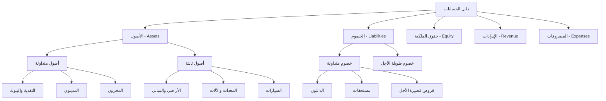

### هيكل الحسابات المحاسبية

```typescript
interface ChartOfAccounts {
  id: string;
  account_code: string;        // رمز الحساب (5 مستويات)
  account_name: string;        // اسم الحساب بالإنجليزية
  account_name_ar: string;     // اسم الحساب بالعربية
  account_type: AccountType;   // نوع الحساب
  account_level: 1 | 2 | 3 | 4 | 5 | 6; // مستوى الحساب
  parent_account_id?: string;  // الحساب الأب
  is_header: boolean;          // حساب رئيسي أم فرعي
  balance_type: 'debit' | 'credit'; // طبيعة الرصيد
  current_balance: number;     // الرصيد الحالي
  is_active: boolean;          // حالة التفعيل
  can_link_customers: boolean; // يمكن ربطه بالعملاء
  can_link_vendors: boolean;   // يمكن ربطه بالموردين
  can_link_employees: boolean; // يمكن ربطه بالموظفين
}
```

### أنواع الحسابات الأساسية

```sql
-- أنواع الحسابات المحاسبية
CREATE TYPE account_type AS ENUM (
    'assets',           -- الأصول
    'current_assets',   -- أصول متداولة
    'fixed_assets',     -- أصول ثابتة
    'liabilities',      -- الخصوم
    'current_liabilities', -- خصوم متداولة
    'long_term_liabilities', -- خصوم طويلة الأجل
    'equity',           -- حقوق الملكية
    'revenue',          -- الإيرادات
    'operating_revenue', -- إيرادات تشغيلية
    'other_revenue',    -- إيرادات أخرى
    'expenses',         -- المصروفات
    'operating_expenses', -- مصروفات تشغيلية
    'administrative_expenses', -- مصروفات إدارية
    'cost_of_sales'     -- تكلفة البضاعة المباعة
);
```

---

## 2. القيود المحاسبية (Journal Entries)

### نظام القيد المزدوج

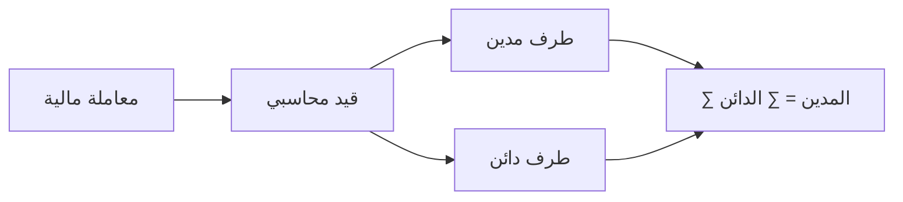

### هيكل القيود المحاسبية

```typescript
interface JournalEntry {
  id: string;
  entry_number: string;        // رقم القيد
  entry_date: Date;           // تاريخ القيد
  description: string;        // وصف القيد
  description_ar: string;     // وصف القيد بالعربية
  total_amount: number;       // إجمالي مبلغ القيد
  status: 'draft' | 'posted' | 'cancelled'; // حالة القيد
  reference_type?: string;    // نوع المرجع
  reference_id?: string;      // معرف المرجع
  created_by: string;         // منشئ القيد
  approved_by?: string;       // معتمد القيد
  posting_date?: Date;        // تاريخ الترحيل
  
  // تفاصيل القيد
  lines: JournalEntryLine[];
}

interface JournalEntryLine {
  id: string;
  journal_entry_id: string;
  account_id: string;         // رقم الحساب
  description?: string;       // وصف السطر
  debit_amount: number;       // المبلغ المدين
  credit_amount: number;      // المبلغ الدائن
  cost_center_id?: string;    // مركز التكلفة
  reference_number?: string;  // رقم مرجعي
}
```

### أنواع القيود التلقائية

1. **قيود المبيعات**
   ```sql
   -- عند إنشاء فاتورة مبيعات
   مدين: حساب العميل (المدينون)
   دائن: حساب الإيرادات
   ```

2. **قيود المشتريات**
   ```sql
   -- عند إنشاء فاتورة مشتريات
   مدين: حساب المشتريات/المخزون
   دائن: حساب المورد (الدائنون)
   ```

3. **قيود المدفوعات**
   ```sql
   -- عند استلام دفعة من عميل
   مدين: حساب البنك/الصندوق
   دائن: حساب العميل
   ```

4. **قيود الرواتب**
   ```sql
   -- عند صرف راتب
   مدين: حساب الرواتب والأجور
   دائن: حساب البنك
   ```

---

## 3. إدارة البنوك والصناديق

### إعداد البنوك

```typescript
interface Bank {
  id: string;
  bank_name: string;          // اسم البنك
  bank_name_ar: string;       // اسم البنك بالعربية
  account_number: string;     // رقم الحساب
  iban?: string;              // رقم الآيبان
  swift_code?: string;        // رمز سويفت
  branch_name: string;        // اسم الفرع
  account_type: 'checking' | 'savings' | 'business'; // نوع الحساب
  currency: string;           // العملة
  opening_balance: number;    // الرصيد الافتتاحي
  current_balance: number;    // الرصيد الحالي
  is_primary: boolean;        // حساب رئيسي
  is_active: boolean;         // حالة التفعيل
}
```

### معاملات البنوك

```typescript
interface BankTransaction {
  id: string;
  bank_id: string;            // معرف البنك
  transaction_number: string; // رقم المعاملة
  transaction_date: Date;     // تاريخ المعاملة
  transaction_type: 'deposit' | 'withdrawal' | 'transfer'; // نوع المعاملة
  amount: number;             // المبلغ
  description: string;        // الوصف
  reference_number?: string;  // رقم مرجعي
  check_number?: string;      // رقم الشيك
  counterpart_bank_id?: string; // البنك المقابل (للتحويلات)
  balance_after: number;      // الرصيد بعد المعاملة
  status: 'pending' | 'completed' | 'cancelled'; // الحالة
  reconciled: boolean;        // تمت المطابقة
  journal_entry_id?: string;  // معرف القيد المحاسبي
}
```

---

## 4. مراكز التكلفة (Cost Centers)

### إعداد مراكز التكلفة

```typescript
interface CostCenter {
  id: string;
  center_code: string;        // رمز المركز
  center_name: string;        // اسم المركز
  center_name_ar: string;     // اسم المركز بالعربية
  center_type: 'department' | 'project' | 'product' | 'region'; // نوع المركز
  parent_center_id?: string;  // المركز الأب
  manager_id?: string;        // مدير المركز
  budget_amount?: number;     // الميزانية المخصصة
  is_active: boolean;         // حالة التفعيل
  
  // إحصائيات
  total_expenses: number;     // إجمالي المصروفات
  total_revenue: number;      // إجمالي الإيرادات
  variance_amount: number;    // الانحراف
  variance_percentage: number; // نسبة الانحراف
}
```

### تطبيق مراكز التكلفة

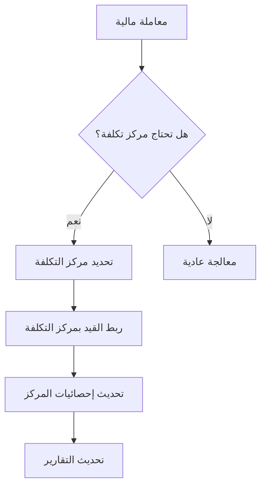

---

## 5. الميزانيات (Budgets)

### إعداد الميزانية

```typescript
interface Budget {
  id: string;
  budget_name: string;        // اسم الميزانية
  budget_year: number;        // سنة الميزانية
  status: 'draft' | 'approved' | 'active' | 'closed'; // الحالة
  total_revenue: number;      // إجمالي الإيرادات المخططة
  total_expenses: number;     // إجمالي المصروفات المخططة
  net_income: number;         // صافي الدخل المخطط
  
  // عناصر الميزانية
  items: BudgetItem[];
}

interface BudgetItem {
  id: string;
  budget_id: string;
  account_id: string;         // الحساب المحاسبي
  budgeted_amount: number;    // المبلغ المخطط
  actual_amount: number;      // المبلغ الفعلي
  variance_amount: number;    // الانحراف
  variance_percentage: number; // نسبة الانحراف
}
```

### تنبيهات الميزانية

```typescript
interface BudgetAlert {
  id: string;
  budget_id: string;
  budget_item_id?: string;
  alert_type: 'budget_exceeded' | 'threshold_reached' | 'variance_high';
  threshold_percentage: number; // نسبة التحذير
  current_percentage: number;   // النسبة الحالية
  amount_exceeded: number;      // المبلغ المتجاوز
  message: string;              // رسالة التنبيه
  is_acknowledged: boolean;     // تم الاطلاع
}
```

---

## 6. الأصول الثابتة (Fixed Assets)

### إدارة الأصول الثابتة

```typescript
interface FixedAsset {
  id: string;
  asset_name: string;         // اسم الأصل
  asset_name_ar: string;      // اسم الأصل بالعربية
  asset_category: 'building' | 'equipment' | 'vehicle' | 'furniture' | 'computer'; // فئة الأصل
  asset_code: string;         // رمز الأصل
  purchase_date: Date;        // تاريخ الشراء
  purchase_cost: number;      // تكلفة الشراء
  useful_life_years: number;  // العمر الافتراضي بالسنوات
  salvage_value: number;      // القيمة المتبقية
  depreciation_method: 'straight_line' | 'declining_balance' | 'units_of_production'; // طريقة الإهلاك
  
  // حسابات محاسبية
  asset_account_id: string;         // حساب الأصل
  depreciation_account_id: string;  // حساب إهلاك الأصل
  expense_account_id: string;       // حساب مصروف الإهلاك
  
  // إحصائيات
  accumulated_depreciation: number; // الإهلاك المتراكم
  book_value: number;              // القيمة الدفترية
  annual_depreciation: number;     // الإهلاك السنوي
  monthly_depreciation: number;    // الإهلاك الشهري
  
  status: 'active' | 'disposed' | 'under_maintenance'; // حالة الأصل
}
```

### حساب الإهلاك التلقائي

```typescript
// مثال على حساب الإهلاك بالطريقة المباشرة
function calculateStraightLineDepreciation(asset: FixedAsset): number {
  const depreciableAmount = asset.purchase_cost - asset.salvage_value;
  return depreciableAmount / asset.useful_life_years;
}

// إنشاء قيد إهلاك شهري تلقائي
function createDepreciationEntry(asset: FixedAsset): JournalEntry {
  const monthlyDepreciation = asset.annual_depreciation / 12;
  
  return {
    description: `إهلاك شهري - ${asset.asset_name}`,
    lines: [
      {
        account_id: asset.expense_account_id,
        debit_amount: monthlyDepreciation,
        credit_amount: 0
      },
      {
        account_id: asset.depreciation_account_id,
        debit_amount: 0,
        credit_amount: monthlyDepreciation
      }
    ]
  };
}
```

---

## 7. التكامل مع أقسام النظام

### التكامل مع إدارة العملاء

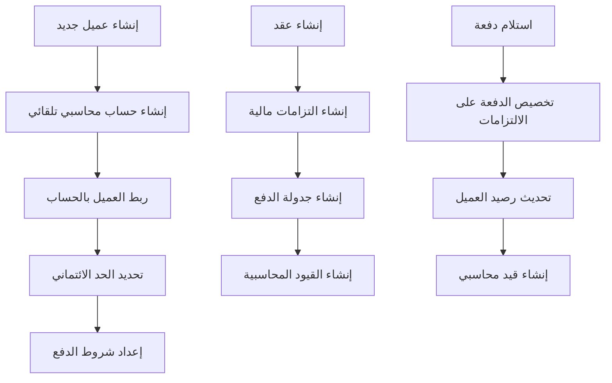

### التكامل مع إدارة المخزون

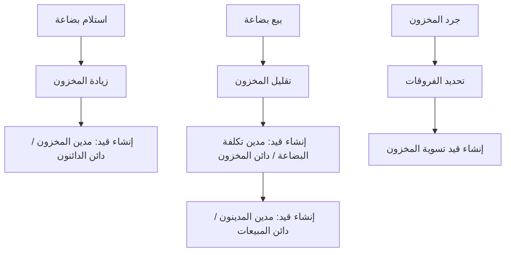

### التكامل مع إدارة الموارد البشرية

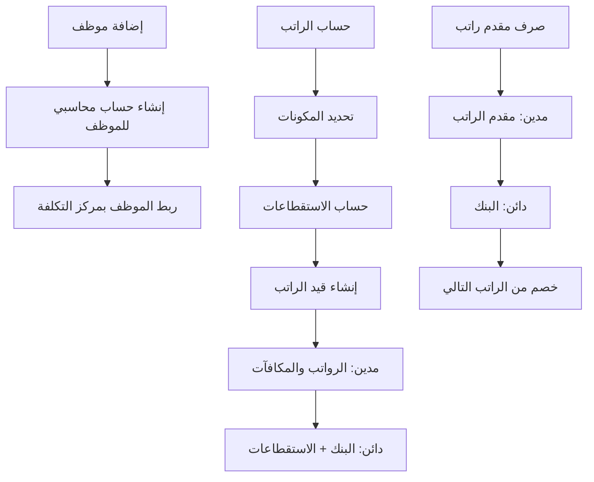

### التكامل مع إدارة المشاريع

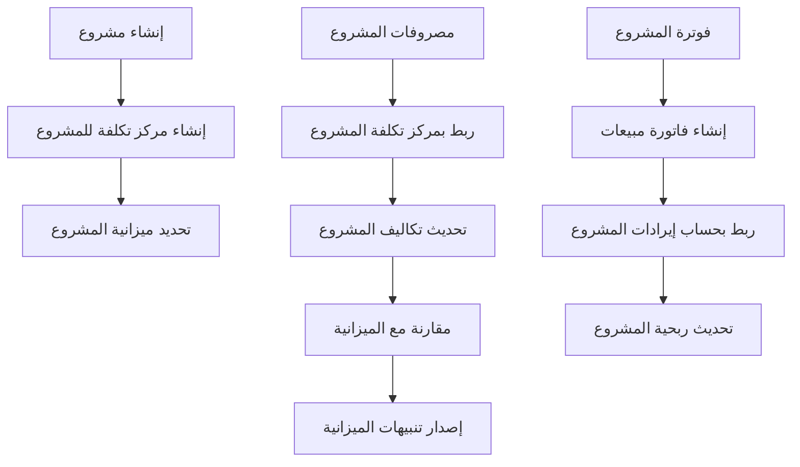

---

## 8. التقارير المالية

### التقارير الأساسية

1. **قائمة المركز المالي (الميزانية العمومية)**
   ```sql
   -- الأصول
   SELECT 
     'assets' as category,
     account_name,
     current_balance
   FROM chart_of_accounts 
   WHERE account_type LIKE '%assets%' 
   AND is_active = true
   
   UNION ALL
   
   -- الخصوم وحقوق الملكية
   SELECT 
     'liabilities_equity' as category,
     account_name,
     current_balance
   FROM chart_of_accounts 
   WHERE (account_type LIKE '%liabilities%' OR account_type = 'equity')
   AND is_active = true
   ```

2. **قائمة الدخل**
   ```sql
   -- الإيرادات
   SELECT 
     'revenue' as category,
     account_name,
     current_balance
   FROM chart_of_accounts 
   WHERE account_type LIKE '%revenue%'
   AND is_active = true
   
   UNION ALL
   
   -- المصروفات
   SELECT 
     'expenses' as category,
     account_name,
     current_balance
   FROM chart_of_accounts 
   WHERE account_type LIKE '%expenses%'
   AND is_active = true
   ```

3. **قائمة التدفقات النقدية**
   ```sql
   -- الأنشطة التشغيلية
   SELECT 
     transaction_type,
     SUM(CASE WHEN transaction_type = 'deposit' THEN amount ELSE -amount END) as net_amount
   FROM bank_transactions
   WHERE transaction_date BETWEEN start_date AND end_date
   GROUP BY transaction_type
   ```

### تقارير مراكز التكلفة

```sql
-- تقرير أداء مراكز التكلفة
SELECT 
  cc.center_name,
  cc.budget_amount,
  SUM(jel.debit_amount) as actual_expenses,
  (cc.budget_amount - SUM(jel.debit_amount)) as variance,
  CASE 
    WHEN cc.budget_amount > 0 THEN 
      ((cc.budget_amount - SUM(jel.debit_amount)) / cc.budget_amount * 100)
    ELSE 0 
  END as variance_percentage
FROM cost_centers cc
LEFT JOIN journal_entry_lines jel ON cc.id = jel.cost_center_id
LEFT JOIN journal_entries je ON jel.journal_entry_id = je.id
WHERE je.status = 'posted'
GROUP BY cc.id, cc.center_name, cc.budget_amount
```

### تقارير الأعمار (Aging Reports)

```sql
-- تقرير أعمار المدينين
SELECT 
  c.customer_name,
  fo.due_date,
  fo.remaining_amount,
  CASE 
    WHEN CURRENT_DATE - fo.due_date <= 30 THEN '0-30 days'
    WHEN CURRENT_DATE - fo.due_date <= 60 THEN '31-60 days'
    WHEN CURRENT_DATE - fo.due_date <= 90 THEN '61-90 days'
    ELSE 'Over 90 days'
  END as aging_category
FROM financial_obligations fo
JOIN customers c ON fo.customer_id = c.id
WHERE fo.status IN ('pending', 'partial', 'overdue')
ORDER BY fo.due_date
```

---

## 9. التحليلات المالية المتقدمة

### مؤشرات الأداء المالي (KPIs)

```typescript
interface FinancialKPIs {
  // مؤشرات السيولة
  current_ratio: number;          // نسبة التداول
  quick_ratio: number;            // النسبة السريعة
  cash_ratio: number;             // النسبة النقدية
  
  // مؤشرات الربحية
  gross_profit_margin: number;    // هامش الربح الإجمالي
  net_profit_margin: number;      // هامش الربح الصافي
  return_on_assets: number;       // العائد على الأصول
  return_on_equity: number;       // العائد على حقوق الملكية
  
  // مؤشرات الكفاءة
  asset_turnover: number;         // معدل دوران الأصول
  inventory_turnover: number;     // معدل دوران المخزون
  receivables_turnover: number;   // معدل دوران المدينين
  
  // مؤشرات المديونية
  debt_to_equity: number;         // نسبة الدين إلى حقوق الملكية
  debt_to_assets: number;         // نسبة الدين إلى الأصول
  interest_coverage: number;      // تغطية الفوائد
}
```

### تحليل الاتجاهات (Trend Analysis)

```typescript
interface TrendAnalysis {
  period: string;                 // الفترة
  revenue_growth: number;         // نمو الإيرادات
  expense_growth: number;         // نمو المصروفات
  profit_growth: number;          // نمو الأرباح
  cash_flow_trend: number;        // اتجاه التدفق النقدي
  
  // تحليل الانحرافات
  budget_variance: number;        // انحراف الميزانية
  cost_variance: number;          // انحراف التكاليف
  revenue_variance: number;       // انحراف الإيرادات
}
```

### التنبؤات المالية

```typescript
interface FinancialForecast {
  forecast_period: string;        // فترة التنبؤ
  projected_revenue: number;      // الإيرادات المتوقعة
  projected_expenses: number;     // المصروفات المتوقعة
  projected_profit: number;       // الأرباح المتوقعة
  projected_cash_flow: number;    // التدفق النقدي المتوقع
  
  // مؤشرات الثقة
  confidence_level: number;       // مستوى الثقة
  variance_range: {               // نطاق التباين
    min: number;
    max: number;
  };
}
```

---

## 10. أتمتة العمليات المالية

### القيود التلقائية

```typescript
// نظام إنشاء القيود التلقائية
interface AutoJournalRule {
  id: string;
  rule_name: string;              // اسم القاعدة
  trigger_event: string;          // الحدث المحفز
  conditions: {                   // الشروط
    amount_min?: number;
    amount_max?: number;
    account_type?: string;
    cost_center?: string;
  };
  journal_template: {             // قالب القيد
    debit_account_id: string;
    credit_account_id: string;
    description_template: string;
  };
  is_active: boolean;             // حالة التفعيل
}

// مثال على تطبيق القاعدة
async function applyAutoJournalRule(event: any, rule: AutoJournalRule) {
  if (matchesConditions(event, rule.conditions)) {
    const journalEntry = {
      description: formatTemplate(rule.journal_template.description_template, event),
      lines: [
        {
          account_id: rule.journal_template.debit_account_id,
          debit_amount: event.amount,
          credit_amount: 0
        },
        {
          account_id: rule.journal_template.credit_account_id,
          debit_amount: 0,
          credit_amount: event.amount
        }
      ]
    };
    
    await createJournalEntry(journalEntry);
  }
}
```

### مطابقة البنوك التلقائية

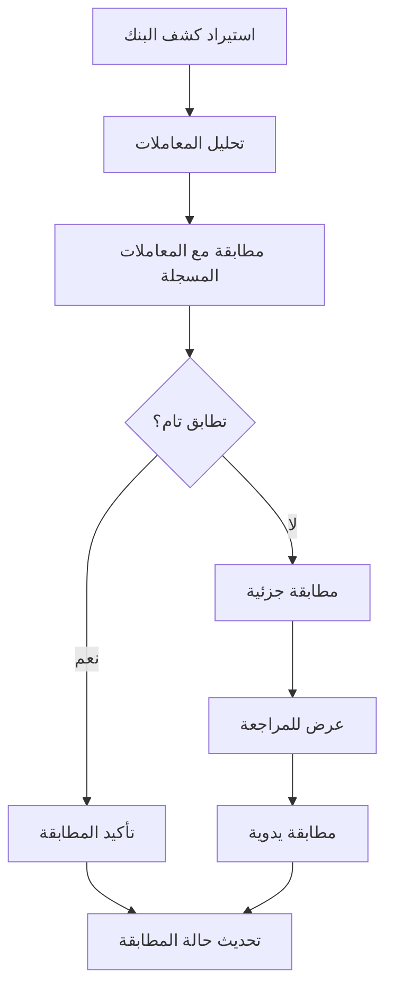

### تنبيهات مالية ذكية

```typescript
interface SmartAlert {
  id: string;
  alert_type: 'cash_flow' | 'budget_variance' | 'receivables_aging' | 'payables_due';
  trigger_conditions: {
    threshold_amount?: number;
    threshold_percentage?: number;
    days_overdue?: number;
    variance_percentage?: number;
  };
  notification_channels: ('email' | 'sms' | 'in_app')[];
  recipients: string[];           // قائمة المستلمين
  is_active: boolean;
  last_triggered: Date;
}

// أمثلة على التنبيهات الذكية
const cashFlowAlert: SmartAlert = {
  alert_type: 'cash_flow',
  trigger_conditions: {
    threshold_amount: 10000 // تنبيه عند انخفاض النقدية تحت 10,000
  },
  notification_channels: ['email', 'in_app'],
  recipients: ['finance_manager', 'ceo']
};

const receivablesAlert: SmartAlert = {
  alert_type: 'receivables_aging',
  trigger_conditions: {
    days_overdue: 30 // تنبيه للمبالغ المتأخرة أكثر من 30 يوم
  },
  notification_channels: ['email'],
  recipients: ['accounts_receivable_clerk']
};
```

---

## 11. الأمان والتحكم في الوصول

### مستويات الصلاحيات المالية

```typescript
enum FinancialPermission {
  // صلاحيات الحسابات
  VIEW_CHART_OF_ACCOUNTS = 'view_coa',
  CREATE_ACCOUNT = 'create_account',
  EDIT_ACCOUNT = 'edit_account',
  DELETE_ACCOUNT = 'delete_account',
  
  // صلاحيات القيود
  VIEW_JOURNAL_ENTRIES = 'view_journal_entries',
  CREATE_JOURNAL_ENTRY = 'create_journal_entry',
  EDIT_JOURNAL_ENTRY = 'edit_journal_entry',
  POST_JOURNAL_ENTRY = 'post_journal_entry',
  CANCEL_JOURNAL_ENTRY = 'cancel_journal_entry',
  
  // صلاحيات البنوك
  VIEW_BANK_ACCOUNTS = 'view_bank_accounts',
  MANAGE_BANK_ACCOUNTS = 'manage_bank_accounts',
  RECONCILE_BANK = 'reconcile_bank',
  
  // صلاحيات التقارير
  VIEW_FINANCIAL_REPORTS = 'view_financial_reports',
  VIEW_DETAILED_REPORTS = 'view_detailed_reports',
  EXPORT_REPORTS = 'export_reports',
  
  // صلاحيات إدارية
  MANAGE_FISCAL_YEAR = 'manage_fiscal_year',
  CLOSE_ACCOUNTING_PERIOD = 'close_accounting_period',
  MANAGE_SYSTEM_SETTINGS = 'manage_system_settings'
}
```

### سياسات أمان البيانات

```sql
-- سياسة RLS للحسابات المحاسبية
CREATE POLICY "company_chart_of_accounts_policy" ON chart_of_accounts
  USING (company_id = get_user_company(auth.uid()));

-- سياسة RLS للقيود المحاسبية
CREATE POLICY "company_journal_entries_policy" ON journal_entries
  USING (company_id = get_user_company(auth.uid()));

-- سياسة RLS للبنوك
CREATE POLICY "company_banks_policy" ON banks
  USING (company_id = get_user_company(auth.uid()));
```

### سجل المراجعة (Audit Trail)

```typescript
interface AuditLog {
  id: string;
  user_id: string;               // معرف المستخدم
  action: string;                // نوع العملية
  resource_type: string;         // نوع المورد
  resource_id: string;           // معرف المورد
  old_values?: any;              // القيم السابقة
  new_values?: any;              // القيم الجديدة
  ip_address: string;            // عنوان IP
  user_agent: string;            // معلومات المتصفح
  created_at: Date;              // وقت العملية
  severity: 'low' | 'medium' | 'high' | 'critical'; // مستوى الأهمية
}

// مثال على تسجيل عملية مراجعة
async function logAuditEvent(action: string, resource: any, oldValues?: any) {
  const auditLog: AuditLog = {
    user_id: getCurrentUserId(),
    action: action,
    resource_type: resource.constructor.name,
    resource_id: resource.id,
    old_values: oldValues,
    new_values: resource,
    ip_address: getClientIP(),
    user_agent: getUserAgent(),
    created_at: new Date(),
    severity: determineSeverity(action, resource)
  };
  
  await saveAuditLog(auditLog);
}
```

---

## 12. التكامل مع الأنظمة الخارجية

### تكامل مع البنوك

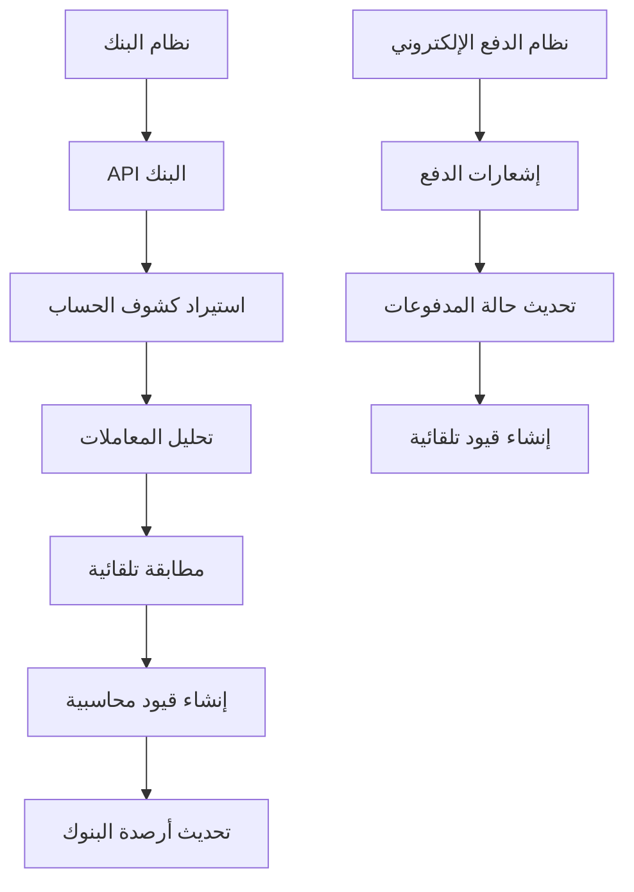

### تكامل مع أنظمة المحاسبة الخارجية

```typescript
interface ExternalAccountingIntegration {
  system_name: string;           // اسم النظام الخارجي
  api_endpoint: string;          // نقطة الاتصال
  authentication: {              // بيانات المصادقة
    type: 'api_key' | 'oauth2' | 'basic_auth';
    credentials: any;
  };
  sync_settings: {               // إعدادات المزامنة
    auto_sync: boolean;
    sync_frequency: 'realtime' | 'hourly' | 'daily';
    sync_entities: string[];     // الكيانات المراد مزامنتها
  };
  field_mapping: {               // خريطة الحقول
    [local_field: string]: string; // الحقل المحلي: الحقل الخارجي
  };
}

// مثال على مزامنة البيانات
async function syncWithExternalSystem(integration: ExternalAccountingIntegration) {
  const externalData = await fetchExternalData(integration);
  
  for (const entity of integration.sync_settings.sync_entities) {
    const localData = await getLocalData(entity);
    const mappedData = mapFields(externalData[entity], integration.field_mapping);
    
    await synchronizeData(entity, localData, mappedData);
  }
}
```

### تكامل مع أنظمة ERP

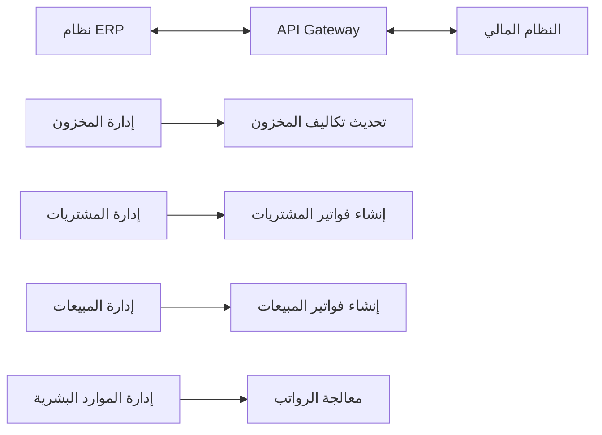

---

## 13. النسخ الاحتياطي والاستعادة

### آلية النسخ الاحتياطي التلقائي

```typescript
interface BackupConfiguration {
  backup_type: 'full' | 'incremental' | 'differential'; // نوع النسخة
  schedule: {                    // جدولة النسخ
    frequency: 'daily' | 'weekly' | 'monthly';
    time: string;                // وقت التنفيذ
    days_of_week?: number[];     // أيام الأسبوع
  };
  retention_policy: {            // سياسة الاحتفاظ
    keep_daily: number;          // الاحتفاظ بالنسخ اليومية
    keep_weekly: number;         // الاحتفاظ بالنسخ الأسبوعية
    keep_monthly: number;        // الاحتفاظ بالنسخ الشهرية
  };
  storage_location: {            // موقع التخزين
    type: 'local' | 'cloud' | 's3';
    path: string;
    encryption: boolean;
  };
}

// مثال على تنفيذ النسخ الاحتياطي
async function performBackup(config: BackupConfiguration) {
  const backupData = {
    chart_of_accounts: await exportChartOfAccounts(),
    journal_entries: await exportJournalEntries(),
    bank_transactions: await exportBankTransactions(),
    fixed_assets: await exportFixedAssets(),
    budget_data: await exportBudgetData()
  };
  
  const compressedData = await compressData(backupData);
  
  if (config.storage_location.encryption) {
    const encryptedData = await encryptData(compressedData);
    await saveBackup(encryptedData, config.storage_location);
  } else {
    await saveBackup(compressedData, config.storage_location);
  }
  
  await logBackupActivity('completed', backupData.length);
}
```

### استعادة البيانات

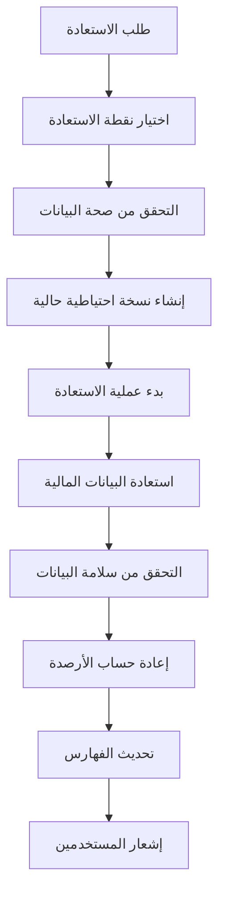

---

## 14. مراقبة الأداء والصحة

### مؤشرات أداء النظام

```typescript
interface SystemHealthMetrics {
  database_performance: {
    query_response_time: number;     // زمن الاستجابة للاستعلامات
    connection_pool_usage: number;  // استخدام مجموعة الاتصالات
    disk_usage_percentage: number;  // نسبة استخدام القرص
  };
  
  financial_data_integrity: {
    trial_balance_status: 'balanced' | 'unbalanced'; // حالة ميزان المراجعة
    reconciliation_rate: number;    // نسبة المطابقة
    pending_transactions: number;   // المعاملات المعلقة
  };
  
  user_activity: {
    active_users: number;           // المستخدمون النشطون
    failed_login_attempts: number; // محاولات تسجيل الدخول الفاشلة
    session_duration_avg: number;  // متوسط مدة الجلسة
  };
  
  backup_status: {
    last_backup_date: Date;         // تاريخ آخر نسخة احتياطية
    backup_success_rate: number;   // معدل نجاح النسخ الاحتياطي
    storage_usage: number;         // استخدام مساحة التخزين
  };
}
```

### تنبيهات صحة النظام

```typescript
interface SystemAlert {
  alert_id: string;
  alert_type: 'performance' | 'security' | 'data_integrity' | 'backup';
  severity: 'info' | 'warning' | 'error' | 'critical';
  message: string;
  affected_system: string;
  threshold_exceeded?: number;
  recommended_action: string;
  auto_resolve: boolean;
  created_at: Date;
  resolved_at?: Date;
}

// أمثلة على تنبيهات النظام
const performanceAlert: SystemAlert = {
  alert_type: 'performance',
  severity: 'warning',
  message: 'زمن الاستجابة للاستعلامات تجاوز الحد المسموح',
  threshold_exceeded: 2000, // milliseconds
  recommended_action: 'فحص الاستعلامات البطيئة وتحسين الفهارس'
};

const integrityAlert: SystemAlert = {
  alert_type: 'data_integrity',
  severity: 'error',
  message: 'ميزان المراجعة غير متوازن',
  recommended_action: 'مراجعة القيود المحاسبية وإجراء التصحيحات اللازمة'
};
```

---

## 15. التحديثات والصيانة

### إدارة إصدارات النظام

```typescript
interface SystemVersion {
  version_number: string;         // رقم الإصدار
  release_date: Date;             // تاريخ الإصدار
  features_added: string[];       // الميزات المضافة
  bugs_fixed: string[];           // الأخطاء المصححة
  breaking_changes: string[];     // التغييرات الكسرية
  migration_scripts: string[];    // سكربتات الترحيل
  rollback_supported: boolean;    // دعم التراجع
}

// مثال على تطبيق تحديث
async function applySystemUpdate(version: SystemVersion) {
  // إنشاء نسخة احتياطية قبل التحديث
  await createPreUpdateBackup();
  
  // تطبيق سكربتات الترحيل
  for (const script of version.migration_scripts) {
    await executeMigrationScript(script);
  }
  
  // التحقق من سلامة البيانات
  const integrityCheck = await performDataIntegrityCheck();
  if (!integrityCheck.passed) {
    await rollbackUpdate();
    throw new Error('فشل في التحقق من سلامة البيانات');
  }
  
  // تحديث رقم الإصدار
  await updateSystemVersion(version.version_number);
  
  // إشعار المستخدمين
  await notifyUsersOfUpdate(version);
}
```

### صيانة دورية

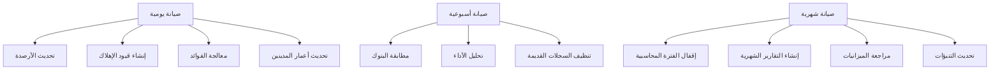

---

## الخلاصة

النظام المالي المطور يوفر حلاً شاملاً ومتكاملاً لإدارة جميع العمليات المالية والمحاسبية، مع التركيز على:

1. **الشمولية**: تغطية جميع جوانب المحاسبة المالية
2. **التكامل**: ربط سلس مع جميع أقسام النظام
3. **الأتمتة**: تقليل التدخل اليدوي وزيادة الدقة
4. **الأمان**: حماية البيانات المالية الحساسة
5. **المرونة**: قابلية التخصيص والتوسع
6. **الامتثال**: التوافق مع المعايير المحاسبية المحلية والدولية

هذا النظام يمكن الشركات من إدارة أموالها بكفاءة وشفافية، مع توفير رؤى تحليلية عميقة لاتخاذ قرارات مالية مدروسة.

## روابط مفيدة

- [دليل العمليات المالية للعملاء](./customer-financial-operations-guide.md)
- [دليل المستخدم للنظام المالي](./financial-user-guide.md)
- [API Documentation](./api-docs.md)
- [أسئلة شائعة](./faq.md)