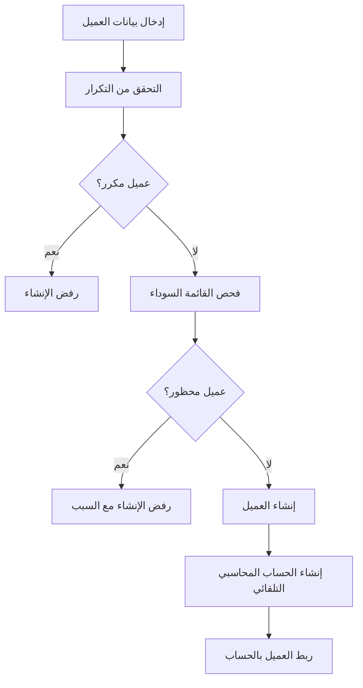
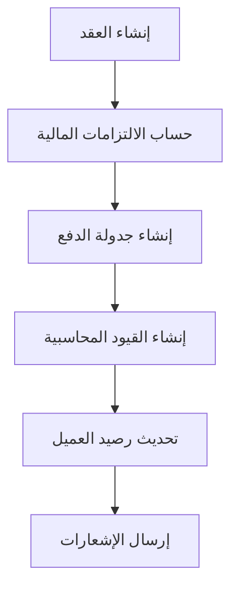
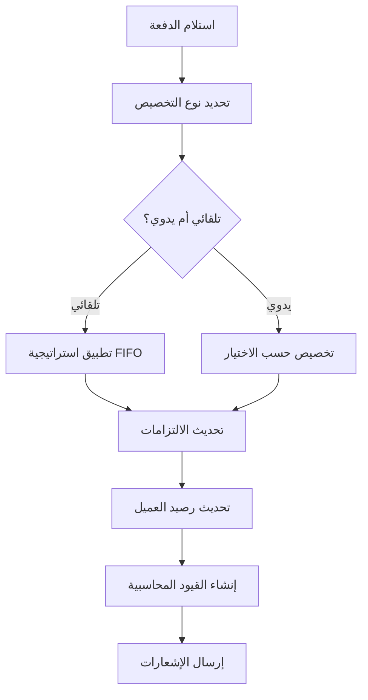
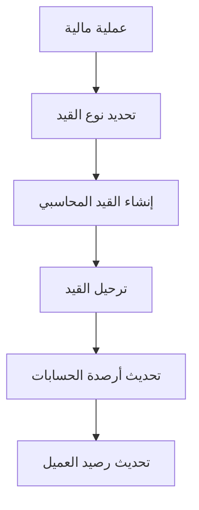

# دليل العمليات المالية للعملاء

## نظرة عامة
يوفر النظام إدارة مالية شاملة للعملاء تبدأ من إنشاء العميل وتنتهي بتتبع الأرصدة والتحليلات المالية المتقدمة.

---

## 1. إنشاء العميل (Customer Creation)

### العملية الأساسية


### التحققات الأمنية
- **فحص التكرار**: التحقق من عدم وجود عميل بنفس:
  - رقم البطاقة الشخصية
  - رقم الجواز
  - رقم الهاتف (اختياري)

- **فحص القائمة السوداء**: 
  - التحقق من عدم وجود عميل محظور بنفس الهوية
  - عرض سبب الحظر في حالة الرفض

### الإعداد المحاسبي التلقائي
```sql
-- مثال على إنشاء حساب العميل التلقائي
INSERT INTO chart_of_accounts (
    company_id,
    account_code,
    account_name,
    account_type,
    balance_type
) VALUES (
    company_id,
    'CUST-' || customer_code,
    customer_name || ' - حساب العميل',
    'receivables',
    'debit'
);
```

---

## 2. إنشاء العقود (Contract Creation)

### تدفق إنشاء العقد


### الالتزامات المالية (Financial Obligations)
يتم إنشاء التزامات مالية تلقائية عند إنشاء العقد:

```typescript
interface FinancialObligation {
  contract_id: string;
  amount: number;
  due_date: Date;
  obligation_type: 'installment' | 'deposit' | 'fee';
  status: 'pending' | 'paid' | 'overdue';
}
```

### أنواع الالتزامات
1. **الدفعة المقدمة**: تستحق فوراً
2. **الأقساط الشهرية**: حسب جدولة العقد
3. **الرسوم الإضافية**: التأمين، الصيانة، إلخ

---

## 3. تتبع الأرصدة المتقدم (Advanced Balance Tracking)

### هيكل رصيد العميل
```typescript
interface CustomerFinancialBalance {
  customer_id: string;
  total_balance: number;
  current_amount: number;      // المبلغ الحالي المستحق
  overdue_amount: number;      // المبلغ المتأخر
  
  // تحليل الأعمار (Aging Analysis)
  aging_30_days: number;       // متأخر 1-30 يوم
  aging_60_days: number;       // متأخر 31-60 يوم
  aging_90_days: number;       // متأخر 61-90 يوم
  aging_over_90_days: number;  // متأخر أكثر من 90 يوم
  
  // إحصائيات الدفع
  total_paid: number;
  last_payment_date: Date;
  payment_history_count: number;
}
```

### حساب الأعمار التلقائي
```sql
-- مثال على حساب تحليل الأعمار
SELECT 
  customer_id,
  SUM(CASE 
    WHEN days_overdue BETWEEN 1 AND 30 THEN amount 
    ELSE 0 
  END) as aging_30_days,
  SUM(CASE 
    WHEN days_overdue BETWEEN 31 AND 60 THEN amount 
    ELSE 0 
  END) as aging_60_days
FROM financial_obligations 
WHERE status = 'overdue'
GROUP BY customer_id;
```

---

## 4. معالجة المدفوعات الذكية (Smart Payment Processing)

### تخصيص الدفعات التلقائي


### استراتيجيات التخصيص
1. **FIFO**: الأقدم أولاً (افتراضي)
2. **أعلى فائدة**: الالتزامات ذات الفوائد العالية
3. **أقرب استحقاق**: المستحقة قريباً
4. **تخصيص يدوي**: حسب اختيار المستخدم

### مثال على التخصيص التلقائي
```typescript
async function allocatePayment(
  customerId: string, 
  amount: number, 
  strategy: 'fifo' | 'highest_interest' | 'nearest_due'
) {
  const obligations = await getUnpaidObligations(customerId, strategy);
  let remainingAmount = amount;
  
  for (const obligation of obligations) {
    if (remainingAmount <= 0) break;
    
    const allocatedAmount = Math.min(
      remainingAmount, 
      obligation.remaining_amount
    );
    
    await createPaymentAllocation({
      obligation_id: obligation.id,
      amount: allocatedAmount,
      allocation_type: 'automatic'
    });
    
    remainingAmount -= allocatedAmount;
  }
}
```

---

## 5. التقارير والتحليلات (Reports & Analytics)

### تقرير الأعمار (Aging Report)
```sql
-- استعلام تقرير الأعمار الشامل
SELECT 
  c.customer_name,
  cfb.total_balance,
  cfb.current_amount,
  cfb.aging_30_days,
  cfb.aging_60_days,
  cfb.aging_90_days,
  cfb.aging_over_90_days,
  cfb.last_payment_date
FROM customer_financial_balances cfb
JOIN customers c ON cfb.customer_id = c.id
WHERE cfb.total_balance > 0
ORDER BY cfb.aging_over_90_days DESC;
```

### تحليلات الدفع (Payment Analytics)
```typescript
interface PaymentAnalytics {
  total_receipts: number;        // إجمالي المقبوضات
  total_payments: number;        // إجمالي المدفوعات
  net_cash_flow: number;         // صافي التدفق النقدي
  
  // تحليل حسب مركز التكلفة
  by_cost_center: Array<{
    cost_center_name: string;
    total_amount: number;
    transaction_count: number;
  }>;
  
  // تحليل حسب نوع الدفع
  by_payment_type: Array<{
    payment_type: string;
    total_amount: number;
    transaction_count: number;
  }>;
}
```

### إحصائيات لوحة التحكم المالية
```typescript
interface FinancialDashboardStats {
  customers_with_balance: number;      // عملاء لديهم أرصدة
  total_outstanding: number;           // إجمالي المستحقات
  total_overdue: number;              // إجمالي المتأخرات
  current_due: number;                // المستحق حالياً
  
  aging_analysis: {
    aging_30: number;
    aging_60: number;
    aging_90: number;
    aging_over_90: number;
  };
  
  top_overdue_customers: Array<{
    customer_name: string;
    overdue_amount: number;
    days_overdue: number;
  }>;
}
```

---

## 6. التنبيهات الذكية (Smart Alerts)

### أنواع التنبيهات
1. **تنبيهات الاستحقاق**
   - قبل موعد الاستحقاق بـ 7 أيام
   - في يوم الاستحقاق
   - بعد التأخير بـ 1، 7، 15، 30 يوم

2. **تنبيهات الحدود الائتمانية**
   - عند الوصول لـ 80% من الحد الائتماني
   - عند تجاوز الحد الائتماني

3. **تنبيهات المتأخرات**
   - عملاء متأخرين لأكثر من 30 يوم
   - مبالغ متأخرة تتجاوز حد معين

### مثال على إعداد التنبيهات
```sql
-- تنبيه للمتأخرات
SELECT 
  c.customer_name,
  fo.amount,
  fo.due_date,
  CURRENT_DATE - fo.due_date as days_overdue
FROM financial_obligations fo
JOIN customers c ON fo.customer_id = c.id
WHERE fo.status = 'overdue'
  AND CURRENT_DATE - fo.due_date >= 30;
```

---

## 7. الربط مع النظام المحاسبي

### القيود المحاسبية التلقائية


### أمثلة القيود
```sql
-- قيد إنشاء عقد جديد
INSERT INTO journal_entries (description, total_amount) 
VALUES ('عقد جديد للعميل', 10000);

-- مدين: حساب العميل
INSERT INTO journal_entry_lines (account_id, debit_amount) 
VALUES (customer_account_id, 10000);

-- دائن: حساب الإيرادات المؤجلة
INSERT INTO journal_entry_lines (account_id, credit_amount) 
VALUES (deferred_revenue_account_id, 10000);
```

---

## 8. الأمان وحقوق الوصول

### مستويات الوصول
- **مدير الشركة**: وصول كامل لجميع البيانات المالية
- **المدير**: عرض وتعديل بيانات فريقه
- **موظف المبيعات**: عرض عملائه فقط
- **المحاسب**: وصول للبيانات المالية والتقارير

### تشفير البيانات الحساسة
```sql
-- مثال على RLS (Row Level Security)
CREATE POLICY customer_access_policy ON customers
FOR ALL USING (company_id = get_user_company(auth.uid()));
```

---

## 9. التكامل مع الأنظمة الخارجية

### APIs المتاحة
- **REST API**: للتكامل مع أنظمة ERP
- **Webhooks**: للإشعارات الفورية
- **GraphQL**: لاستعلامات مرنة

### مثال على Webhook
```typescript
// إشعار عند إنشاء دفعة جديدة
POST /webhook/payment-received
{
  "customer_id": "uuid",
  "amount": 1000,
  "payment_date": "2024-01-15",
  "contract_id": "uuid"
}
```

---

## 10. النسخ الاحتياطي والاسترداد

### آلية النسخ الاحتياطي
- نسخ احتياطية يومية للبيانات المالية
- نسخ احتياطية أسبوعية شاملة
- إمكانية الاستعادة النقطية

### مراقبة النظام
- مراقبة الأداء المستمرة
- تنبيهات الأخطاء الفورية
- سجلات المراجعة (Audit Logs)

---

## الخلاصة

النظام يوفر حلاً شاملاً لإدارة العمليات المالية للعملاء بدءاً من إنشاء العميل وحتى التحليلات المالية المتقدمة، مع ضمان الأمان والدقة في جميع العمليات.

## روابط مفيدة
- [دليل المستخدم](./user-guide.md)
- [API Documentation](./api-docs.md)
- [أسئلة شائعة](./faq.md)