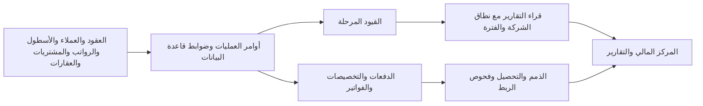

# مراجعة النظام المالي وإعادة تصميمه — 6 سبتمبر 2026

أُنجزت إعادة تصميم واجهة المركز المالي وتوحيد القراءات المحاسبية الرئيسية محليًا، مع ترحيل قاعدة بيانات قابل للتراجع واختبارات. لم تُنشر التغييرات ولم يُعدّل أي سجل مالي في الإنتاج. **لم يُعتمد النظام كاملًا للإنتاج**: توجد مشكلات تاريخية وتكاملات تتطلب اختبارًا على نسخة تجريبية مماثلة للإنتاج.

## ما تغيّر

**تحديث الواجهات والأقسام الفرعية والشريط الجانبي:** اكتمل محليًا توحيد التصميم والتنقل عبر 57 وجهة مالية، مع 217 اختبارًا في الحزمة المالية و114 فحص فتح على الكمبيوتر والجوال. تفاصيل التسليم والصور وحدود التحقق في [تقرير إعادة تصميم الواجهات](interface-redesign.md). هذا يوسع نطاق الواجهة المسجل أدناه ولا يزيل عوائق اعتماد الإنتاج المحاسبي.

استُكمل العمل بمقترح وتنفيذ محلي لفصل رسوم التأخير عن أصل الإيجار، وتحسين ربط الحسابات، واختبار التحصيل والإلغاء المتزامنين. التفاصيل والأدلة في [مقترح رسوم التأخير والتحصيل](fee-proposal.md). الحساب المقترح 4312 تحت 431؛ لم يُنشأ في الإنتاج.

الاستكمال الأحدث أصلح اختلاف القسط عند قبض رسوم منفصلة، ووحّد مشغلات تسوية الفاتورة والعقد والقسط. كما نُقلت ملخصات المتابعة المالية وقائمة فواتير العميل إلى الدفعات والتخصيصات الفعلية. التفاصيل في [إصلاح مشغلات التسوية](settlement-proposal.md) و[قارئ التحصيل الجديد](collection-reader.md). اختبارات التزامن تشمل الآن دوال العقود والأقساط الفعلية، مع حدود التغطية المعلنة.

- مركز مالي عربي/إنجليزي متجاوب يجمع نتيجة النشاط، التحصيل، الذمم، المركز المالي، قائمة الفحوص وروابط عشرة أقسام. فصل الإيراد المرحّل عن المقبوضات، وإظهار الخسائر والدفعات الجزئية والأخطاء دون تحويلها إلى أصفار.
- توحيد قراء أرصدة الحسابات وميزان المراجعة والملخص المالي وقائمة الدخل. الأرصدة المخزّنة مشتقة من القيود؛ لا تُضاف إلى مجموعها مرة ثانية. الميزانية تراكمية حتى تاريخ التقرير، والأرباح والخسائر تخص الفترة المحددة.
- استبعاد قيود الإقفال وعكسها من قياس الأداء، وإبقاؤها في دفتر الأستاذ والميزانية. إضافة نتيجة الأعمال غير المقفلة إلى حقوق الملكية في عرض الميزانية.
- تحميل القيود وبنودها على صفحات مستقلة، بما يشمل القيود التي تتجاوز 1000 بند. التصدير وكشف الحساب يستخدمان الشركة المختارة والبيانات الكاملة؛ أخطاء القراءة تمنع تقريرًا جزئيًا صامتًا.
- إلغاء زيادة مبالغ تسوية الفواتير والعقود أثناء عمليات التحديث في `AccountingService`. التحديث يقرأ الحالة الملتزم بها؛ أوامر التسجيل والعكس تبقى ضمن الآليات المحاسبية الموجودة.
- منع تركيب الصفحات المالية قبل انتهاء التحقق من الصلاحيات. تقييد القراء الجدد بالمستخدم والشركة وRLS، وحجب التنفيذ عن المجهول. تقييد ترحيل القيد بالشركة وحالة المسودة.
- تحديث القراء الماليين بعد نجاح عمليات React Query في الأقسام، ومسح سياق العمل المالي عند تغيير الشركة.
- تصحيح نطاق الخزينة والمقارنة الشهرية وعزل العملات. إزالة تقديرات 80/10/10 للتدفقات، والتوقعات ودرجات الصحة غير المستندة إلى نموذج معتمد. عرض نسب السيولة «غير متاح» إذا لم يكتمل التصنيف.
- إضافة ترجمات فعلية إلى `public/locales/{ar,en}/financial.json` مع قيم احتياطية آمنة داخل React.

## أدلة الإنتاج: قراءات فقط

المشروع: `qwhunliohlkkahbspfiu`؛ شركة العراف: `24bc0b21-4e2d-4413-9842-31719a3669f4`. الأدلة التجميعية محفوظة في [live-aggregate-evidence.json](live-aggregate-evidence.json)، وآخر لقطة عند 07:07:47 UTC.

| الفحص | النتيجة | حدود الاستنتاج |
|---|---:|---|
| إجمالي القيود المرحلة دون حد زمني، عند بداية المراجعة | 23,320 | عدد متغير بمرور الوقت |
| قيود مرحلة حتى 6 سبتمبر | 21,443 | القيود المستقبلية مستبعدة |
| قيود غير متوازنة/أقل من بندين/اختلاف مجاميع البنود والرأس حتى تاريخ العرض | 0 | التوازن الحسابي لا يثبت صحة المستند المصدر |
| اختلاف رصيد الحساب المخزّن عن مجموع القيود المرحلة | 0 | يثبت أن جمع الرصيد المخزّن مع الحركات يكررها |
| بنود على حسابات أقل من المستوى الثالث حتى تاريخ العرض | 3,490 | 4,470 بندًا دون حد زمني؛ لم تُعدّل تاريخيًا |
| حسابات أصول/التزامات نشطة غير تجميعية بلا تصنيف فرعي | 186 | يمنع اعتماد نسب السيولة |
| الذمم المسجلة المستحقة على العملاء | 4,002,546.66 ر.ق | رصيد الفواتير المسجل حاليًا؛ ليس إعادة بناء تاريخية للتسويات |
| المقبوضات المكتملة المسجلة خلال سبتمبر | 51,340 ر.ق | ليس قائمة تدفقات نقدية مصنّفة |
| أصول / التزامات / حقوق ملكية شاملة النتيجة غير المقفلة | 19,632,930 / 2,275,015.91 / 17,357,914.09 ر.ق | متساوية حسابيًا وفق القيود |
| صافي نتيجة سبتمبر حتى 6 سبتمبر | ‎-1,109,044 ر.ق | يتضمن عكسًا فعليًا؛ يحتاج تفسيرًا ومطابقة مصدرية، ولم يُحوّل إلى موجب |

عشرة فحوص في القارئ الجديد: توازن القيد، حسابات الترحيل، ربط المقبوضات، حساب رصيد الفاتورة، تاريخ الاستحقاق المسبق، تجاوز التخصيصات، ربط الرواتب والصيانة والعقارات، وتصنيف الحسابات. النتيجة الصفرية تعني عدم وجود مخالفة لتعريف الفحص في الصفوف المتاحة، ولا تعني شهادة شاملة على القسم.

## مراجعة التكامل

| القسم | ما تحقق | ما يلزم قبل اعتماد الإنتاج |
|---|---|---|
| العقود والعملاء والفواتير والتحصيل | القراء والتخصيصات والتحديث المتكرر، اختبارات RPC على PostgreSQL معزول، فحص تواريخ الاستحقاق | حل مزامنة إجمالي الفاتورة مع الإيصالات الفردية، واختبار التسجيل والعكس المتزامن على المخطط الكامل |
| دفتر الأستاذ والإقفال | عدم جمع الرصيد مرتين، الحفاظ على الإشارات، استبعاد الإقفال من الأداء، ميزان المراجعة، RLS والتراجع | معالجة حسابات الترحيل القديمة ومراجعة أثرها على جميع إعدادات الربط |
| الخزينة والبنوك | مفاتيح واستعلامات حسب الشركة، اكتمال الصفحات، شهر تقويمي، عدم جمع عملات مختلفة | اختبار أوامر البنك والمطابقة والعكس مع مخطط الإنتاج وجميع المشغلات |
| الرواتب | توازن مكونات المصروف/المستحق/الاستقطاعات/الضريبة، وجود ضابط `guard_payroll_financial_state_v1` | اعتماد وترحيل وصرف وعكس دورة رواتب كاملة تجريبيًا |
| الأسطول والصيانة | ربط قيد تكلفة الصيانة وفحص مفقودات الربط؛ مشغّل `vehicle_maintenance_accounting_v1` قائم | اختبار دورة أمر العمل والفاتورة والصرف والإلغاء والإهلاك |
| المشتريات والموردون والمخزون | مراجعة بوابة أوامر الشراء والروابط ومسار التحديث؛ ضابط دورة الشراء قائم | اختبار شراء/استلام/فاتورة/دفع/مرتجع ومطابقة المخزون والموردين محاسبيًا |
| العقارات | فحص الربط بقيد الدفعة؛ مشغّل محاسبي قائم | سيناريوهات الإيجار والدفعة والعكس على بيانات تجريبية |
| الشؤون القانونية | الحفاظ على تغييرات العقود والقضايا الجارية؛ رابط من المركز المالي وتحديث التقارير بعد العمليات | مطابقة التحويلات القانونية والتسويات والإلغاء دون تكرار الذمم |
| الموازنات ومراكز التكلفة | قراءة بنود الموازنة، وتحليل مراكز التكلفة حسب الشركة والقيود المرحلة | استكمال التصنيف والمطابقة الزمنية للموازنة السنوية وفترة التحليل |

## عوائق اعتماد الإنتاج

1. **مشغّل `trg_sync_receipt_on_invoice_update` ما زال فعالًا.** يعيد اشتقاق إيصالات فردية من إجمالي الفاتورة، وقد يتعارض مع حماية الإيصال. أربعة اختبارات تشخيصية موجودة تعيد إظهار الخطأ؛ هي موسومة TODO عمدًا. إصلاح الإلغاء المحلي الموجود في `20260904001503_retire_invoice_aggregate_receipt_sync.sql` يذكر صراحة أنه غير جاهز للإطلاق حتى ترحيل القراء القديمة وتدقيق مصدر الإيصالات. لم يُطبّق ولم تُعدّل تلك الملفات ضمن هذه المراجعة.
2. **الترحيل على حسابات المستوى الثاني** يخالف قاعدة المشروع. لم تُفرض قاعدة المستوى الثالث فجأة، لأن ذلك سيوقف مسارات حالية قبل تصحيح إعدادات الربط. يلزم اعتماد حسابات تفصيلية بديلة وخطة إعادة تصنيف قابلة للتدقيق؛ لا يُعاد كتابة السجل التاريخي تلقائيًا.
3. **186 حسابًا بلا تصنيف مالي فرعي.** تحتاج نسب السيولة والتدفقات المصنفة إلى خريطة معتمدة، لا تخمين من بادئة رقم الحساب.
4. **اختبار المخطط الكامل غير مكتمل.** أُنجزت ثمانية اختبارات باتصالات PostgreSQL متزامنة للتحصيل والإلغاء والبنك. ما زالت الاختبارات تستخدم شريحة محددة من المشغلات ودوال فعلية وبدائل معلنة؛ لا تغطي كل مشغلات الإنتاج أو الصلاحيات الفعلية أو جميع الأقسام من المتصفح.
5. **القراء الجدد غير مثبتين في الإنتاج.** الواجهة تحتاج ترحيل قاعدة البيانات المرفق أولًا على نسخة تجريبية، ثم اختبار مستخدمين فعليين بصلاحيات محاسب/مدير وتبديل الشركة. لا تُنشر الواجهة منفردة.

## التحقق المنفّذ

- `npm run finance:ci -- --offline`: **191 اختبارًا** في آخر تحقق محلي: 72 اختبار قواعد مالية، و11 للقراء، و30 للتحصيل والعكس، و17 لترابط التسوية، و12 لقارئ تحصيل العملاء، و49 اختبار واجهات وخدمات. فحص تغطية الصلاحيات وسلامة الملفات وفحص الأنواع المالي ضمن الحزمة. الخيار offline يمنع تشغيل أدوات كتابة اللقطات على الإنتاج حتى إن وجدت متغيرات خدمة في البيئة.
- `npm run test:finance-concurrency`: ثمانية اختبارات محلية ناجحة على PostgreSQL 18.4 باتصالات مستقلة؛ تشمل الطلب المكرر وتجاوز أصل الفاتورة والرسوم ورصيد البنك والإلغاء المتزامن. تفاصيل الفروق عن الإنتاج في المقترح.
- مجموعة تكامل الفواتير والعقود مع قارئ المركز: 70 حالة عند تشغيلها؛ 65 ناجحة و5 TODO. أربعة TODO توثق عيوب مزامنة الإيصالات؛ الخامسة بوابة اختبار المخطط الكامل والتزامن. **لا تُحسب TODO اختبارات ناجحة.**
- `npm run type-check`: فحص التطبيق وإعدادات Node كاملًا؛ منفصل عن بناء Vite.
- `npm run build:ci`: بناء الإنتاج محليًا. تحذيرات أحجام بعض الحزم القديمة كبيرة، ولم تتغير إعدادات تجميع React.
- تشغيل نسخة البناء المحلية على `/auth` في Playwright: نجح ظهور حقول الدخول دون أخطاء صفحة أو أخطاء React؛ لا يختبر هذا المسارات المالية المحمية بمستخدم فعلي.
- ESLint للقراء والخدمات والمكونات الأساسية: دون أخطاء، مع تحذيرات أنواع/تأكيد عدم الخلو الموجودة في السجل.
- Playwright على المكونات الحقيقية ببيانات اختبار معزولة: العربية RTL والإنجليزية LTR، عرضا 1440 و390، اتجاه فعلي محسوب، حجم الأيقونات، الجدول الموسع دون تجاوز أفقي، حالة الفشل وإعادة المحاولة والتحميل والتنقل إلى العقود. صور المعاينة **بيانات اختبار وليست صورًا من الإنتاج**.

## الملفات والتشغيل

- الترحيل: `supabase/migrations/20260906060900_financial_workspace_ledger_readers.sql`؛ التراجع المطابق في `supabase/rollbacks/`.
- مقترح فصل قيد الرسوم: `supabase/migrations/20260906074051_separate_collected_late_fee_journal.sql`؛ تراجع مطابق. يتطلب أوامر الدفع السابقة ولا ينشئ حسابًا أو ربطًا للشركة تلقائيًا.
- توحيد مشغلات التسوية: `20260906081942_canonical_settlement_trigger_writers.sql`؛ قارئ تحصيل العملاء: `20260906083542_canonical_customer_collection_summary.sql`؛ لكل منهما تراجع مطابق.
- القراء: `src/services/financialReporting.ts`؛ التحديث بين الأقسام: `src/services/financialQuerySynchronization.ts`.
- الواجهة: `src/components/finance/workspace/`؛ اختبار التصميم: `tests/visual/financial-workspace/`.
- [معاينة عربية لسطح المكتب](workspace-ar-1440.png)، [معاينة إنجليزية للهاتف](workspace-en-390.png).

لإعادة فحص التصميم، شغّل Vite بالإعداد `tests/visual/financial-workspace/vite.config.mts` على المنفذ المحلي 4191 ثم `node tests/visual/financial-workspace/check.mjs`. لإعادة فحص قواعد البيانات محليًا: `node --test tests/database/financial-workspace.test.mjs`.

مسار الإطلاق المطلوب: نسخة تجريبية من المخطط الكامل → تثبيت ترحيل القراء فقط مع حفظ التعريفات السابقة → اختبار RLS والصلاحيات والنتائج مقابل SQL التجميعي → معالجة عوائق الإيصالات والتصنيف → دورات الأقسام والتزامن → إصدار الواجهة والخدمات معًا. لا تُشغّل جميع الترحيلات المعلقة في شجرة العمل دفعة واحدة؛ توجد تغييرات من أعمال أخرى.
