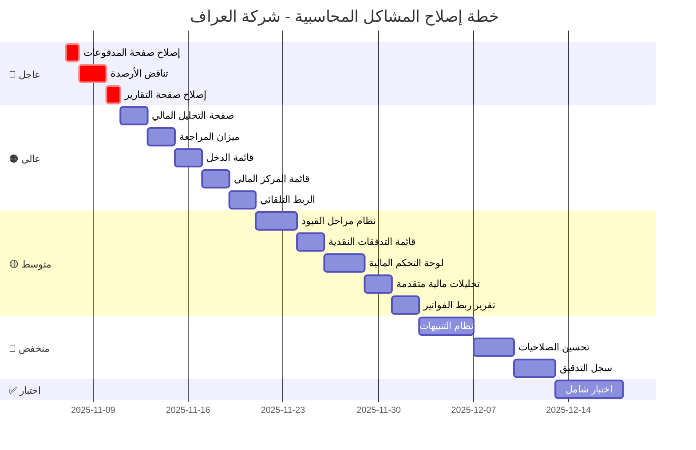

---

# 🗺️ خارطة الطريق - إصلاح المشاكل المحاسبية

## 📅 المراحل الزمنية

### الأسبوع الأول (أيام 1-5)
```
اليوم 1-2:  🔴 إصلاح صفحة المدفوعات + تناقض الأرصدة
اليوم 3:    🔴 إصلاح صفحة التقارير
اليوم 4-5:  🟠 صفحة التحليل + ميزان المراجعة
```

### الأسبوع الثاني (أيام 6-10)
```
اليوم 6-7:  🟠 قائمة الدخل + قائمة المركز المالي
اليوم 8-9:  🟠 الربط التلقائي
اليوم 10:   🟡 نظام مراحل القيود (البداية)
```

### الأسبوع الثالث (أيام 11-15)
```
اليوم 11-12: 🟡 نظام مراحل القيود (إكمال)
اليوم 13-14: 🟡 قائمة التدفقات + لوحة التحكم
اليوم 15:    🟡 تحليلات مالية متقدمة
```

### الأسبوع الرابع (أيام 16-20)
```
اليوم 16-17: 🟡 تقرير ربط الفواتير
اليوم 18-19: 🔵 نظام التنبيهات
اليوم 20:    🔵 تحسين الصلاحيات
```

### الأسبوع الخامس (أيام 21-25)
```
اليوم 21-22: 🔵 سجل التدقيق
اليوم 23-25: ✅ اختبار شامل
```

---

## 🎯 المعالم الرئيسية (Milestones)

```
📍 Milestone 1: النظام يعمل بدون أخطاء
   ↳ إكمال المرحلة 🔴 (يوم 3)
   ✓ صفحة المدفوعات تعمل
   ✓ الأرصدة متوازنة
   ✓ التقارير متاحة

📍 Milestone 2: التقارير الأساسية جاهزة
   ↳ إكمال المرحلة 🟠 (يوم 9)
   ✓ ميزان المراجعة
   ✓ قائمة الدخل
   ✓ قائمة المركز المالي
   ✓ الربط التلقائي

📍 Milestone 3: نظام متقدم
   ↳ إكمال المرحلة 🟡 (يوم 17)
   ✓ نظام المراحل
   ✓ التحليلات المتقدمة
   ✓ لوحة تحكم شاملة

📍 Milestone 4: نظام احترافي
   ↳ إكمال المرحلة 🔵 (يوم 22)
   ✓ التنبيهات الذكية
   ✓ الصلاحيات المتقدمة
   ✓ سجل التدقيق

📍 Milestone 5: جاهز للإنتاج
   ↳ إكمال الاختبار (يوم 25)
   ✓ اختبار شامل
   ✓ توثيق كامل
   ✓ تدريب المستخدمين
```

---

## 🔄 التبعيات بين المهام

```
                     [صفحة المدفوعات] ──┐
                              │          │
                     [تناقض الأرصدة] ────┤
                              │          │
                     [صفحة التقارير] ────┴───▶ [ميزان المراجعة]
                                                      │
                                                      ▼
                                               [قائمة الدخل]
                                                      │
                                                      ▼
                                            [قائمة المركز المالي]
                                                      │
                           ┌──────────────────────────┴──────┐
                           ▼                                  ▼
                    [الربط التلقائي]              [صفحة التحليل المالي]
                           │                                  │
                           ▼                                  ▼
                  [نظام مراحل القيود]              [تحليلات متقدمة]
                           │                                  │
                           └──────────────┬──────────────────┘
                                          ▼
                                  [لوحة التحكم]
                                          │
                           ┌──────────────┼──────────────┐
                           ▼              ▼               ▼
                    [التنبيهات]    [الصلاحيات]    [سجل التدقيق]
                           │              │               │
                           └──────────────┴───────────────┘
                                          ▼
                                   [اختبار شامل]
```

---

## 📊 توزيع الجهد

```
المرحلة          │ المهام │  الأيام  │  الجهد   │ الأولوية
─────────────────┼────────┼──────────┼──────────┼──────────
🔴 عاجل         │   3    │   2-3    │   ███░░  │  عالية جداً
🟠 عالي         │   5    │   5-7    │   █████  │  عالية
🟡 متوسط        │   5    │   7-10   │   █████  │  متوسطة
🔵 منخفض        │   3    │  10-15   │   ███░░  │  منخفضة
✅ اختبار       │   1    │   3-5    │   ███░░  │  حرجة
─────────────────┼────────┼──────────┼──────────┼──────────
المجموع         │   17   │  27-40   │          │
```

---

## 🎨 رمز الألوان

- 🔴 **عاجل:** يجب إصلاحها فوراً - النظام لا يعمل
- 🟠 **عالي:** ضرورية للعمل اليومي - النظام يعمل لكن غير كامل
- 🟡 **متوسط:** تحسينات مهمة - النظام يعمل لكن يحتاج تطوير
- 🔵 **منخفض:** ميزات إضافية - النظام يعمل بشكل جيد
- ✅ **اختبار:** التحقق النهائي - ضمان الجودة

---

## 🚦 إشارات الحالة

### المهام:
- ⏳ **لم تبدأ:** في قائمة الانتظار
- 🔄 **قيد العمل:** جاري التنفيذ حالياً
- ✅ **مكتملة:** تم الانتهاء واختبارها
- ⚠️ **محظورة:** تواجه عائق يحتاج حل
- ❌ **ملغاة:** لن يتم تنفيذها

### النظام:
- 🔴 **خطير:** أخطاء حرجة
- 🟠 **تحذير:** يحتاج انتباه
- 🟡 **متوسط:** يعمل لكن يحتاج تحسين
- 🟢 **جيد:** يعمل بشكل ممتاز

---

**تاريخ الإنشاء:** 2025-11-06
**المدة المتوقعة:** 27-40 يوم عمل
**عدد المطورين:** 1-2 مطور
**الحالة:** 🟡 قيد التخطيط

