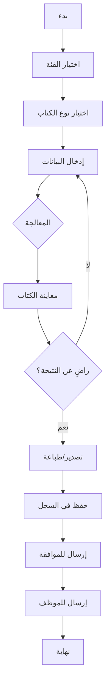

# خطة تنفيذ نظام مولد الكتب الرسمية
# Legal Document Generator Implementation Plan

## 📋 نظرة عامة | Overview

**الهدف**: بناء نظام ذكي لتوليد الكتب الرسمية لشركة العراف، يسمح للمندوبين بإنشاء مستندات قانونية دون الحاجة لانتظار المحامي أو المدير.

**Target**: Build an intelligent system for generating official letters for Al-Araf Company, allowing representatives to create legal documents without waiting for lawyers or managers.

---

## 🎯 المتطلبات الأساسية | Core Requirements

### 1. أنواع الكتب المدعومة | Supported Document Types

#### أ. كتب شركات التأمين | Insurance Company Letters
- **طلب شطب مركبة** | Vehicle Deregistration Request
- **إخطار حادث** | Accident Notification
- **طلب تعويض** | Compensation Claim
- **إخطار مطالبة** | Claim Notification
- **إلغاء وثيقة** | Policy Cancellation

#### ب. كتب المرور | Traffic Department Letters
- **طلب نقل ملكية** | Ownership Transfer Request
- **طلب استخراج رخصة** | License Issuance Request
- **طلب تجديد رخصة** | License Renewal Request
- **طلب فحص دوري** | Periodic Inspection Request
- **إخطار بيع مركبة** | Vehicle Sale Notification
- **طلب بدل فاقد** | Lost Document Replacement Request

#### ج. كتب رسمية عامة | General Official Letters
- **كتاب رسمي لجهة حكومية** | Official Letter to Government Entity
- **طلب معلومات** | Information Request
- **كتاب تعهد** | Undertaking Letter
- **كتاب تفويض** | Power of Attorney Letter
- **إقرار رسمي** | Official Declaration

#### د. كتب العملاء | Customer Letters
- **إشعار استحقاق** | Due Notification
- **إنذار رسمي** | Official Warning
- **طلب سداد** | Payment Request
- **إشعار تأخير** | Delay Notification
- **كتاب إلغاء عقد** | Contract Cancellation Letter

---

## 🏗️ البنية المعمارية | Architecture

```
┌─────────────────────────────────────────────────────────────┐
│                     Legal Document Generator                  │
├─────────────────────────────────────────────────────────────┤
│                                                               │
│  ┌─────────────┐    ┌─────────────┐    ┌─────────────┐     │
│  │   Selector  │ -> │   Wizard    │ -> │   Preview   │     │
│  │  Step 1     │    │  Steps 2-4  │    │   Step 5    │     │
│  └─────────────┘    └─────────────┘    └─────────────┘     │
│         │                  │                  │              │
│         v                  v                  v              │
│  ┌─────────────┐    ┌─────────────�    ┌─────────────┐     │
│  │  Document   │    │   Dynamic   │    │   Export    │     │
│  │   Type      │    │   Forms     │    │  (PDF/Word) │     │
│  │ Selection   │    │   Based     │    │             │     │
│  │             │    │   on Type   │    │             │     │
│  └─────────────┘    └─────────────┘    └─────────────┘     │
│                                                               │
│  ┌─────────────────────────────────────────────────────┐   │
│  │              Template Engine                          │   │
│  │  (Variable Replacement + Arabic Formatting)          │   │
│  └─────────────────────────────────────────────────────┘   │
│                                                               │
│  ┌─────────────────────────────────────────────────────┐   │
│  │              Database Layer                           │   │
│  │  • Templates Table                                    │   │
│  │  • Generated Documents Table                          │   │
│  │  • Document History                                   │   │
│  └─────────────────────────────────────────────────────┘   │
└─────────────────────────────────────────────────────────────┘
```

---

## 📊 قاعدة البيانات | Database Schema

### الجدول 1: legal_document_templates

```sql
CREATE TABLE legal_document_templates (
  id UUID PRIMARY KEY DEFAULT gen_random_uuid(),
  template_key TEXT UNIQUE NOT NULL,
  name_ar TEXT NOT NULL,
  name_en TEXT,
  category TEXT NOT NULL, -- 'insurance', 'traffic', 'general', 'customer'
  description_ar TEXT,
  description_en TEXT,

  -- Template content
  subject_template TEXT,
  body_template TEXT NOT NULL,
  footer_template TEXT,

  -- Configuration
  variables JSONB NOT NULL, -- Array of required variables
  is_active BOOLEAN DEFAULT true,
  requires_approval BOOLEAN DEFAULT false,

  -- Metadata
  created_by UUID REFERENCES auth.users(id),
  created_at TIMESTAMP WITH TIME ZONE DEFAULT NOW(),
  updated_at TIMESTAMP WITH TIME ZONE DEFAULT NOW()
);

-- Indexes
CREATE INDEX idx_templates_category ON legal_document_templates(category);
CREATE INDEX idx_templates_active ON legal_document_templates(is_active);
```

### الجدول 2: legal_document_generations

```sql
CREATE TABLE legal_document_generations (
  id UUID PRIMARY KEY DEFAULT gen_random_uuid(),
  template_id UUID REFERENCES legal_document_templates(id),
  company_id UUID REFERENCES companies(id),

  -- Document info
  document_type TEXT NOT NULL,
  document_number TEXT,

  -- Content
  subject TEXT,
  body TEXT NOT NULL,
  variables_data JSONB NOT NULL, -- User input data

  -- Status
  status TEXT DEFAULT 'draft', -- 'draft', 'generated', 'approved', 'rejected'
  approval_status TEXT DEFAULT 'pending', -- 'pending', 'approved', 'rejected'

  -- Recipient info
  recipient_name TEXT,
  recipient_entity TEXT,
  recipient_address TEXT,

  -- References
  related_vehicle_id UUID REFERENCES vehicles(id),
  related_contract_id UUID REFERENCES contracts(id),
  related_customer_id UUID REFERENCES customers(id),

  -- File storage
  file_url TEXT, -- Supabase Storage URL
  file_name TEXT,
  file_type TEXT, -- 'pdf', 'docx', 'html'

  -- Metadata
  generated_by UUID REFERENCES auth.users(id),
  approved_by UUID REFERENCES auth.users(id),
  approved_at TIMESTAMP WITH TIME ZONE,
  created_at TIMESTAMP WITH TIME ZONE DEFAULT NOW(),
  updated_at TIMESTAMP WITH TIME ZONE DEFAULT NOW()
);

-- Indexes
CREATE INDEX idx_generations_template ON legal_document_generations(template_id);
CREATE INDEX idx_generations_company ON legal_document_generations(company_id);
CREATE INDEX idx_generations_status ON legal_document_generations(status);
CREATE INDEX idx_generations_date ON legal_document_generations(created_at DESC);
```

---

## 🎨 واجهة المستخدم | UI Design

### الخطوة 1: اختيار نوع الكتاب | Document Type Selection

```
┌─────────────────────────────────────────────────────────┐
│          مولد الكتب الرسمية                              │
│          Legal Document Generator                        │
└─────────────────────────────────────────────────────────┘

┌─────────────────────────────────────────────────────────┐
│  اختر نوع الكتاب المطلوب                                │
│  Select the required document type                       │
└─────────────────────────────────────────────────────────┘

┌─────────────┐ ┌─────────────┐ ┌─────────────┐ ┌─────────────┐
│   🏢         │ │   🚗         │ │   📋         │ │   👤         │
│ التأمين      │ │  المرور      │ │  رسمي        │ │  العملاء    │
└─────────────┘ └─────────────┘ └─────────────┘ └─────────────┘
     Insurance        Traffic       General       Customers

┌─────────────────────────────────────────────────────────┐
│  الأنواع الشائعة:                                       │
│  • طلب شطب مركبة من التأمين                            │
│  • إخطار نقل ملكية للمرور                              │
│  • إنذار رسمي للعميل                                   │
│  • طلب استخراج رخصة                                    │
└─────────────────────────────────────────────────────────┘
```

### الخطوة 2-4: المعالج التفاعلي | Interactive Wizard

```
┌─────────────────────────────────────────────────────────┐
│  طلب شطب مركبة من شركة التأمين                         │
│  Vehicle Deregistration Request                          │
└─────────────────────────────────────────────────────────┘

التقدم: [████████████░░░░░░░░] 3/5

┌─────────────────────────────────────────────────────────┐
│  معلومات الجهة المستلمة | Recipient Information        │
├─────────────────────────────────────────────────────────┤
│                                                         │
│  اسم شركة التأمين:                                     │
│  [المدخلات............................]                 │
│                                                         │
│  رقم الوثيقة:                                          │
│  [12345678.......................]                     │
│                                                         │
│  العنوان:                                              │
│  [المدخلات............................]                 │
│                                                         │
└─────────────────────────────────────────────────────────┘

┌─────────────────────────────────────────────────────────┐
│  معلومات المركبة | Vehicle Information                 │
├─────────────────────────────────────────────────────────┤
│                                                         │
│  [اختر المركبة من القائمة ▼]                           │
│  أو                                                      │
│  • رقم اللوحة: [ABC-1234..........]                    │
│  • رقم الهيكل: [.....................]                 │
│  • الماركة والموديل: [تويوتا كامري....]                │
│                                                         │
└─────────────────────────────────────────────────────────┘

┌─────────────────────────────────────────────────────────┐
│  ملاحظات إضافية | Additional Notes                     │
│  [...................................................]  │
│  [...................................................]  │
│                                                         │
└─────────────────────────────────────────────────────────┘

            [السابق]  [التالي]  [حفظ مسودة]
```

### الخطوة 5: المعاينة والتصدير | Preview & Export

```
┌─────────────────────────────────────────────────────────┐
│  معاينة الكتاب | Document Preview                        │
└─────────────────────────────────────────────────────────┘

┌─────────────────────────────────────────────────────────┐
│                                                         │
│  شركة العراف للمقاولات                                 │
│  Al-Araf Contracting Company                            │
│                                                         │
│  التاريخ: 28/12/2025                                    │
│  رقم الكتاب: ARF-2025-0001                              │
│                                                         │
│  إلى: شركة التأمين العربية                              │
│  الموضوع: طلب شطب مركبة                                 │
│                                                         │
│  ─────────────────────────────────────────────          │
│                                                         │
│  التحية الطيبة،                                        │
│                                                         │
│  نود إعلامكم برغبتنا في شطب المركبة التالية:          │
│                                                         │
│  • رقم اللوحة: ABC-1234                                │
│  • رقم الهيكل: JT1234567890                            │
│  • الماركة: تويوتا                                     │
│  • الموديل: كامري 2022                                 │
│                                                         │
│  نرجو منكم اتخاذ اللازم إزاء ذلك.                     │
│                                                         │
│  وتفضلوا بقبول فائق التقدير والاحترام.                │
│                                                         │
│                                                         │
│  المدير العام                                          │
│  شركة العراف                                           │
│                                                         │
└─────────────────────────────────────────────────────────┘

┌─────────────────────────────────────────────────────────┐
│                                                         │
│  [🖨️ طباعة]  [📥 تحميل PDF]  [📄 تحميل Word]           │
│                                                         │
│  [✓ إرسال للموافقة]  [✏️ تعديل]  [📋 نسخ]              │
│                                                         │
└─────────────────────────────────────────────────────────┘
```

---

## 🔧 الميزات التقنية | Technical Features

### 1. نظام القوالب | Template System

```typescript
interface DocumentTemplate {
  id: string;
  key: string;
  name: string;
  category: DocumentCategory;
  variables: TemplateVariable[];
  subjectTemplate: string;
  bodyTemplate: string;
  requiresApproval: boolean;
}

interface TemplateVariable {
  name: string;
  label: string;
  type: 'text' | 'number' | 'date' | 'select' | 'textarea' | 'vehicle' | 'customer';
  required: boolean;
  placeholder?: string;
  options?: string[]; // For select type
  validation?: ValidationRule[];
}
```

### 2. محرك الاستبدال | Replacement Engine

```typescript
class TemplateEngine {
  // Replace variables in template
  render(template: string, data: Record<string, any>): string {
    // Support: {{variable_name}} syntax
    // Support: conditional blocks
    // Support: date formatting
    // Support: number formatting (Arabic numerals)
  }

  // Format dates in Arabic
  formatDateAr(date: Date): string {
    // 28 ديسمبر 2025
  }

  // Format numbers in Arabic
  formatNumberAr(num: number): string {
    // ١٢٣٤ (Arabic-Indic numerals)
  }
}
```

### 3. التكامل مع AI (اختياري) | AI Integration

```typescript
// Use Z.AI API for smart suggestions
interface AIGenerationService {
  // Suggest document content based on context
  suggestContent(documentType: string, context: any): Promise<string>;

  // Auto-complete fields
  autoCompleteFields(template: DocumentTemplate, partialData: any): Promise<any>;
}
```

### 4. نظام التصدير | Export System

```typescript
interface ExportService {
  // Export as PDF
  exportToPDF(document: GeneratedDocument): Promise<Blob>;

  // Export as Word
  exportToWord(document: GeneratedDocument): Promise<Blob>;

  // Print directly
  print(document: GeneratedDocument): void;

  // Copy to clipboard
  copyToClipboard(document: GeneratedDocument): Promise<void>;
}
```

---

## 📁 الملفات المطلوبة | Required Files

### Pages (الصفحات)
```
src/pages/legal/
├── LegalDocumentGenerator.tsx       # Main page
└── components/
    ├── DocumentTypeSelector.tsx     # Step 1
    ├── DocumentWizard.tsx           # Steps 2-4
    ├── DocumentPreview.tsx          # Step 5
    └── TemplateVariableForm.tsx     # Dynamic form
```

### Components (المكونات)
```
src/components/legal/document-generator/
├── index.ts
├── DocumentGeneratorContainer.tsx   # Main container
├── CategoryCard.tsx                 # Category selection
├── TemplateCard.tsx                 # Template selection
├── WizardProgress.tsx               # Progress indicator
├── VariableField.tsx                # Dynamic field renderer
├── TemplateEngine.ts                # Template rendering
├── DocumentPreview.tsx              # Preview component
├── ExportActions.tsx                # Export buttons
└── DocumentHistory.tsx              # History list
```

### Hooks (الخطافات)
```
src/hooks/
├── useDocumentTemplates.ts          # Template CRUD
├── useDocumentGeneration.ts         # Generation logic
├── useTemplateEngine.ts             # Template rendering
└── useDocumentExport.ts             # Export functionality
```

### Types (الأنواع)
```
src/types/legal-document-generator.ts
```

### Utils (الأدوات)
```
src/utils/
├── template-engine.ts               # Template rendering
├── document-exporter.ts             # PDF/Word export
└── arabic-formatter.ts              # Arabic formatting
```

---

## 🔄 سير العمل | Workflow



---

## ✅ معايير القبول | Acceptance Criteria

- [ ] يمكن للمندوب اختيار نوع الكتاب من قائمة منظمة
- [ ] تظهر الأسئلة المناسبة حسب نوع الكتاب المختار
- [ ] يتم توليد الكتاب بصيغة احترافية
- [ ] يمكن معاينة الكتاب قبل التصدير
- [ ] يمكن تصدير الكتاب بصيغة PDF و Word
- [ ] يتم حفظ الكتاب في السجل مع جميع البيانات
- [ ] يمكن طباعة الكتاب مباشرة
- [ ] يدعم النظام اللغة العربية بشكل كامل
- [ ] يمكن نسخ الكتاب للحافظة
- [ ] يمكن تعديل الكتاب قبل التصدير النهائي
- [ ] يتم إرسال إشعار للمدير/المحامي للموافقة
- [ ] يمكن البحث في الكتب السابقة
- [ ] يمكن إعادة استخدام الكتاب السابق

---

## 🚀 خطة التنفيذ | Implementation Steps

### المرحلة 1: الأساسيات | Foundation (اليوم 1-2)
1. إنشاء جداول قاعدة البيانات
2. إنشاء الملفات الأساسية
3. إضافة عنصر القائمة في السايدبار
4. بناء الصفحة الرئيسية

### المرحلة 2: المعالج | Wizard (اليوم 3-4)
1. بناء مكون اختيار الفئة
2. بناء مكون اختيار القالب
3. بناء المعالج التفاعلي
4. نظام الحقول الديناميكي

### المرحلة 3: محرك القوالب | Template Engine (اليوم 5)
1. نظام استبدال المتغيرات
2. تنسيق التواريخ العربية
3. تنسيق الأرقام العربية
4. القوالب الافتراضية

### المرحلة 4: التصدير | Export (اليوم 6)
1. تصدير PDF
2. تصدير Word
3. الطباعة المباشرة
4. النسخ للحافظة

### المرحلة 5: المتقدمة | Advanced (اليوم 7)
1. نظام الموافقات
2. السجل التاريخي
3. البحث والتصفية
4. الإشعارات

### المرحلة 6: الاختبار | Testing (اليوم 8)
1. اختبار جميع السيناريوهات
2. إصلاح المشاكل
3. تحسين الأداء
4. التوثيق

---

## 🎨 الميزات الإضافية المقترحة | Suggested Extra Features

### ميزات المستقبل
1. **AI Smart Fill**: تعبئة ذكية للحقول بناءً على البيانات المتاحة
2. **Signature Integration**: التكامل مع التوقيع الإلكتروني
3. **WhatsApp Integration**: إرسال الكتب مباشرة عبر واتساب
4. **Email Integration**: إرسال الكتب بالبريد الإلكتروني
5. **Translation**: ترجمة الكتب للإنجليزية
6. **Templates Management**: إدارة القوالب من قبل المدير
7. **Analytics**: إحصائيات استخدام الكتب
8. **Bulk Generation**: توليد عدد كبير من الكتب دفعة واحدة

---

## 📝 ملاحظات التقنية | Technical Notes

### الأمان
- جميع الكتب محفوظة في قاعدة البيانات
- RLS Policies للتحكم بالصلاحيات
- تشفير البيانات الحساسة

### الأداء
- Lazy Loading للقوالب
- Caching للقوالب الشائعة
- Pagination للسجل التاريخي

### التوافق
- متوافق مع جميع المتصفحات الحديثة
- دعم كامل للهواتف المحمولة
- طباعة متوافقة مع المعايير

---

## 🔐 API Key
**Z.AI API Key**: `136e9f29ddd445c0a5287440f6ab13e0.DSO2qKJ4AiP1SRrH`

---

**تاريخ الإنشاء**: 28 ديسمبر 2025
**الحالة**: قيد التنفيذ 🚧
**المسؤول**: فريق التطوير
